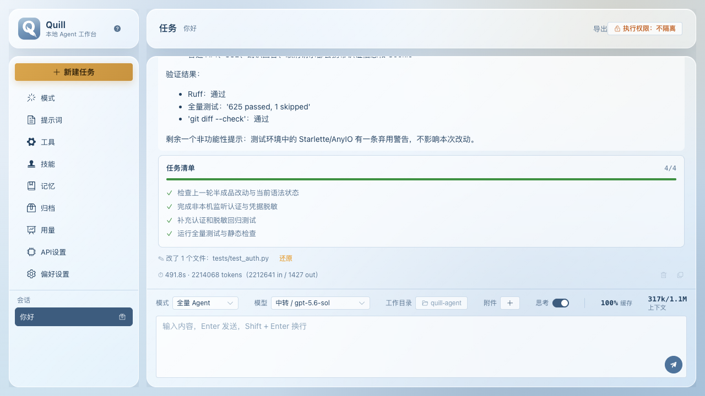
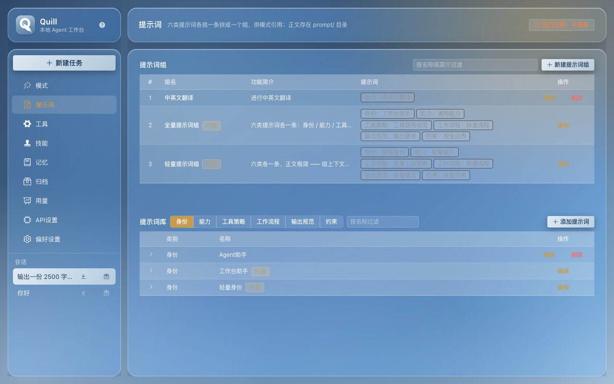

# quill

**一个跑在你自己机器上的 Agent 工作台。** 给它一个工作目录，它就能读写文件、跑命令、查
git、搜网页 —— 而且每一步都摊开给你看：调了哪个工具、改了哪几行、花了多少 token。

不用注册、不用把代码传上去：模型 Key 填你自己的，数据落在你自己的磁盘上。

| 任务页 | 深色主题 |
| --- | --- |
|  |  |

> **想改代码、想知道每个设计为什么这么做？**
>
> - **[README-developer.md](./README-developer.md)** —— 详细设计文档：按目录/模块讲清每一层、
>   每个模块和取舍、二次开发从哪儿下手。
> - **[ARCHITECTURE.md](./ARCHITECTURE.md)** —— 按功能与机制横向贯通的一条条链路。
>
> 这份 README 只讲怎么用。

## 它能做什么

- **读写你的文件**：读、改、新建、移动、删除、按文件名或内容搜索 —— 都限定在你指定的**工作目录**里。
- **跑命令**：构建、测试、脚本；也能后台起一个长驻进程，再把它停掉。
- **看代码**：列出文件的符号骨架、跨文件找定义与引用；以及 git 的 status / diff / commit（只提交本地，**不 push**）。
- **上网**：搜索 + 抓某个网页的正文（配一个搜索服务商即可）。
- **派子代理**：互不依赖的调研一次派出去**并行**跑，只把结论带回来。
- **记住结论**：跨会话的记忆；外加两块常驻便签 —— 右缘的**公共剪贴板**（复制记录）和左缘的**公共备忘录**（自己敲）。
- **可插拔的「人设」**：提示词组 + 工具组 + 技能组 + 记忆开关 + 偏好模型 = 一个**模式**。
- **接外部工具**：连 MCP 服务器，它提供的工具会和内置工具一起摆到模型面前。
- **看得见花销**：按天看折线、按任务看表格的 token 用量。

## 跑起来

### 1. 最省事：双击启动脚本

macOS 双击 `start.command`、Windows 双击 `start.bat`、Linux 跑 `./start.sh`。脚本会检查
依赖、起服务并打开浏览器。唯一的前置是 [uv](https://github.com/astral-sh/uv) ——
首次运行要联网下载 Python 与依赖（几十 MB）。

### 2. 桌面版（原生窗口，可选）

```bash
uv sync --extra desktop    # 装 pywebview
uv run quill-desktop       # 起服务 + 开一个原生窗口
```

macOS 上还能打成一个 `.app`：

```bash
make desktop              # 构建前端产物 + 打包，产出 release/Quill.app
open release/Quill.app    # 未签名，首次要「右键 → 打开」
```

> Windows / Linux 的打包还没做（在做），那两个平台先用双击脚本走浏览器版 —— 功能完全一样，
> 桌面壳只是把同一个页面装进系统 WebView。

### 3. 从源码跑

```bash
make dev                   # 装运行时 + 开发依赖
cp .env.example .env       # 可选，不配也能跑
make build && make api     # 构建前端并启动 → http://localhost:8000
```

`web/dist` 存在时后端会连前端一起托管，不用常驻 Node。改前端时开两个终端：`make api` +
`make web`（5173，`/api` 自动转发）。完整命令与发布前检查见
[README-developer.md](./README-developer.md)。

## 第一次打开：两步

**一、配一个模型** —— 左侧「API设置」→「新建连接」：

1. 填接口地址（如 `https://api.deepseek.com`）、协议、API Key；
2. 点「获取模型列表」把该端点的模型拉回来勾选（也能直接手敲）；
3. 填「上下文窗口」—— 任务页右上角的用量仪表盘按它算占比；
4. 点「测试连接」确认能通。

接本地 Ollama 更省事：协议选 `Ollama（本地）`，**地址留空**，Key 不用填。
（DeepSeek 示例：地址 `https://api.deepseek.com`，协议 `OpenAI Chat Completions`，
模型 `deepseek-chat` / `deepseek-reasoner`。）

**二、选一个模式** —— 出厂带了三个（**全量 Agent** / **轻量 Agent** / **仅问答**），
先用「轻量 Agent」跑通最省心。想自己搭一个，「模式」页里把提示词组、工具组、技能组挑一挑
就是一套新配置；三个组**都可以不选**，那就是纯问答。

## 界面导览

| 页面 | 干什么 |
| --- | --- |
| **任务** | 对话的地方。左侧是会话列表（新建 / 切换 / 导出 / 归档）；输入框上方那一排是模式、模型、工作目录、附件 |
| **模式** | Agent 的一套完整配置（见上） |
| **提示词** | 六类：身份 / 能力 / 工具策略 / 工作流程 / 输出规范 / 约束。正文就是 `prompt/` 下的 `.md`，界面里能改，拿外部编辑器直接改文件也行 |
| **工具** | 模型能调用的动作，按组搭配 |
| **技能** | 「某类任务该怎么做」。平时只在上下文里占一行，模型觉得需要时才读全文 |
| **记忆** | 跨会话保留的事实与偏好，模型主动写入 |
| **用量** | token 统计，按天 / 按任务（含已归档） |
| **API设置** | 模型连接 |
| **偏好设置** | 主题、对话、联网搜索、MCP、归档、关于 |

另外两处不在页面里：

- **顶栏右侧那个锁**是**执行权限（沙箱）** —— 限制命令够得着什么。它管整台机器，和输入框
  上方那一排（只管当前这一轮）不是一类东西。
- **窗口左右边缘**各贴着一个入口：右边**公共剪贴板**，左边**公共备忘录**。点边缘箭头拉出，
  跨页面、跨会话都不丢。

对话生成中，发送按钮会原地变成「停止」。

## 原理（够用就好）

```
web/ (Vue)  ──HTTP/SSE──>  server/ (FastAPI)  ──>  src/quill_agent/  (业务层，纯 Python)
```

- **业务层是纯 Python，不依赖任何界面框架**（`src/quill_agent/`）。所以同一份逻辑，今天被
  Vue 前端调用，明天也能被命令行或脚本复用。
- `server/` 只做一件事：把业务层包成 HTTP + SSE 接口。界面只负责发请求、收事件流。
- **一轮对话**：按模式装好提示词、工具、记忆与历史 → 请求模型 → 模型要调工具就调、把结果
  回灌 → 如此往复，直到给出结论。全程以事件流推给界面，所以你看到的工具调用与思考是**按真实
  发生顺序穿插**在正文里的，不是事后拼的。
- **跑到一半也不丢**：输出边生成边落盘。刷新、切页面、关掉再打开，进行中的那轮都还在。
- **两道边界**：文件工具只能看工作目录以内（这既是工作台也是安全边界）；跑命令另有一层
  内核级沙箱 —— Linux 用 `bubblewrap`、macOS 用系统自带的 `sandbox-exec`，
  **原生 Windows 没有后端，所以那边默认关着**。

## 数据放在哪

在平台的用户目录下（macOS `~/Library/Application Support/Quill`、Windows
`%APPDATA%\Quill`、Linux `~/.local/share/quill`）；如果程序目录里同时有源码（就地运行），
就放在那儿。想指定别处：设环境变量 `QUILL_HOME`。

里面是 `data/`（会话、模型配置、记忆、界面偏好）、`prompt/`、`skills/`。
**卸载 = 删掉这个目录**，没有别的地方留东西。

## 常见问题

**双击没反应 / 窗口一闪就没了**
看数据根下的 `desktop.log`（双击启动没有终端，启动自检与报错都写在那儿）。

**能不能让它别乱动我的文件**
能。模式的工具组里不选执行类工具，它就只剩读写文件；再配合顶栏那个锁（沙箱），越界的写入
和联网会被内核直接拒掉。

**端口被占**
`quill serve` 会自动顺延并打印实际地址；`make api` 是固定 8000。

**它的命令为什么在 Windows 上跑不了 `ls`**
因为走的是 `cmd.exe`（POSIX 上走 `sh`）。该用 `dir` / `type`。

**首次启动很慢**
在下载 Python 和依赖。之后就快了。

**沙箱档位怎么选**
不知道就用默认。Windows 上请保持 `off` —— 那边没有后端，配成别的档位会让每条命令都被拒。

## 许可

[MIT](LICENSE) © 2026 zhaoyifan —— 可自由使用、修改、分发（含商业用途），只需保留版权声明。
