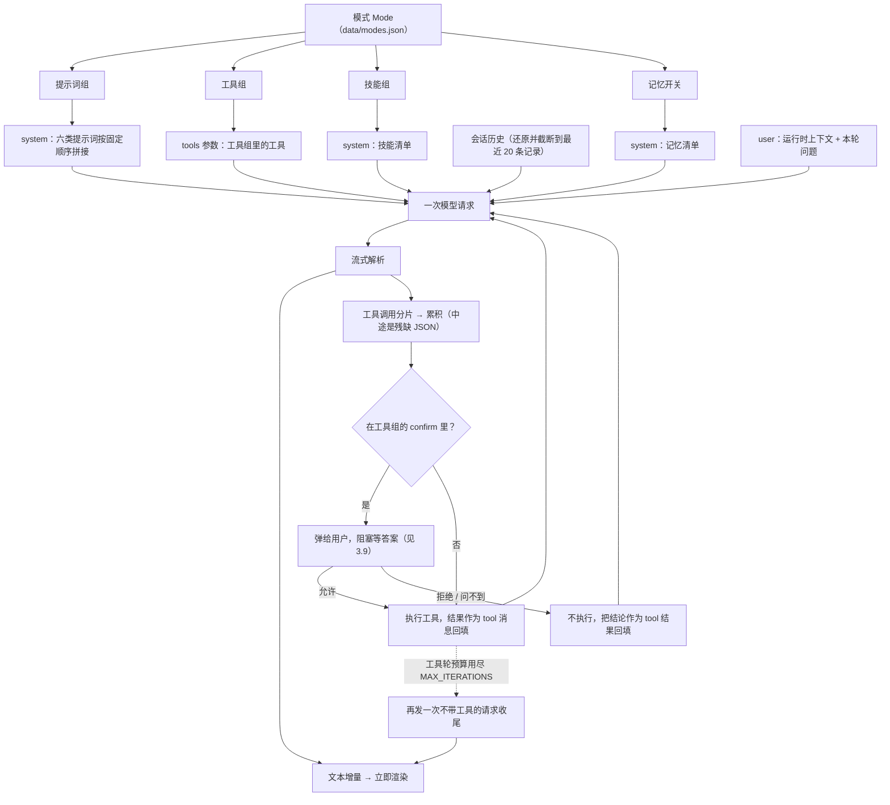

# quill

一个可本地运行、可二次开发的 Agent 应用。**业务层（`src/quill_agent/`）与界面完全分离**，
业务层是纯 Python、不依赖任何界面框架，所以同一份逻辑今天能被 Vue 前端调用，
明天也能被命令行或脚本复用：

```
web/ (Vue)  ──HTTP/SSE──┐
                        ├──>  src/quill_agent/  (业务层，纯 Python)
app/ (Streamlit) ───────┘
```

> **两个界面并存。** `web/` 是新的 Vue 前端，`app/` 是早期的 Streamlit 版本。
> 后者保留着当参照物（接口对不上时切过去比一比），功能对齐后可以删。
> 两套界面共用同一份会话记录，互不干扰。

---

## 1. 运行环境要求与运行方式

### 环境要求

| 项 | 要求 |
| --- | --- |
| Python | **>= 3.10**（开发环境用 3.12，见 `.python-version`） |
| 包管理 | [uv](https://github.com/astral-sh/uv)（仓库内已含 `uv.lock`，安装可复现） |
| Node | **>= 20**（只在跑 Vue 前端时需要；用 Streamlit 界面可以不管） |
| 操作系统 | macOS / Linux / Windows 均可。工作目录选择器会按平台自动适配 |

### 快速开始

```bash
# 1. 安装后端依赖（首次会自动创建 .venv 并下载对应 Python）
make dev

# 2. 复制环境变量模板（可选，不配也能跑）
cp .env.example .env
```

**方式一：Vue 前端（推荐）** —— 需要两个终端：

```bash
cd web && npm install      # 只需一次
make api                   # 终端 A：后端，监听 8000
make web                   # 终端 B：前端，浏览器打开 http://localhost:5173
```

前端开发服务器会把 `/api` 转发给后端，所以浏览器看到的是同源请求，不用配跨域。

**方式二：Streamlit 界面（旧）**

```bash
make run        # 浏览器打开 http://localhost:8501
```

### 常用命令

| 命令 | 说明 |
| --- | --- |
| `make install` | 只装运行时依赖 |
| `make dev` | 装运行时 + 开发依赖（pytest / ruff） |
| `make api` | 启动后端 API（FastAPI，8000） |
| `make web` | 启动前端开发服务器（Vue，5173） |
| `make run` | 启动 Streamlit UI（旧界面，8501） |
| `make cli` | 运行命令行入口 |
| `make test` | 运行单元测试 |
| `make lint` | 静态检查（ruff） |
| `make fmt` | 格式化代码 |
| `make clean` | 清理缓存与虚拟环境 |

### 首次使用

应用启动后需要先配置一个模型，否则任务页无法发起对话：

1. 打开左侧「**模型**」页 → 添加模型
   - 填接口地址（如 `https://api.deepseek.com`）、协议、API Key
   - 点「**获取模型列表**」把该端点的模型拉回来（走 `GET /models`），从下拉里勾选；
     也可直接手敲模型名（下拉支持输入后回车新建）
   - 「上下文窗口」填该模型的窗口大小（tokens），任务页右侧的用量仪表盘按它算占比
2. 回到「**任务**」页 → 在功能区选择模型 → 开始对话

> 配置示例（DeepSeek 官方）
> 地址 `https://api.deepseek.com`，协议 `OpenAI Chat Completions`，
> 模型名 `deepseek-chat` / `deepseek-reasoner`

---

## 2. 目录结构

```
quill-agent/
├── app/                          # UI 层（Streamlit，旧版）—— 只做渲染与交互
│   ├── app.py                    # 唯一入口：st.set_page_config + 声明页面列表
│   ├── main.py                   # 页面：任务（对话主界面 + 模式 / 模型选择）
│   ├── models.py                 # 页面：模型（连接与模型名管理）
│   ├── prompt.py                 # 页面：提示词（提示词组配置 + 提示词库浏览）
│   ├── tools.py                  # 页面：工具（筛选 + 展示）
│   ├── skills.py                 # 页面：技能（元信息列表）
│   ├── memory.py                 # 页面：记忆（查看 / 开关 / 删除）
│   └── archived.py               # 页面：归档（归档会话的搜索 / 恢复 / 删除）
│
│   （工具组 / 技能组 / 模式的管理只在 Vue 版提供；Streamlit 版保留为旧界面）
│
├── server/                       # 后端：把业务层暴露成 HTTP + SSE
│   ├── main.py                   # FastAPI 应用装配（CORS、路由挂载）
│   ├── stores.py                 # 各存储的构造入口（每次新建，不缓存）
│   ├── schemas.py                # 请求体模型
│   └── routes/                   # 按「前端一个页面 ≈ 一个模块」拆分
│
├── web/                          # 前端：Vue 3 + Vite + TypeScript
│   ├── vite.config.ts            # 含 /api 反向代理
│   └── src/
│       ├── api/                  # 接口封装（REST + SSE 解析）
│       ├── stores/               # 共享状态（会话、当前选择、草稿）
│       ├── components/           # Sidebar / MessageItem
│       └── views/                # 各页面，与路由一一对应
│
├── src/quill_agent/                 # 业务层 —— 纯 Python，禁止 import streamlit
│   ├── __init__.py               # 版本号
│   ├── config.py                 # 集中式配置（环境变量 / .env）
│   ├── models.py                 # 数据模型（Pydantic）：连接、提示词组、工具组、技能组、模式
│   ├── store.py                  # 配置类数据持久化（JSON）
│   ├── preferences.py            # 界面偏好（上次选的模型 / 模式 / 工作目录 / 会话草稿）
│   ├── history.py                # 会话历史（JSONL + 归档）
│   ├── prompts.py                # 提示词库：读写 prompt/ 目录
│   ├── skills.py                 # 技能库：读写 skills/ 目录（元信息 + 正文）
│   ├── memory.py                 # 记忆：跨会话保留的长期事实（JSON）
│   ├── usage.py                  # 用量统计：按天、按任务汇总 token（扫描会话文件）
│   ├── model_catalog.py          # 模型规格快照：模型名 -> 上下文窗口（查表）
│   ├── naming.py                 # 用户输入的内容名 -> 安全文件名的校验
│   ├── core.py                   # 接口连通性测试（拉取模型列表）
│   ├── agent.py                  # ★ Agent 循环：组装上下文 → 请求 → 执行工具
│   ├── interaction.py            # 运行期交互通道：工具问用户并阻塞等答案（见 3.9）
│   ├── cli.py                    # 命令行入口
│   └── tools/                    # 工具层
│       ├── __init__.py           # 导出 registry（import 即触发工具注册）
│       ├── base.py               # ToolSpec / ToolRegistry：声明、路由、执行
│       ├── builtin.py            # 通用内置工具（read_skill / remember）
│       ├── files.py              # 文件工具 + 路径边界校验 + 附件落盘
│       └── shell.py              # 执行工具（唯一不受工作目录约束的一个）
│
├── prompt/                       # 提示词正文（用户在文件系统里直接维护）
│   ├── 身份/  能力/  工具策略/  工作流程/  输出规范/  约束/
│
├── skills/                       # 技能（一个子目录一个技能）
│   ├── 代码审查/SKILL.md
│   └── 提交信息/SKILL.md
│
├── data/                         # 运行时数据（已 gitignore，不会提交）
│   ├── models.json               # 模型连接配置
│   ├── model_catalog.json        # 模型规格快照（模型名 -> 上下文窗口，可手工编辑）
│   ├── prompt_groups.json        # 提示词组（各类选了哪个提示词）
│   ├── tool_groups.json          # 工具组（工具的搭配方案）
│   ├── skill_groups.json         # 技能组（技能的搭配方案）
│   ├── modes.json                # 模式（引用三类组 + 记忆开关 + 偏好模型）
│   ├── memory.json               # 长期记忆条目
│   ├── preferences.json          # 界面偏好
│   └── conversations/            # 会话历史
│       ├── active/               #   活跃会话
│       └── archived/             #   归档会话
│
├── tests/                        # 单元测试
├── .streamlit/config.toml        # Streamlit 运行配置与主题
├── .env.example                  # 环境变量模板
├── pyproject.toml                # 项目元数据、依赖、ruff / pytest 配置
├── Makefile                      # 常用命令
└── uv.lock                       # 依赖锁定
```

### 分层约定

依赖方向**严格单向**：

```
app/  ──依赖──>  src/quill_agent/
```

- `src/quill_agent/` 内**不允许** import `streamlit`。这条约束是整个架构的支点：它保证业务逻辑能被 UI、CLI、
  测试、脚本任意复用，也让底层改动不会牵动界面。
- `app/` 内**不写业务逻辑**，只做「取输入 → 调底层 → 展示结果」。数据读写的代码全部在业务层，
  页面里出现 `open()` / `json.load()` 基本就是分层漏了。

---

## 3. Agent 设计逻辑

先看一张总体流程图。四类资源（提示词 / 记忆 / 技能 / 工具）各自从**模式**里被解析出来，
分别落到 system 消息、`tools` 参数和 user 消息上，然后进入「请求 → 流式解析 → 执行工具 → 再请求」
这个循环：



> system 消息刻意拆成三条（提示词 / 记忆 / 技能清单）而不是拼成一条：三者随模式变化的部分
> 不同，拼在一起的话换个技能组就把整段前缀打乱，模型侧的前缀缓存跟着作废（见 3.1）。

### 3.1 提示词

**核心概念：正文是文件，组合是配置。**

```
提示词正文  →  prompt/<类别>/<名称>.md      ← 用户直接新建 / 编辑 / 删除文件
提示词组（组合）→  data/prompt_groups.json      ← 界面上配置：每类挑一个
```

六类提示词（顺序即拼装顺序）：

| 类别 | 作用 |
| --- | --- |
| 身份 | 模型扮演什么角色 |
| 能力 | 具备哪些能力与知识边界 |
| 工具策略 | 何时使用工具、如何使用 |
| 工作流程 | 处理任务的标准步骤 |
| 输出规范 | 回答的格式与风格要求 |
| 约束 | 安全与合规红线 |

一个「**提示词组**」= 从六类里各挑一个（**都可以不挑**）拼成的一套系统提示词。
六类全不挑也是合法配置，等价于「不带任何系统提示词」的纯问答。

> 这套东西原先就叫「模式」。现在模式指三类组 + 记忆的组合（见 3.6 / 3.7），所以它改名叫
> **提示词组**，数据也从 `data/modes.json` 挪到 `data/prompt_groups.json` —— 那个文件名
> 归了新模式，两边共用一个文件的话新模式一写入就会把提示词组整份覆盖掉。
> 偏好模型一并搬到模式上（见 3.7）。

**几个设计决定：**

- **正文放文件而不是数据库**。提示词是用户要反复迭代的东西，`.md` 文件方便纳入版本控制，
  也能用自己顺手的编辑器改。界面上同样能直接改（见 7.20），但那只是**另一条写入路径**，
  文件始终是唯一的事实来源 —— 界面上改完落下来的还是那个 `.md`。
- **拼装顺序固定按 `PROMPT_CATEGORIES`**，与用户在弹窗里的勾选顺序无关。顺序稳定 → 同一组每次拼出的
  system prompt 完全一致 → 命中模型侧的前缀缓存（省钱、降延迟）。
- **引用的文件被删除不会报错**，只是该类别不参与拼装；界面上会标注「（文件缺失）」。

**运行时上下文不放 system prompt**。当前时间、工作目录、附件路径这些每轮都在变的信息，
放在 user 消息开头。如果塞进 system prompt，前缀缓存会永远失效。见 `agent.build_user_message()`。

### 3.2 工具

**定义只在代码里，没有第二份开关。** 给不给某个工具由模式的工具组决定（见 3.8）——
同一个工具模式 A 要、模式 B 不要，一个全局布尔值表达不了这件事。

```python
@registry.tool(
    description="一句话说清「什么时候该用我」—— 这是模型判断的唯一依据。",
    category="分类（只用于界面筛选，不会发给模型）",
    parameters={"type": "object", "properties": {...}, "required": [...]},
)
def your_tool(...) -> str:
    ...
```

- **`description` 是模型判断要不要调用的唯一依据**，写得越贴合真实场景，调用越准。
- 不在模式的工具组里的工具**不会被发给模型**（`registry.schemas(only=...)`），模型自然不会请求调用它。
- **执行契约**：工具内部任何异常都转成可读文本返回，不向上抛。模型看到错误说明后通常能自行修正，
  而抛异常会直接打断整个 Agent 循环。

**当前工具清单（13 个）：**

| 工具 | 分类 | 说明 |
| --- | --- | --- |
| `list_dir` | 文件 | 列出目录内容：只列一层，带文件大小 |
| `read_file` | 文件 | 读文件内容：带行号、自动截断，可用 `offset` 分页续读 |
| `write_file` | 文件 | 写入 / 覆盖文件：自动创建父目录、原子写入 |
| `edit_file` | 文件 | 局部替换：要求 `old_string` 在文件中唯一 |
| `search_content` | 文件 | 按正则搜索**文件内容**，返回 `文件:行号: 内容` |
| `search_files` | 文件 | 按通配符查找**文件名**，如 `*.py`、`**/*.json` |
| `delete_file` | 文件 | 删除文件（不删目录） |
| `run_command` | 执行 | 在工作目录里跑一条 shell 命令（见下） |
| `ask_user` | 交互 | 向用户提问并停下等他回答（见 3.9） |
| `submit_plan` | 交互 | 交一份实施方案给用户审批，批准了才动手（见 3.9） |
| `read_skill` | 技能 | 读取某个技能的完整说明（技能体系的按需加载入口） |
| `remember` | 记忆 | 写入一条长期记忆（跨会话保留的偏好与事实） |
| `forget` | 记忆 | 按原文忘掉一条记忆（要求一字不差，避免误删） |

> `search_content` 是这批里最关键的一个：没有它，模型要确认「某个函数在哪定义」就只能挨个读文件，
> token 消耗是几十倍。它会自动跳过 `.venv` / `.git` / `__pycache__` 等目录，并按行截断、
> 限制命中数量 —— 这三条都是为了不把上下文撑爆。

**工具组：工具的唯一搭配单位。** 工具定义里没有第二份开关，给不给由模式的工具组决定（见 3.6 / 3.8）：

```json
{
  "id": "8f2c1a...",
  "name": "文件操作",
  "description": "读写和搜索工作目录里的文件",
  "tools": ["list_dir", "read_file", "write_file", "delete_file"],
  "confirm": ["delete_file"]
}
```

- `tools` **允许为空** —— 「纯对话」这种组要的就是一个都不给，靠全局开关只能挨个关。
- `confirm` 是 `tools` 的**子集**，表示「每次调用都要用户先点头」（见 3.9）。它补上了原先
  缺掉的一档：`run_command` 这类工具本来只能在「加进组 = 把一台机器交出去」和
  「不加 = 一点用没有」之间二选一，有了它才能表达「给，但动手前问我」。
- **组名唯一**：模式编辑界面里同名会让用户分不清两个组各自是什么。
- **成员名必须真实存在**：保存时对着 `registry` 查，查不到直接 400。拼错的工具名不会报错，
  只会让模型端的工具菜单静默少一项，用户还以为它在。`confirm` 只需是 `tools` 的子集 ——
  「不在场却要求确认」是自相矛盾的配置，同样在保存时 400。
- 界面上新建 / 编辑共用一张弹窗表单，成员多选下拉里平铺了分类和简介（见 7.16）。

**文件工具的安全边界：**

所有文件工具都跑在工作目录（`work_dir`）内，路径统一经 `PathGuard` 校验：

```python
resolved = (root / raw).resolve()           # 展开 .. 和符号链接
if not resolved.is_relative_to(root):
    raise ValueError("拒绝访问工作目录之外的位置")
```

`resolve()` 会跟随符号链接，所以「在工作目录里放一个软链接指向外部」这条绕过路径也拦得住
（只做字符串层面判断 `..` 是拦不住的）。

工作目录可在任务页的 📁 里切换，取值优先级：**界面选择 > 配置项 `WORK_DIR`**。
选过的目录若被删除，会自动回落到配置默认值，不会让工具直接罢工。

**`run_command` 是唯一不受这条边界约束的工具。** 文件工具的能力边界是工作目录，而一条
命令（`cat ~/.ssh/id_rsa`、`curl …`、`pip install …`）不受它约束 —— cwd 只是它「从哪里
开始」，不是它「只能到哪里」。这件事没法靠参数校验抹平，只能靠三件事：

1. **它是自选的**：工具定义不会自动进入任何模式的工具组，要用必须显式加进去 ——
   这是唯一真正的边界，也意味着用户加它的那一下就是一次知情同意；
2. **对模型说清楚**：description 里点明它不受工作目录限制、点明不可逆操作要先问用户；
3. **机械防护只做「防手滑」**，而且分成两档（见 3.9）：
   - `_reject_reason()` **直接拒绝**交互式程序（`vim` / `top` / `ssh`…）。它们和危险命令不同，
     问用户也没用 —— 用户说允许，它照样在那儿等一个永远不会到来的回车。
   - `_danger_reason()` 认出看着危险的写法（`rm -rf /`、fork 炸弹、`sudo`…）时**弹给用户点头**。
     判定危险的是我们，能不能承担风险的是用户。

   **换个写法就能绕过这两个判断，所以它们都不是安全边界**，只负责拦住「模型一时糊涂写出来的
   那几条」。真正的边界始终是第 1 条：得有人把它加进工具组。

另外三条是执行类工具的通用要求，缺一个都会出问题：

- **必须有超时**（默认 30 秒、上限 300 秒）：一条 `sleep 1000` 会把 chat 端点的 worker
  线程占住不放；
- **必须杀进程组**：只对 shell 本身发信号，它派生的子进程会变成孤儿继续跑，下一轮再来
  抢端口、抢文件。所以用 `start_new_session=True` 让它自成进程组，超时按组 `SIGTERM`
  → `SIGKILL`；
- **输出必须截断**：`npm install` 的日志动辄几万行，原样回填会撑爆上下文，也会把会话文件
  顶到几 MB。**砍中间而不是砍尾巴** —— 头几行是它在干什么，最后几十行是结论和报错。

`stderr` 并进 `stdout`：构建日志的先后顺序本身就是信息，分开收就得自己去猜它们的相对位置，
而退出码已经能说明成败。ANSI 颜色码会被剥掉 —— 有些工具不管有没有 TTY 都上色，
那些转义序列进了上下文纯属噪声。

### 3.3 技能

**技能是一份「这类任务该怎么做」的说明：平时只占一行，用到时才全文加载。**

```
提示词（每轮全量注入）  →  技能（按需加载）  →  工具（按需执行）
   用户决定                  模型决定              模型决定
```

为什么不直接写成提示词：假设「代码审查」的流程说明有 800 字，塞进 system prompt 后，
**每一轮、每个不相关的任务**都要付这 800 字，模型还得在一堆无关指示里找相关的。
库里放 20 个这类流程就是 1.6 万字的常驻开销，前缀缓存也白搭。技能把这笔账拆成两段付：

| 阶段 | 花多少 | 谁决定 |
| --- | --- | --- |
| 平时 | 一行「名字 + 适用场景」（约 30 字） | 用户（模式的技能组） |
| 用到时 | 全文（可能上千字） | **模型**（判断任务匹配后调 `read_skill`） |

**目录约定**（和 `prompt/` 一个思路：正文是文件，用户在编辑器里维护）：

```
skills/
└── 代码审查/
    └── SKILL.md        ← 目录名就是技能名，入口固定叫 SKILL.md
```

`SKILL.md` = 文件头的元信息块 + 正文：

```markdown
---
description: 当用户要求审查代码、评估一段实现时使用。
---

（正文：这类任务的完整做法，可以写得很长）
```

- `description` 是**模型判断要不要加载的唯一依据**。写「处理代码」是没用的，要写清
  「什么时候用我」—— 和工具的 `description` 同理。
- 元信息块只支持单行 `键: 值`，所以没有引 YAML 解析依赖。没写 `description` 也能用，
  只是模型少了这条线索，技能页会把它标出来。
- **目录里有 SKILL.md 才算技能**，在 `skills/` 下放别的东西（草稿、附件）不会被误认。

**清单单独占一条 system 消息**，不拼进身份提示词。原因和「运行时上下文不放 system
prompt」是同一个：清单会随模式（技能组）变化，跟身份提示词拼在一起的话，换个技能组
就把整段 system prompt 打乱，前面那段的缓存前缀跟着作废。

**技能没有全局开关**，给不给由模式的技能组决定（见 3.8）。`read_skill` 也不再自行
拦截：它本来就随技能组一起下发，模型手上只有组里那几个，想读也读不到别的。

**技能组：技能的唯一搭配单位。** 和工具组同构 —— 同样是 `id / name / description`，
成员字段叫 `skills`（存技能名），约束也一致：成员可为空、组名唯一。唯一的差别是**校验依据**：
工具名对着代码里的注册表查，技能名对着 `skills/` 目录查（技能由用户建目录维护，删掉目录后
组里会留下失效引用）。数据结构见 5.2 的 `skill_groups.json`。

### 3.4 记忆

记忆不是一个东西，而是**三个不同的问题**。这个项目按性质分别处理：

| 类型 | 解决什么 | 实现 |
| --- | --- | --- |
| 工作记忆 | 当前对话装不下 | 会话历史 + 截断 / 还原（见第 5 节） |
| 程序性记忆 | 「这类任务怎么做」 | **技能**（见 3.3） |
| 长期记忆 | 跨会话的事实与偏好 | `data/memory.json` + `remember` 工具 |

**工作记忆**是一套「忘记」的机制。每轮只带最近 `MAX_HISTORY_RECORDS`（默认 20）条记录，
且上一轮的工具调用会被还原成 `assistant.tool_calls` + `tool` 消息一起发过去
（见 `agent.build_history_messages`）—— 模型因此记得自己查过什么，不会反复调用同一个工具。

截断刻意放在「展开工具调用之前」：先展开再截断会把 `assistant.tool_calls` 和对应的
`tool` 消息切开，那是 API 不接受的非法序列。单条工具结果回放时有 2000 字符上限，
避免读一个大文件就把历史撑爆（界面上展示的仍是完整结果）。

**长期记忆**解决的是另外两件事：窗口一过就忘、换个会话就从零开始。它的机制刻意做得跟
技能一样 ——

```
技能：模型按需加载「怎么做」    →  方法
记忆：常驻清单「关于用户的事实」 →  事实
```

都存成数据、都由模式决定给不给、都作为独立的一条 system 消息进上下文。两个取舍值得说明：

- **写入是显式的**：模型必须主动调 `remember` 工具，而不是系统自动抽取。自动抽要额外调
  一次模型，而且用户看不见它到底记了什么、错在哪 —— 记忆一旦成了黑盒，错了就没法纠正，
  会一直污染后续对话。
- **遗忘也是显式的**：模型要调 `forget` 工具，而且 `text` 必须和记忆原文**一字不差**。
  不做模糊匹配，是因为模型看到的本来就是清单里的原文、照抄并不难；而按「包含」匹配会让
  「忘掉 A」顺手把「A 和 B」一起删掉 —— 删除不可逆，这里宁可让它多失败一次。工具描述里
  还写了条否定边界：只在用户明确要求时删，不能因为自己觉得某条过时就动手。
- **不做自动淘汰**：条数到上限（`MAX_MEMORIES`，默认 50）后**拒绝写入**，让用户去清理，
  而不是悄悄扔掉最旧的。记忆是用户的资产，丢哪条该由人决定。

记忆页把每条都摆出来：能看、能关（关掉不等于删除，留着以后还能用回来）、能删。

> ⚠️ **别把记忆当成授权。** 它只是提示。文件工具的权限始终由 `PathGuard` 兜底，
> 不会因为记忆里写了一句「以后不用确认」就放开。

### 3.5 用户能看到的文件

| 路径 | 谁维护 | 作用 |
| --- | --- | --- |
| `prompt/<类别>/*.md` | **用户 / 界面** | 提示词正文。新建文件即新增一个可选提示词，文件名就是引用标识 |
| `skills/<技能名>/SKILL.md` | **用户 / 界面** | 技能正文。新建目录即新增一个技能，目录名就是技能名 |

> 标「用户 / 界面」的两处，两条写入路径是等价的：界面的「添加 / 编辑」最终就是写这两个
> 文件（见 7.20），用外部编辑器改完刷新页面即可，两边不会各存一份。
| `data/models.json` | 界面 | 模型连接配置（地址、Key、模型名） |
| `data/prompt_groups.json` | 界面 | 提示词组（各类选了哪个提示词 + 功能简介） |
| `data/modes.json` | 界面 | 模式（引用三类组 + 记忆开关 + 偏好模型） |
| `data/tool_groups.json` | 界面 | 工具组（工具的搭配方案） |
| `data/skill_groups.json` | 界面 | 技能组（技能的搭配方案） |
| `data/memory.json` | 界面 / 模型 | 长期记忆条目（模型用 `remember` 写入，界面可管） |
| `<工作目录>/.attachments/` | 程序 | 上传附件的落脚处；同名覆盖，内容就是原文件 |
| `data/preferences.json` | 界面 | 上次选的模型 / 模式 / 工作目录、各会话的输入草稿 |
| `data/conversations/**` | 界面 | 会话历史与归档 |
| `.env` | 用户 | 环境变量（可选）。参考 `.env.example` |

> ⚠️ **`api_key` 以明文存储在 `data/models.json` 中。** `data/` 已在 `.gitignore` 里，不会被提交，
> 但文件本身在你的磁盘上是明文。生产环境请改用环境变量或密钥管理服务。

### 3.6 资源分组与模式

早期「模式」只等于「提示词的组合」。这有个明显漏洞：**选了纯问答模式，工具、技能、
记忆照样全量拼进上下文** —— 模式只管住了提示词，管不住另外三类资源。

所以每类资源都需要一层「组」作为搭配单位，再用一个**模式**把四类搭配固定下来：

| 资源 | 搭配单位 | 状态 |
| --- | --- | --- |
| 提示词 | **提示词组**（`data/prompt_groups.json`） | **已实现** |
| 工具 | **工具组**（`data/tool_groups.json`） | **已实现** |
| 技能 | **技能组**（`data/skill_groups.json`） | **已实现** |
| 记忆 | **一个开关**（不做分组） | **已实现** |

记忆这一格和另外三类不同：记忆条目本身就是「一句话一条」，再套一层组只会让界面多两跳
才能关掉它。所以模式里它就是一个布尔值：**开了就带上，关了这个模式就不记得用户**
（`data/memory.json` 里每条自己的开关仍然管着单条记忆）。

一个组 = 组名 + 功能简介 + 成员名列表（工具组装工具名，技能组装技能名）。三个设计点：

- **成员列表允许为空**。这是把资源从「全局开关」升级成「组」的核心动机 ——
  「纯对话」组要的就是一个都不给；靠全局开关只能挨个关，换模式还得再挨个开回来。
- **组名唯一**。模式编辑界面里同名会让用户分不清两个组各自是什么，所以保存时就拦下。
- **成员名必须真实存在**。拼错的工具名会让模型端的工具菜单静默少一项，用户还以为它在。
  工具名对着注册表查，技能名对着 `skills/` 目录查。

> 两类组的实现是同构的（`ToolGroupStore` / `SkillGroupStore`），差别只有校验依据。
> 之所以没有抽成泛型基类：两者的领域含义不同，而且在只差一个校验函数的阶段，
> 直白的两份比一层抽象更好读。

**提示词组是这四类里唯一「成员不是平铺列表」的**：它的成员是「类别 → 提示词名」的映射，
从六类里各挑一个（可以都不挑）。因为六类提示词是分工不同的角色（身份 / 能力 / 工具策略 /
工作流程 / 输出规范 / 约束），而不是一堆可以随意混搭的同类项 —— 用平铺列表就表达不了
「这一类挑谁」。

### 3.7 模式：Agent 的一套完整配置

模式 = 三类组（提示词 / 工具 / 技能）+ 记忆开关 + 偏好模型，存在 `data/modes.json`。

```python
Mode(
    id="c61121ecffb7...",         # 界面上作为「模式 ID」展示，便于对照日志
    name="标准 Agent",
    description="全套配置",
    prompt_group_id="...",        # 三类组都按 id 引用（不是组名）
    tool_group_id="...",
    skill_group_id="",
    memory_enabled=True,
    preferred_model="5382674b...::deepseek-flash",
)
```

**为什么存 id 而不是组名**：组改名是常事（「文件操作」改成「文件读写」），
存名字的话每次改名都要回头修所有模式。存 id 则改多少次都不影响引用。

**为什么模式是必选项**（任务页没有「不用模式」这个选项）：没有模式就意味着没有提示词、
没有工具、没有技能、没有记忆 —— 那已经不是这个 Agent 了。让这种状态可选中，用户
只会以为「工具坏了」。真想要纯问答，就建一个四项全空的模式（示例里的「纯问答」）：
**它是配置出来的，不是「没配置」**。

**四个字段都可以空**，空 = 这一类什么都不给。解析逻辑见 `agent.resolve_mode()`。

> 引用被删掉的组（`tool_group_id` 指向一个已经不存在的组）不会报错，只当这一类没选。
> 用户看到的是「这个模式的工具没了」，而不是一轮跑不起来的对话。

**偏好模型从提示词组搬到了模式上**：提示词组只决定「用哪些提示词」，不该顺带决定
用哪个模型；而「这个 Agent 配哪个模型」正是模式该管的事。

### 3.8 模式如何影响一次对话

模式**在每一轮请求时解析**（不是在保存时固化），解析结果是一个 `ModeContext`：

```
Mode(prompt_group_id, tool_group_id, skill_group_id, memory_enabled)
        │  agent.resolve_mode()
        ▼
ModeContext(prompts={类别: 提示词名}, tools=[工具名], skills=[技能名], memory_enabled=bool)
        │
        ▼
组装上下文（顺序策略不变，见 3.1 与 agent.py 顶部注释）
    system: 身份 → 能力 → 工具策略 → 工作流程 → 输出规范 → 约束
    system: 记忆清单        ← 只在 memory_enabled 时
    system: 技能清单        ← 只含技能组里的技能
    tools:  工具组的工具    ← 不给就是空（模型连工具菜单都看不到）
    user:   运行时上下文 + 本轮问题
```

**工具和技能不再有全局开关**（整套机制连同 `tools.json` / `skills.json` 已从代码里移除）。原因很直接：
同一个工具，模式 A 需要、模式 B 不需要 —— 一个全局布尔值表达不了这件事，而且会让
「组里明明选了却用不了」变成无从排查的静默失败。

> 一个例外：**技能组里给了技能，就一定会附上 `read_skill` 工具**（`SKILL_READER_TOOL`），
> 哪怕工具组里没有它。技能清单要求模型「用 read_skill 读取正文」，工具却不在场的话，
> 模型会去调一个不存在的工具。这里选择让技能可用，而不是严格执行工具组。

### 3.9 让 Agent 停下来等人

一根通道，三种用法，按落地顺序排：

| 用途 | 谁发起 | 在哪一节 |
| --- | --- | --- |
| **执行前确认** | 系统（工具组的 `confirm` / 工具自己判定危险） | 见下 |
| **模型主动提问**（`ask_user`） | 模型 | 见下 |
| **审批实施方案**（`submit_plan`） | 模型 | 见下 |
| **停止正在跑的一轮** | 用户（界面上的停止按钮） | 见下 |

前三个走的是「问一句、等答案」，第四个走的是「叫醒正在等的那个、同时别再往下跑」——
共用同一份阻塞与唤醒机制，所以放在一起讲。

#### 要解决的问题：`run_command` 没有中间档

`run_command` 加进来之后，「加进工具组」就等于「把一台机器交给模型」。中间没有档位 ——
要么全信，要么别给。

现在有第三档：工具组的 `confirm` 列出「每次调用都要用户点头」的工具。命中时循环**停在那里**，
前端弹出一张卡片（要执行的命令、为什么判定有风险），用户点「允许」才继续。

#### 为什么不能直接阻塞

agent 循环是一个**同步生成器**，而它在执行工具时本身就处在生成器内部。它被卡住的那一刻，
连 `yield` 都做不到 —— 问题根本发不出去：

```
生成器 ──yield──┐
                ├──> queue ──> SSE ──> 浏览器
ask() ──publish─┘   （生成器被阻塞时，这一路照样通）
```

所以问题不能走生成器，只能走**旁路**：一条属于本次运行的队列。生成器被卡住时，
`ask()` 自己往队列里塞一个事件；HTTP 层从队列里读并推给浏览器。用户回答后，
另一个请求把答案写回来，阻塞解除，工具拿到答案继续跑。**生成器全程不中断。**

这条改动落在 `server/routes/chat.py`：`StreamingResponse` 不再直接迭代生成器，而是
`_pump` 在自己的线程里跑生成器、把事件推进通道，`_sse`（async 生成器）从队列里取。
顺带把「拼 SSE 文本」从生成器里挪到了 `_sse` —— 于是生成器产出的事件和 `ask()` 塞进来的
问题在传输层是**同一种格式**，只有一份拼装逻辑。

#### 为什么工具签名一个字没改

工具是 `fn(**args) -> str`，参数从模型的 JSON 里解出来。往这个契约里塞一个「运行上下文」
意味着 `registry.execute()` 和全部 11 个工具都要改签名 —— 而绝大多数工具根本用不上它。

改用 `ContextVar`：`_pump` 在自己的线程里 `activate` 一次，谁要用谁自己 `interaction.confirm(...)`。
每个线程天然有一份独立上下文，`finally` 里 `deactivate` 即可。（用 ContextVar 而不是
`threading.local`：将来若把 runner 换成 async task，这里一行不用改。）

#### 两条独立的确认路径

| 路径 | 谁决定 | 拦在哪 |
| --- | --- | --- |
| 工具组的 `confirm` | **用户**（配置） | `agent._execute()` —— 它知道这一轮解析出的 `confirm` 集合 |
| `run_command` 认出危险命令 | **工具自己** | `shell.run_command()` —— 它认识「`rm -rf /` 长什么样」 |

两者**可以叠加**，也可以单独用。第二条是顺手把一个遗留问题修掉的：原先 `run_command` 对
灾难性命令是**硬拒绝**，理由写的是「换个写法就能绕过，所以不把它当安全边界」。有了确认机制，
它就该升级成**问一句** ——

> **判定危险的是我们，能不能承担风险的是用户。**

同样是「防手滑」，从一刀切变成一次知情授权。用户说允许就执行。

#### 三条边界上的规定

- **问不到 = 拒绝。** 没有通道（Streamlit 版、单元测试）或等待超时，一律按拒绝处理。
  一条被判为危险的命令，在没人点头的情况下执行，是这个机制最坏的失败方式。
- **超时必须存在**（默认 10 分钟）。用户关掉页面走人，这一轮不能把 runner 线程永久占住 ——
  那是「暂停等人」最容易踩的坑。
- **答案要带问题 id。** 服务端按 `(run_id, question_id)` 匹配，对不上就拒。因为
  「用户点允许的同时那一轮刚好超时结束」是**正常竞态**：只按 run 匹配的话，这个迟到的答案
  会落到下一轮提问上。这种情况接口返回 `accepted: false` 而不是 404 —— 前端不该为一个
  正常竞态弹错误提示。

还有一条是给模型看的：被拒绝时，工具结果里明确写着「**不要换个写法再试一次**」。
模型很擅长换个拼法重试，而那等于绕开用户刚刚做出的决定。

#### 代价（选它而没选另一条路）

另一条路是「挂起-恢复」：暂停时结束这次请求、把未完成的一轮存盘，用户回答后发新请求恢复。
好处是不占线程、能跨重启，但要持久化「跑了一半的一轮」（`steps` 现在只存**已执行**的调用，
恢复时要同时表达「已执行」和「等待中」），循环也得变成可重入的。**而它的收益对一个
本地单用户、用户就坐在屏幕前的应用几乎等于零。**

所以选了阻塞式。代价是明确的：**服务重启会丢掉正在跑的那一轮**（已落盘的用户消息还在，
会话文件不会坏，但这一轮的答案没了）。

**换成挂起-恢复的触发条件**：① 要部署成多人服务；② 出现「暂停后关掉页面、第二天回来接着答」
的真实需求；③ 提问超时被要求设到小时级。到那时 `Interaction` 的 `ask` / `answer` 接口不用变，
只是背后从「阻塞」换成「挂起 + 恢复」。

#### 它顺带解锁的东西

`ask_user`（模型主动提问）、`ExitPlanMode`（先给计划再动手）、运行取消 —— 都只需要往
同一条通道上再挂一个工具或一个事件。下面两个已经做了。

#### 模型主动提问：`ask_user`

和确认是**同一条通道、相反的发起方**：确认是系统在执行前拦一下，`ask_user` 是模型自己
决定要问。所以它复用 `ask`（不复用 `confirm`），前端也复用同一张卡片 —— 区别只在
`kind`：`confirm` 渲染成按钮组，`ask` 有选项时也渲染成按钮，没选项才退回输入框。

要写好这个工具，**难点全在 description 上**：模型天然倾向于多问（问了就不用担责任），
而每次都问会把对话变成审讯。所以描述里明确列了「值得问的」和「不该问的」：

- 值得问：需求有几种合理理解且结果差别很大；要动用户的东西但不确定是哪一个；
  需要只有用户才知道的信息（环境地址、账号、业务规则）。
- 不该问：只是想让用户替你拿主意、能自己查的、问「我可以开始了吗」。

另外三条设计：

- **`options` 是可选的，而且鼓励给。** 给了就渲染成按钮，点一下答完 —— 比打字快，
  也答不偏。答案确实是有限几个的时候，这是明显的更优解。
- **返回值必须给「接着怎么办」。** 没通道（Streamlit 版）、超时、用户交了个空白 ——
  三种情况都不能只报「失败」：模型会原地卡住，或者把问题原样再问一遍（那也是白问）。
  所以每种都附一句「自己拿主意，并说明你的假设」。
- **答案带「用户回答：」前缀。** 这句话会原样进 `tool` 消息，不加前缀的话，
  用户说的话和工具自己的输出长得一模一样，模型分不出来。

**提问次数不用另外设闸**：每次提问都占一轮工具预算，`MAX_ITERATIONS` 天然把它限住了。
加一个「最多问几次」的计数器只会多一个要同步的状态。

#### 审批实施方案：`submit_plan`

「先给计划、用户批准、再动手」那件事。

**这里最要紧的一句：没有「计划存在哪儿」这个问题。**

我一开始以为这是个要设计的难点 —— 计划是不是要落成一份状态？批准之后怎么恢复？
要不要存「当时用的是什么模式 / 什么模型」？后来发现这些疑问全来自一个错误的前提：
**以为批准一定会打断运行。** 而阻塞式通道不打断运行 —— 它只是让那个工具调用多花一点时间。

于是：

| 原本要设计的 | 实际怎么解决的 |
| --- | --- |
| 计划存哪儿 | 不存。它就是 `submit_plan` 的一次**工具调用参数**，随步骤记进会话文件 |
| 批准之后怎么恢复 | 不用恢复。`submit_plan` 返回一个字符串，循环接着往下跑 |
| 恢复时用哪个模式 / 模型 | 没有「恢复时刻」，还是同一轮，用的还是同一套配置 |
| 计划与消息怎么关联 | 不用关联。它本来就在那一轮里 |

这就是那个「暂停等人」的机制值钱的地方：**它把一类需要状态机的问题，变成了一个普通的
函数调用。** 代价和确认机制共用同一份：服务重启会丢掉正在等审批的那一轮。

`submit_plan` 和 `ask_user` 是同一条通道的两种问法，别混用：一个是「请批准我要做的事」，
一个是「请告诉我该做什么」。描述里也写了：**要让用户在几个方案里挑，那是提问，用 `ask_user`。**

**Plan Mode 本身不需要写代码。** 它就是用户建的一个模式：

- **工具组**只放读的那几个（`list_dir` / `read_file` / `search_content` / `search_files`）
  + `submit_plan` + `ask_user`；
- **提示词组**里放一段「先把现状看清楚，别急着改；给出计划前不要动任何文件」。

「调研阶段不能写文件」这条约束**由工具组天然保证** —— 写工具压根没发给模型。
不需要再实现一个「计划模式下禁止写入」的运行时开关，那反而是把同一件事说两遍。

这也意味着**不该给它做一个预设模式**：模式是用户的配置，往 `data/modes.json` 里塞一条
预设，等于把「你自己的搭配」变成「程序替你选好的搭配」。

**没有通道时（Streamlit 版）不能默许它动手** —— 那正好把这个工具要防的事放了进去
（「先问再动」变成「不问就动」）。这种情况下的退路是：让它把计划作为本轮回答直接输出，
并说明自己还没有动手；用户回一句「做吧」，下一轮再执行。多一次往返，但语义是对的。

**顺带把工具轮预算从 5 提到了 10。** 一轮「调研 → 交计划 → 等批准 → 动手 → 验证」
真实要 5～6 格（调研那几轮常一次读好几个文件，一批只算一格），留 5 格时计划刚批准就快到顶，
模型会被迫在半路上收尾。10 格既容得下，也仍然是个有意义的防死循环上限 ——
它的目的是兜住跑飞，不是省那几次请求。

#### 停止正在跑的一轮

「停止」比它看起来微妙，因为**卡住的地方不止一处**：模型正在生成、工具正在执行、
或者正停在确认卡片上等人。所以取消要做两件事：

1. **立一个标记** —— `agent` 循环在「每轮请求前」和「每个工具执行前」各查一次；
2. **把正在等的提问唤醒** —— 否则用户在一个等待确认的轮次上按停止，什么都不会发生
   （那一轮卡在 `wait()` 里，标记立得再多也看不见）。

被唤醒的 `ask()` 返回 `None`，也就是走「问不到」那条路 —— **不必为取消单独造一套返回值**，
调用方照常处理「没问到」就行。

三个约定：

- **接口是「请求停止」，不是「已经停了」。** `/chat/cancel` 返回 `true` 只代表标记立起来了；
  正在跑的那次模型请求会先跑完，循环才在下一个检查点退出。所以前端**不在这里解锁输入框** ——
  真正的结束信号始终是流里收到 `done`。
- **检查点放在循环顶部，不是工具执行之后。** 这样「模型正在生成的这一次」也会被掐掉，
  而不是等它把整轮跑完。
- **一批工具里取消，剩下的不执行。** 它们的副作用已经没人要了。

一次成功取消的现场（真跑出来的）：正文长度停止增长、`已取消这一轮` 的提示出现、
停止按钮让位给发送按钮、输入框解锁。

#### 还没做的

**子代理**（创建 / 发消息 / 等待 / 关闭）。它比上面几个都麻烦：需要的不是「一问一答」，
而是一条能共享上下文的通道 —— 子代理得看见主代理已经知道的东西，主代理也得看得见
子代理的产出。现在这套通道只够「停下来问一句」，不够传递上下文。

---

## 4. 业务层对象与函数（二次开发指南）

业务层的对外接口都通过模块级导入暴露，没有额外的门面层 —— 直接 `from quill_agent.xxx import yyy` 即可。

### 4.1 配置 `quill_agent.config`

```python
from quill_agent.config import get_settings

settings = get_settings()   # 全局唯一实例（带缓存，避免重复解析 .env）
```

| 字段 | 默认值 | 说明 |
| --- | --- | --- |
| `app_name` | `quill` | 应用名 |
| `work_dir` | 启动时的当前目录 | **文件工具的工作目录，同时是安全边界** |
| `models_path` | `data/models.json` | 模型配置 |
| `prompt_groups_path` | `data/prompt_groups.json` | 提示词组 |
| `modes_path` | `data/modes.json` | 模式 |
| `tool_groups_path` | `data/tool_groups.json` | 工具组 |
| `skill_groups_path` | `data/skill_groups.json` | 技能组 |
| `skills_dir` | `skills` | 技能目录（一个子目录一个技能） |
| `memory_path` | `data/memory.json` | 长期记忆 |
| `preferences_path` | `data/preferences.json` | 界面偏好 |
| `conversations_dir` | `data/conversations` | 会话目录 |
| `prompt_dir` | `prompt` | 提示词目录 |

所有字段都能用**同名大写环境变量**覆盖（如 `WORK_DIR`、`MODELS_PATH`）。测试时如需重新解析，
调用 `get_settings.cache_clear()`。

> `work_dir` 的默认值取**进程启动时**的当前目录（`default_factory=Path.cwd`，实例化配置时
> 求值一次）。用 `Path(".")` 的话要到每次访问才解析，中途有别处 `chdir` 就会悄悄改变边界 ——
> 而这是个安全边界，不该有这种隐式行为。正式使用建议在 `.env` 里显式配 `WORK_DIR`。

### 4.2 数据模型 `quill_agent.models`

| 对象 | 说明 |
| --- | --- |
| `ModelConfig` | 一条连接配置：`id / name / base_url / protocol / api_key / models[] / context_windows{}`（后者是**模型级**的：模型名 → 窗口大小，见 4.10） |
| `ModelChoice` | 一次具体选择：`config`（连接）+ `model`（模型名） |
| `PromptGroup` | 提示词组（原「模式」）：`id / name / description / settings{}` |
| `ToolGroup` | 工具组：`id / name / description / tools[] / confirm[]`（成员可空、组名唯一、成员名须在注册表里、`confirm` 须是 `tools` 的子集） |
| `SkillGroup` | 技能组：`id / name / description / skills[]`（同上，成员名须在 `skills/` 目录里） |
| `Mode` | 模式：`id / name / description / prompt_group_id / tool_group_id / skill_group_id / memory_enabled / preferred_model` |
| `Protocol` | 协议枚举（`OPENAI` / `ANTHROPIC`）。`.label` 给出正式名：OpenAI 侧是 **Chat Completions**（`/v1/chat/completions`），Anthropic 侧是 **Messages**（`/v1/messages`）—— 「OpenAI 协议」并不是标准叫法 |
| `model_choice_key(config_id, model)` | 生成模型选择的**稳定标识** `"{连接id}::{模型名}"` |
| `check_api_key(protocol, api_key)` | 按协议校验 Key 格式，通过返回 `None` |

> `model_choice_key` 这个「连接 id + 模型名」的标识很重要：它解决了**列表下标会漂移**的问题
> （删掉一个连接，原本的「第 3 个」可能变成「第 2 个」，用户的选择就悄悄换了对象）。
> 任务页的模型选择、提示词组的偏好模型都用这个口径，两边可以直接互相赋值。

### 4.3 持久化 `quill_agent.store`

几个结构相似的存储类，接口统一：

```python
store.list()                  # 读全部
store.get(id)                 # 按 id 取，找不到返回 None
store.add(...)                # 新增，返回新对象（id 由内部生成）
store.update(item)            # 按 id 覆盖更新
store.remove(id)              # 按 id 删除
```

| 类 | 存什么 | 文件 |
| --- | --- | --- |
| `ModelStore` | `list[ModelConfig]` | `data/models.json` |
| `PromptGroupStore` | `list[PromptGroup]`（提示词组） | `data/prompt_groups.json` |
| `ModeStore` | `list[Mode]`（模式） | `data/modes.json` |
| `ToolGroupStore` | `list[ToolGroup]` | `data/tool_groups.json` |
| `SkillGroupStore` | `list[SkillGroup]` | `data/skill_groups.json` |

另外两个存储类不在这个文件里（它们各有自己的领域逻辑），但共用同一套读取方式：
`MemoryStore`（`memory.py`）、`PreferenceStore`（`preferences.py`）。

**读取统一走 `read_json()`**：文件不存在、内容为空、读取出错、JSON 损坏，一律退回
默认值，而不是把异常抛到界面上。这些文件用户会直接编辑 —— 为了一个手滑写坏的括号
让整个应用打不开，代价太大。

> 损坏的文件会被改名成 `xxx.corrupt` 留档。不能只是忽略：否则下一次保存就把用户
> 原来的数据永久盖掉了。

### 4.4 会话历史 `quill_agent.history`

```python
from quill_agent.history import ConversationStore

store = ConversationStore(settings.conversations_dir)
store.ensure_dirs()

conv_id = store.create()               # 新建空会话，返回 id
store.append(conv_id, {"role": "user", "content": "你好"})
messages = store.load(conv_id)         # -> list[dict]

store.list_active()                    # list[ConversationMeta]，按最近更新倒序
store.list_archived()                  # 同上，时间是「归档时间」

store.archive(conv_id)                 # -> bool：True 已归档，False 是空会话被直接删除
store.restore(conv_id)                 # 归档恢复
store.remove_archived(conv_id)         # 永久删除单条
store.remove_all_archived()            # 清空归档，返回删除数量
```

`ConversationMeta` 提供：`id` / `title`（首条用户消息截断）/ `updated_at` / `updated_text` / `archived_text`。

### 4.5 界面偏好 `quill_agent.preferences`

```python
from quill_agent.preferences import PreferenceStore, draft_key

prefs = PreferenceStore(settings.preferences_path)
prefs.get("model")            # 读不到时返回 ""
prefs.set("model", "c1::m-a")
prefs.remove("model")

draft_key("20260918-043332-0307")   # -> "prompt_draft::20260918-043332-0307"
```

这是个极简键值存储（值统一按字符串处理）。**文件损坏、类型不符、JSON 解析失败都退回默认值**，
绝不因为一个偏好文件坏掉就让页面起不来。

### 4.6 提示词库 `quill_agent.prompts`

```python
from quill_agent.prompts import PROMPT_CATEGORIES, PromptLibrary

library = PromptLibrary(settings.prompt_dir)
library.ensure_dirs()
library.list_names("身份")             # 某类别下的提示词名（不含扩展名）
library.read("身份", "Agent助手")       # 正文，不存在返回 None
library.exists("身份", "Agent助手")     # 引用是否还有效

library.save("身份", "Agent助手", 正文)                     # 覆盖写入
library.save("身份", "新提示词", 正文, create_only=True)     # 新建；重名报 ValueError
```

`save()` 会校验类别（必须是 `PROMPT_CATEGORIES` 里的一个）和名字（见 4.14），
并返回去掉首尾空白后的名字。`create_only=True` 时同名文件已存在会抛 `ValueError`
而不是覆盖 —— 提示词名是提示词组里的引用标识，而「AI助手」这种名字很容易撞上。

### 4.7 技能库 `quill_agent.skills`

```python
from quill_agent.skills import SkillLibrary, split_frontmatter

library = SkillLibrary(settings.skills_dir)
library.ensure_dir()
library.list_names()                  # 全部技能名（= 目录名），按名称排序
library.list_meta()                   # list[SkillMeta]：名字 + 适用场景
library.read("代码审查")               # 正文（不含元信息块），不存在返回 None
library.exists("代码审查")             # 目录和 SKILL.md 都在才算数
library.meta("代码审查")               # SkillMeta，不存在返回 None

library.save("代码审查", "什么时候用我", 正文)                    # 覆盖写入
library.save("代码审查", "什么时候用我", 正文, create_only=True)   # 新建；重名报错
```

`split_frontmatter(text)` 把 `SKILL.md` 拆成 `(元信息 dict, 正文)`。它只认单行
`键: 值`；没有元信息块（或有开头没结尾）时返回 `({}, 原文)` —— 宁可少解析，
也不要把正文误当成元信息吃掉。

反方向的 `compose_skill(description, body)` 把拆开的两部分拼回文件内容，
**界面上编辑技能走的就是这一对函数**：

```python
from quill_agent.skills import compose_skill, split_frontmatter

meta, body = split_frontmatter(原始文件)     # 打开编辑器时：拆
新内容 = compose_skill(界面上的使用场景, 界面上的正文)   # 保存时：合
```

**元信息块由代码拼，不让用户直接编。** `split_frontmatter` 只认单行 `键: 值`，
用户在编辑器里多写一行、缩进一下，解析就会**静默失败** —— `description` 丢掉，
而它正是模型判断「什么时候该用我」的唯一依据。所以界面上 `description` 是独立的
输入框、正文只编 body，用户没有机会把结构弄坏。`description` 为空时 `compose_skill`
不写元信息块（保持「没有块」这种合法形态）。

拼清单的 `build_skill_catalog()` 不在这里，而在 `agent` 层 —— 它按模式选中的技能名拼，
属于「组装上下文」的职责，和 `build_system_prompt()` 并列。

### 4.8 记忆 `quill_agent.memory`

```python
from quill_agent.memory import MemoryStore

store = MemoryStore(settings.memory_path)
store.list()                        # list[MemoryItem]，新的在前
store.enabled()                     # 只取参与注入的那些
store.add("偏好简洁回答")             # 新增；重复 / 超长 / 超上限会抛 ValueError
store.forget("偏好简洁回答")          # 按原文忘掉；一字不差才对得上，否则抛 ValueError
store.set_enabled(item_id, False)   # 关掉（不等于删除）
store.remove(item_id)               # 删除
store.clear()                       # 清空，返回删掉的条数
```

`MemoryItem` 有四个字段：`id` / `text` / `enabled` / `created_at`。`created_at` 不是装饰 ——
记忆会过时（「我在用 Python 3.10」，升级之后这条就是错的），时间是最基本的判断依据。

`add()` 抛出的 `ValueError` 文案是**直接给模型看的**：`remember` 工具会把它转成文本回给
模型，模型据此决定是换个说法重试、还是提醒用户去清理。

拼清单的 `build_memory_block()` 在 `agent` 层，和 `build_skill_catalog()` 并列。

### 4.9 接口连通性 `quill_agent.core`

```python
from quill_agent.core import test_connection, fetch_models

result = test_connection(base_url="https://api.deepseek.com", api_key="sk-...")
result.ok          # bool
result.message     # "连接成功" / "连接失败"
result.models      # 拉取到的模型名列表
result.detail      # 原始错误信息（排查用，界面不展示）
```

实现走 `GET /models`，**不消耗 token**。并非所有服务都实现了这个端点（部分中转站只有
`/chat/completions`）——失败时改用界面上的手动录入即可。当前仅支持 OpenAI（Chat
Completions）这一侧；Anthropic Messages 没有等价的列表端点。

### 4.10 模型规格快照 `quill_agent.model_catalog`

上下文窗口大小是**模型的属性，不是连接的属性** —— 同一条连接下的多个模型窗口常常不一样
（一条中转站可能同时挂着 64k 和 200k 的模型）。所以它是 `ModelConfig.context_windows`
里的一个映射，而不是连接上的一个数字。

取值的顺序是「**接口 → 快照 → 留空**」：

| 层 | 来源 | 说明 |
| --- | --- | --- |
| 1 | 端点返回 | `GET /models` 里有些服务会带上窗口（OpenRouter / vLLM / Groq / LM Studio / LiteLLM 代理），字段名各家不同，按候选表宽松解析（见 `core.CONTEXT_KEYS`） |
| 2 | 本地快照 | `data/model_catalog.json`，一份「模型名 → 窗口」的表。**官方 OpenAI / Anthropic / DeepSeek 的 `/models` 问不出来，所以这一层通常才是主要来源** |
| 3 | 留空 | 前面都没有就空着，界面显示「—」 |

```python
from quill_agent.model_catalog import ModelCatalog, refresh

catalog = ModelCatalog(settings.model_catalog_path)
catalog.available                 # 快照能不能用（同步过、且解析出条目）
catalog.lookup("gpt-4o-2024-11-20")   # -> 128000；查不到返回 None

refresh(settings.model_catalog_path, settings.model_catalog_url)   # 拉一份新的，返回 (ok, 文案, 条数)
```

**为什么不像别的 Agent 那样内置一份写死的表。** OpenCode 这类工具「从来不用手填」，
靠的是构建时从 [models.dev](https://models.dev) 生成一份快照打进产物、运行时查表。这里
做法一样，但**不把快照放进仓库**：模型规格变得很快（同一家的模型半年前 64k、现在 128k），
一份会随版本过期的内置表给出的正是「看起来对、其实是错」的值。所以快照是一份**运行时
数据**（`data/`，已 gitignore），由用户在「API 设置」页点一次「同步模型库」拉下来，
也可以自己手写（就是个 `{模型名: 窗口}` 的 JSON）。拉不到不影响任何功能。

**查表只做归一化后的精确匹配，不做模糊匹配。** `normalize()` 会小写、去 vendor 前缀、
点 / 下划线转连字符、剥掉末尾的日期尾巴（`-2024-11-20` / `-20241022` / `-0324`），
于是 `anthropic/claude-sonnet-4-20250514` 和 `claude-3.5-sonnet` 都能命中
`claude-sonnet-4-5` / `claude-3-5-sonnet` 这一行。

但**不往前缀 / 包含上靠**：`gpt-4` 是 8k、`gpt-4-1106-preview` 是 128k，两个名字互为
前缀而窗口差了 16 倍。模糊匹配在这种地方一定会命中错误的行，而错的值比空值更糟 ——
用量仪表盘会给出一个看着合理的占比，用户以为还有空间，实际早就超了。

> `-preview` / `-mini` / `-v3` 这类后缀**不剥**：它们后面是不同的模型，不是版本尾巴。

### 4.11 Agent 循环 `quill_agent.agent`

这是整个业务的入口，也是**二次开发最可能改的地方**。

```python
from quill_agent.agent import Notice, ReasoningDelta, ToolStep, run_agent_stream

for event in run_agent_stream(
    prompt="帮我看看当前目录有什么",   # 本轮用户输入
    files=[],                          # 上传的文件列表
    mode=mode,                          # Mode | None（决定提示词/工具/技能/记忆）
    choice=model_choice,                # ModelChoice | None
    history=[{"role": "user", "content": "..."}],
):
    if isinstance(event, Notice):
        ...        # 系统提示：没选模型 / 调用失败 / 模型空回答。不是模型输出
    elif isinstance(event, ReasoningDelta):
        ...        # 思维链增量（推理模型才有），累积起来展示
    elif isinstance(event, str):
        ...        # 文本增量，直接追加渲染
    else:
        ...        # ToolStep：一次工具调用已完成（name / arguments / result）
```

**为什么是生成器**：一次流式响应里可能**同时**有文本增量和工具调用增量，两者处理方式完全不同 ——
文本可以立刻往外吐（用户看到逐字输出），工具调用只能累积（分片到达，中途是残缺 JSON），
必须等整条流结束才能执行。生成器让调用方按类型分派，UI 想怎么渲染都行。

事件一共四类：**文本增量**（`str`）、**思维链增量**（`ReasoningDelta`）、
**工具调用记录**（`ToolStep`）、**系统提示**（`Notice`）。

`Notice` 和文本增量刻意分开，因为它**不是模型输出** —— 界面要单独标黄渲染，而且不能写进
会话历史：否则「请先选择模型」这类提示会被当成模型说过的话，下一轮又塞回上下文里污染对话。

模型一个字都没说时（推理模型把输出预算全花在思考上时会出现）也会产出一个 `Notice`，
否则界面上就是一个空气泡，用户不知道发生了什么。所有异常同样走 `Notice`，不向上抛。

`ReasoningDelta` 是推理模型的思考过程。DeepSeek 系在 `delta.reasoning_content` 里返回它，
少数中转站叫 `reasoning` —— 两者都用 `getattr` 兜底读取：它不是 OpenAI 的标准字段，
SDK 未必保留，取不到就静默跳过，不影响正文。思考过程按增量产出，界面累积后存进消息的
`reasoning` 字段供折叠回看，但**不进历史** —— 回传它既浪费上下文，也可能干扰后续推理。

> 一个细节：思考过程**不算**「模型回答了」。模型只思考不输出正文时，仍然会触发上面那条
> 空回答提示 —— 用户要的是答案，不是思考过程。

其他可用的函数：

| 函数 | 说明 |
| --- | --- |
| `resolve_mode(mode)` | 把模式解析成 `ModeContext`（提示词 / 工具 / 技能 / 记忆开关） |
| `build_system_prompt(prompts)` | 按固定顺序把选中的提示词片段拼成 system prompt |
| `build_user_message(prompt, attachments)` | 拼装运行时上下文（时间 / 工作目录 / 附件路径）+ 本轮问题（**只有文本部分**） |
| `image_content(text, attachments)` | 把正文与图片附件拼成请求体的 `content`；没有图片时原样返回字符串 |
| `build_history_messages(history)` | 把会话记录还原成 API 消息（含 `tool` 消息），并截断到最近 20 条记录 |
| `_execute(slot, confirm)` | 执行一次工具调用；命中 `confirm` 时先让用户点头（见 3.9） |
| `_preview(name, arguments)` | 把一次调用压成确认卡片上那段给人看的说明 |

工具轮次上限由 `MAX_ITERATIONS` 控制（默认 10），防止工具调用陷入死循环。
注意它计的是**工具轮次**而不是请求次数：预算用尽后会再发一次**不带工具**的请求，
强制模型基于已有信息收尾 —— 整个循环因此最多请求 `MAX_ITERATIONS + 1` 次。
这样就不会出现「工具已经执行、副作用已经发生，结果却没机会被模型看到」的浪费。
发给模型的历史上限由 `MAX_HISTORY_RECORDS` 控制（默认 20 条记录）。

> `history` 参数收的是**会话记录**（界面口径，可能带 `steps` / `ts`），不是现成的 API 消息 ——
> 还原与截断都由 `build_history_messages` 负责，调用方不需要先清洗字段。

**用量与耗时**由一个 `RunStats` 对象带出来：

```python
stats = RunStats()
for event in run_agent_stream(..., stats=stats):
    ...
print(stats.total_tokens, stats.elapsed)
```

生成器没法「返回」值，而这两项都要等流结束才知道，所以只能由调用方创建、由
`run_agent_stream` 就地填充。`elapsed` 在任何结束路径上都会补上（内部用 `try/finally`
包了一层）。用量依赖接口支持 `stream_options`：少数网关不认这个参数，第一次失败后
会自动退回普通请求并**记住结果**，不会每轮都白试一次。

**附件分两条路：文本落盘给路径，图片直接变成内容块。**

- **文本类附件**（`.md` / `.py` / `.csv`…）保存在 `<工作目录>/.attachments/` 下，user 消息
  里给出路径 —— 模型用现成的 `read_file` 就能读。落盘而不是把内容直接塞进消息，是为了不
  破坏「文件工具只能访问工作目录」这条唯一的安全边界。
- **图片**（png / jpg / gif / webp）走另一条路：它没法变成文本，只能在组装消息时作为
  `image_url` 内容块交给模型的视觉能力（`agent.image_content()`）。

**图片为什么不做成一个工具。** 工具的结果契约是「返回一段文本」（`registry.execute()` 的
返回值直接进 `tool` 消息），所以没有任何一个工具能把图像递给视觉能力 —— 这是契约层面的
限制，不是偷懒。硬要做就得改工具契约、再在 `tool` 消息后面补一条 user 消息，而不少服务
并不接受这么发图。

几条相关取舍：

- **只发本轮的图片，历史里的不重发**：一张截图一两千 token，而历史最多带 20 条记录，
  全带着等于把每一轮的固定成本永久抬高。这和「附件是这一轮的输入」是同一个口径。
- **没有图片时 `content` 仍然是字符串**：请求体和以前一字不差，不必为一个偶尔才用到的
  能力买单。
- **只收两家接口都认的格式**（png / jpg / jpeg / gif / webp）：`bmp` / `tiff` 放进去只会
  换来一个 400。单张上限 4 MB —— base64 之后还要再涨三分之一，而它每一轮都要发出去。
- **模型不支持图片时会响亮地报错**，不会静默降级：「调用模型失败」比「模型假装看不见图」
  好排查得多。
- **`read_file` 读到图片 / 二进制时给一句明确的回执**，而不是笼统的「不是 UTF-8 文本文件」——
  原先那句话等于什么都没说，模型读完还是不知道该干什么。

> PDF 仍然读不了：抽文本要引一个解析库，这一版没做。它现在的回执会明说是二进制读不了，
> 而不是含糊地失败。

### 4.11.1 交互通道 `quill_agent.interaction`

设计说明在 3.9，这里只列接口：

```python
from quill_agent import interaction

# 工具里（或任何跑在 runner 线程里的代码）
approval = interaction.confirm(text="允许执行吗？", detail="$ rm -rf /")  # True / False / None
answer = interaction.ask(kind="ask", text="要哪个环境？", options=("测试", "生产"))
```

| 函数 | 说明 |
| --- | --- |
| `activate(channel)` / `deactivate(token)` | 把通道绑定到当前线程；**必须成对，`deactivate` 放 `finally`** |
| `current()` | 当前通道；没有时返回 `None` |
| `ask(kind, text, detail, options, timeout)` | 提问并阻塞；**问不到返回 `None`** |
| `confirm(text, detail, timeout)` | 是非题；`True` 允许 / `False` 拒绝 / **`None` 问不到** |
| `cancelled()` | 用户是否要求取消当前这一轮；没有通道时永远 `False` |

`Interaction` 上另有三个方法，`agent` 循环和 HTTP 层用：`cancel()`（立标记 + 唤醒正在等的
提问）、`is_cancelled()`、`waiting()`。

两个约定值得记住：

- **没有通道时不抛异常，返回 `None`。** 「没法问」是这类场景的常态（Streamlit 版就没有通道），
  不该被当成错误。但调用方必须处理这个分支 —— `ask_user` 该退回「自己拿主意」，
  确认题该退回「拒绝」。
- **`None` 和 `False` 必须分开。** 前者是「当前界面根本没法确认」，后者是用户的决定；
  提示语完全不同，用户才知道下一步该干什么。

### 4.12 工具层 `quill_agent.tools`

```python
from quill_agent.tools import registry, ToolSpec

registry.all()                          # list[ToolSpec]，全部工具
registry.schemas(only=[...])            # 转成 API 的 tools 参数（只含名单里的工具）
registry.search(keyword="", category="") # 名称模糊 + 分类精确
registry.categories()                    # 现有分类
registry.execute("read_file", '{"path": "README.md"}')   # 执行，异常转文本
```

### 4.13 用量统计 `quill_agent.usage`

```python
from quill_agent.usage import build_report

report = build_report(store, days=7)    # store = ConversationStore(settings.conversations_dir)

report.dates     # ["2026-09-13", ..., "2026-09-19"]，折线的横轴
report.series    # [ModelSeries(model="deepseek-flash", values=[...])]，一条线一个模型
report.tasks     # [TaskUsage(...)]，一行一个任务
```

| 对象 | 说明 |
| --- | --- |
| `ModelSeries` | 一个模型在窗口内的每日用量，`values` 与 `dates` 一一对应 |
| `TaskUsage` | `conversation_id / title / models / created_at / tokens / archived` |
| `UsageReport` | 上面三样：`dates` / `series` / `tasks` |

**只算 token，不算钱。** 各家怎么计价、有没有缓存折扣、什么时候调价，是供应商自己的
事；token 数才是唯一准确、且各家口径一致的东西。所以这里没有单价、没有币种、没有汇率。

**不另立账本，直接扫会话文件。** token 早就随消息落盘了（`stats`），再存一份只会多出
一处会对不上的地方。代价得说清：**「清空归档」会把这些记录一起删掉，历史用量跟着变小**。
要留住历史就得另立账本，那是以后的事。

三个实现上的取舍：

- **折线的窗口和表格的范围不是一回事**：折线只画最近 `days` 天（默认 7），表格始终覆盖
  全部会话（含归档）—— 用量页要能翻到更早的任务，而不是只能看最近七天。
- **窗口内一次都没用过的模型不画**：全是 0 的线只会占着图例干扰阅读。这条同时把
  「没有模型信息的老记录」挡在了折线外面。
- **按模型分组靠记录里的 `model` 字段**，而它是后加的：在它之前产生的记录读不到模型名，
  只进表格的合计。这个字段只能在**落盘时**记下 —— `stats` 里只有 token 数，而一个会话
  中途可以换模型，事后没法反推（见 5.2）。

会话的创建时间不在 `stats` 里，也不需要新字段：会话 id 的前半段就是创建时刻
（`ConversationMeta.created_at` 直接解它），比文件 mtime 可靠 —— 归档会把 mtime 改成
归档那一刻。

### 4.14 内容写入的名字校验 `quill_agent.naming`

提示词和技能都是「名字就是文件名 / 目录名」的目录约定，而这两个名字**直接来自界面
输入框**。不拦的话，`../..` 之类的输入会写到 `prompt/` 和 `skills/` 之外去 —— 和文件
工具的 `PathGuard` 是同一个问题的两个面：那边防的是模型给的路径，这边防的是用户给的
名字。

```python
from quill_agent.naming import safe_name

safe_name("  Agent助手  ")   # -> "Agent助手"
safe_name("../逃出去")       # ValueError（文案可直接展示给用户）
```

规则只有一条：**名字只能是一个名字，不能是一段路径**。具体挡掉五类：

- 空、纯空白、超过 60 字符；
- 以点开头（会造出隐藏文件，也让 `.` / `..` 这类路径片段混进来）、以点结尾
  （Windows 上会被静默去掉，文件建出来跟预期的名字不一样）；
- 含 `/ \ : * ? " < > |` 及控制字符（含换行）—— 各平台非法字符取并集，这个项目是跨平台的；
- Windows 保留设备名（`CON` / `NUL` / `COM1`…），那边根本建不出同名文件；
- 两端空白会被去掉，所以 `"  助手  "` 和 `"助手"` 指向同一个文件。

路由层把它抛的 `ValueError` 原样转成 400，所以界面上看到的拒绝理由就是上面这些文案
本身，不需要前端再各写一份规则。

> 只校验**写入**。读取路径（`path_of` / `exists`）保持宽松：技能组里可能已经存着一条
> 历史的引用，读的时候抛异常会让整个页面 500，而正确行为是「这个引用失效了」。

### 4.15 二次开发：三个常见场景

**① 新增一个工具**（最常见）

在 `src/quill_agent/tools/builtin.py` 里加一个函数 + 装饰器，工具页会自动出现它：

```python
@registry.tool(
    description="把文本转成大写。当用户要求转换文本大小写时使用。",
    category="文本",
    parameters={
        "type": "object",
        "properties": {"text": {"type": "string", "description": "要转换的文本"}},
        "required": ["text"],
    },
)
def to_upper(text: str) -> str:
    return text.upper()
```

要点：返回 `str`；异常自己转成可读文本（不要抛）；`description` 写清「什么时候用」。

**② 给数据模型加字段**

以「模式加记忆开关」为例，改动链条是固定的三步：

1. `src/quill_agent/models.py` —— 加字段，**给默认值**（保证旧数据能读进来）
2. `src/quill_agent/store.py` —— 如果 `add()` 是显式参数，补上它
3. `server/schemas.py` + `server/routes/models.py` —— 让接口收得进来、发得出去
4. `web/src/views/ModesView.vue` —— 弹窗里加控件，保存时写进去

**③ 换持久化方案**

只需替换 `src/quill_agent/store.py` 的实现（比如改成 SQLite 或远端 API）。
页面代码调用的是 `list / get / add / update / remove` 这套薄接口，不受影响 ——
这也是刻意把这些类写得这么薄的原因。

---

## 5. 持久层设计

### 5.1 数据文件一览

```
data/
├── models.json           # 模型连接配置
├── model_catalog.json    # 模型规格快照（模型名 -> 上下文窗口）
├── prompt_groups.json    # 提示词组（原「模式」，启动时自动迁移过来）
├── tool_groups.json      # 工具组（工具的搭配方案，模式的一部分）
├── skill_groups.json     # 技能组（技能的搭配方案，模式的一部分）
├── modes.json            # 模式（引用三类组 + 记忆开关 + 偏好模型）
├── memory.json           # 长期记忆条目
├── preferences.json      # 界面偏好
└── conversations/
    ├── active/           # 活跃会话
    │   └── 20260918-034512-a1b2.jsonl
    └── archived/         # 归档会话
        └── 20260918-030000-c3d4.jsonl
```

### 5.2 各文件的数据结构

**`models.json`** — 数组，每个元素是一条连接

```json
[
  {
    "id": "5382674b1ed6462bbd5005d9b4dc5cef",
    "name": "deepseek官方",
    "base_url": "https://api.deepseek.com",
    "protocol": "openai",
    "api_key": "sk-...",
    "models": ["deepseek-v4-pro", "deepseek-flash"],
    "context_windows": { "deepseek-v4-pro": 1000000, "deepseek-flash": 1000000 }
  }
]
```

`context_windows` 按**模型名**给窗口，缺某个模型就是「不知道」（界面显示「—」，
仪表盘不按它算占比）。不要因为它是个映射就觉得麻烦 —— 一条中转站同时挂 64k 和 200k
的模型是常事，一个连接级的值根本表达不了。

**`prompt_groups.json`** — 数组，每个元素是一个提示词组

```json
[
  {
    "id": "286d7e6ed0d2450d9fade2f43e356b19",
    "name": "严谨分析",
    "description": "偏保守、重推理的回答风格",
    "settings": { "身份": "Agent助手", "能力": "通用能力", "约束": "安全边界" }
  }
]
```

`settings` 只包含用户实际选了的类别（一个都不选也合法 = 纯问答）；
`description` 是功能简介（后加的字段，老数据默认空串）。
**这里没有 `preferred_model`** —— 它搬到了模式上（见 3.7）。

**`modes.json`** — 数组，每个元素是一个模式

```json
[
  {
    "id": "c61121ecffb7...",
    "name": "标准 Agent",
    "description": "全套配置",
    "prompt_group_id": "286d7e6ed0d2450d9fade2f43e356b19",
    "tool_group_id": "8f2c1a...",
    "skill_group_id": "",
    "memory_enabled": true,
    "preferred_model": "5382674b...::deepseek-flash"
  }
]
```

三类组都按 **id** 引用（不是组名），空串表示这一类什么都不给；`memory_enabled`
关掉时这个模式就不带记忆清单；`preferred_model` 为空串表示不指定（此时沿用任务页
当前选的模型）。解析逻辑见 `agent.resolve_mode()`，设计理由见 3.7。

**`tool_groups.json`** — 数组，每个元素是一个工具组

```json
[
  {
    "id": "8f2c1a...",
    "name": "文件操作",
    "description": "读写和搜索工作目录里的文件",
    "tools": ["list_dir", "read_file", "write_file"]
  }
]
```

`tools` **允许为空** —— 「纯对话」这种组要的就是一个工具都不给，这正是把工具从
「全局开关」升级成「组」的核心动机（见 3.6）。组名不允许重复：模式编辑里同名会让
用户分不清两个组各自是什么。

**`skill_groups.json`** — 结构同上，把 `tools` 换成 `skills`（存技能名）

```json
[
  {
    "id": "3a91f0...",
    "name": "写作相关",
    "description": "生成各类文本",
    "skills": ["代码审查", "提交信息"]
  }
]
```

约束也一致：`skills` 可为空、组名唯一。技能名必须真实存在 —— 校验依据是 `skills/`
目录（技能由用户建目录维护，删掉目录后组里会留下失效引用）。

**`memory.json`** — 数组，每个元素是一条记忆

```json
[
  {
    "id": "3912a8f0c4d94d1e8f7b6a5c4d3e2f10",
    "text": "偏好简洁回答，不要啰嗦的总结",
    "enabled": true,
    "created_at": "2026-09-18T14:30:00"
  }
]
```

记忆的开关**内联在条目里**：条目本来就是程序（`remember` 工具）写进来的，不是用户
手写的文件，所以 `enabled` 直接放在每条上，改一条就是改一处，不需要另开一个开关文件。

`created_at` 用来判断记忆是否过时；界面按它显示记录时间。单条数据坏掉只跳过那一条，
其余照常读出。

**`preferences.json`** — 扁平键值对象

```json
{
  "model": "5382674b...::deepseek-flash",
  "mode": "286d7e6ed0d2450d9fade2f43e356b19",
  "work_dir": "/Users/you/projects/demo",
  "mode::20260918-043332-0307": "c61121ecffb3496d80ae37ee6686af41",
  "prompt_draft::20260918-043332-0307": "写到一半的内容"
}
```

两类键都按会话隔离，所以在会话 A 里写一半切到 B，两边互不影响：

- `prompt_draft::<会话id>` —— 输入框草稿。
- `mode::<会话id>` —— 这个任务记住的模式（见 7.19）。**不带前缀的 `mode` 键仍然照写，
  但 Vue 版不再读它** —— 只要还拿它当回落值，「切到另一个任务却还是上一个任务的模式」
  就会原样复现。留着它是给 Streamlit 版当全局默认。

**`conversations/*.jsonl`** — 一个会话一个文件，**一行一条消息**

```jsonl
{"role": "user", "content": "你好", "ts": "2026-09-18T04:33:32"}
{"role": "assistant", "content": "你好！有什么可以帮你的？", "ts": "2026-09-18T04:33:35", "model": "deepseek-flash", "steps": [], "stats": {"prompt_tokens": 812, "completion_tokens": 12, "total_tokens": 824, "elapsed": 2.4}}
{"role": "assistant", "content": "", "ts": "2026-09-18T04:34:02", "steps": [], "notices": ["模型没有返回任何内容。可以重试，或换一个模型 —— 推理模型有时会把输出预算全用在思考上。"]}
{"role": "user", "content": "读一下附件", "ts": "2026-09-18T04:35:10", "files": ["quill-attachment.txt"]}
```

**会话 id 就是文件名**（`时间戳-随机后缀`），所以按文件名排序即按时间排序，不需要额外的索引文件。

`steps` 里是这一轮的工具调用。界面用它做折叠展示；发给模型时由 `agent.build_history_messages`
还原成 `assistant.tool_calls` + `tool` 消息，而不是被丢掉。每条 step 另带一个 `elapsed`
（这次调用花了多久），回看时能看出是哪一步慢。

`stats` 是这一轮的用量与耗时，只用于界面展示（消息下方的 `⏱ 2.4s · 824 tokens`），
组历史时同样不带 —— 它在发给模型的消息里没有任何意义。

`model` 是这一轮用的模型名，**落盘时就记下**。用量页要按模型分组，而 `stats` 里只有
token 数、认不出是哪个模型花的 —— 一个会话中途可以换模型，事后也没法反推（见 4.13）。
老记录没有这个字段，用量页会把它们显示成「—」。

`notices` 是系统提示（没选模型、调用失败、模型空回答）。界面把它们标黄渲染；这类记录的
`content` 是空的，组历史时会被 `build_history_messages` 跳过 —— 提示不会污染上下文。

`reasoning` 是推理模型的思维链全文，只用于折叠回看，同样不进历史。

`files` 只出现在**带附件的用户消息**上，记的是文件名而不是内容 —— 附件已经落盘到工作目录的
`.attachments/` 下，模型拿到的是那里的路径（由 `build_user_message` 写进消息正文）。这个字段
纯粹是给界面回看的：不记的话，界面上完全看不出这条消息带过附件，**而模型明明看得见**，两边
对不上。它也不进历史（组历史只认 `role` / `content` / `steps`）。

### 5.3 为什么用 JSONL 而不是 JSON 数组

对话是**只追加**的：新消息永远加在末尾。

- JSONL 追加一行是 `O(1)`；JSON 数组每次都要读出全部、追加、再整体写回 —— `O(n)` 且中间崩溃会毁掉整个文件
- 某一行的 JSON 写坏了只丢那一条消息，其余照常读出；数组格式则整个文件报废

### 5.4 归档机制

归档就是文件在两个目录之间移动：

- **归档**：`active/` → `archived/`，并显式更新文件的 `mtime`。
  （`Path.replace()` 只是改名，不会更新 `mtime`，不显式处理的话「归档时间」显示的会是最后一条消息的时间。）
- **恢复**：`archived/` → `active/`，同样不动 `mtime` —— 消息时间应该保持真实。
  代价是恢复后的会话按原时间排序，可能排在列表靠后。
- **空会话归档 = 直接删除**：一条消息都没有的会话没有归档价值，不产生空文件。
- **永久删除会话时同步清理它的草稿与模式偏好**，避免偏好文件里堆积孤儿键。
  （归档 / 恢复不动它们：会话还在，只是搬了个目录。）

### 5.5 旧数据兼容

所有新增字段都带默认值，且用 `model_validator(mode="before")` 兜底老格式：

- `ModelConfig.models` 早期叫 `model`（单个字符串），现在会自动迁移成列表
- `ModelConfig.protocol` 缺失时默认按 OpenAI 处理
- `ModelConfig.context_window`（连接级的一个数字）会摊给当时配的每个模型，写进
  `context_windows` —— 它本来就是「这个连接的这些模型都是这个窗口」的意思（见 4.10）。
  老数据如果连这个字段都没有（更早的版本不写它），迁移后就是空映射，界面显示「—」
- `Mode.preferred_model` 缺失时默认空串；`PromptGroup` 去掉了这个字段，老数据里
  残留的 `preferred_model` 键会被 Pydantic 忽略（不会报错）

> 文件改名/搬家的那一次是**启动时迁移**（`store.migrate_prompt_groups`），不属于
> 「字段级兼容」：旧版 `modes.json` 里装的其实是一批提示词组，会被搬到
> `prompt_groups.json`，把 `modes.json` 这个文件名让给新模式。只有确认旧文件
> 装的是提示词组（元素带 `settings` 而不是 `prompt_group_id`）且目标文件还不存在
> 时才搬，所以重复调用是安全的。

**读旧数据不会报错，也不会自动改写文件** —— 直到用户下次编辑该条记录才会写入新字段。

---

## 6. 界面层：Streamlit（旧版）

> 下面是早期 Streamlit 界面的实现记录。里面不少坑（尤其是 6.3、6.4）恰好解释了
> **为什么后来要换 Vue**，所以原样留着。

### 6.1 结构

使用 Streamlit 的 `st.navigation` 多页模式：

- **`app/app.py` 是唯一入口**，声明页面列表；`st.set_page_config` 只能在这里调用一次
- 侧边栏的会话列表也在这里渲染 —— 它属于全局 UI，与当前在哪个页面无关
- 页面文件整体执行，各自的 `main()` 在导航切换时运行

### 6.2 页面职责

页面只做三件事：**取输入 → 调业务层 → 渲染结果**。

一个典型例子是任务页的提交流程：把参数交给 `run_agent_stream()`，然后按事件类型分派 ——
文本增量写进输出区预留的 `st.empty()` 占位符（实时渲染），工具调用写进 `st.status` 面板。

### 6.3 几个踩过的坑（改动 UI 前建议先读）

| 现象 | 原因与对策 |
| --- | --- |
| 切换页面后输入框内容消失 | **widget 的状态在切页时会被清理**，普通 `st.session_state` 键不会。需要跨页保留的状态要自己存到普通键里（或用 widget 的 `persist_state="page"`） |
| 弹窗里点按钮后弹窗直接消失 | `st.dialog` 只在其 `if` 分支里渲染，重跑后条件不成立就没了。要用 `session_state` 驱动渲染（见 `archived.py`）。**`st.popover` 没有这个问题**，它的展开状态由前端管理 |
| 改变控件后错误提示一闪而过 | 回调/按钮点击后紧跟 `st.rerun()` 会清掉提示。错误路径不要 rerun |
| 改 `src/quill_agent/` 后页面报 ImportError | Streamlit 热重载只重跑页面脚本，**不会重新 import 已加载的模块**。新增/删除被导入的符号、改 `.env`、动依赖，都需要重启进程 |

### 6.4 样式定制

任务页的高度布局依赖 CSS 覆盖，选择器基于 Streamlit 内部类名（`st-key-*`、`data-testid`），
属于**非公开接口**，升级 Streamlit 后可能失效。相关代码集中在 `app/main.py` 的 `PAGE_CSS` 里，
并附有实测结论（哪一层才是真正控制高度的元素），改动前建议先读那段注释。

### 6.5 输出区自动跟随

`st.container(height=...)` **不会**因为内容变长而自动滚动。而对话恰恰全是「新内容长在底部」，
所以不做处理的话，用户发完消息什么也看不到 —— 思考过程和回答都在下面看不见的地方。

方案是注入一段脚本（`app/main.py` 的 `AUTO_SCROLL_HTML`）。三个要点各对应一个踩过的坑：

| 坑 | 处理 |
| --- | --- |
| `st.markdown(unsafe_allow_html=True)` 会把 `<script>` 过滤掉 | 改用 `components.html`：它的 iframe 与原页面同源，能拿到父页面的 `document` |
| `components.html` 在重跑时被 React 复用，脚本**只在首次打开页面时执行过一次**，重跑后不会再对齐到底部 | 往 HTML 里塞一个时间戳注释，让每次重跑的内容都不同，iframe 才会真正重新加载 |
| 无脑跟随会打断「用户往上翻看历史」 | 只在距底部 40px 以内时跟随；用户上翻即停止，自己滚回底部后自动恢复 |

脚本里用的 `.st-key-task_output` 与 6.4 是同一类**非公开接口**，升级 Streamlit 后需要回归验证。

---

## 7. 界面层：Vue（新）

### 7.1 为什么换掉 Streamlit

不是审美问题，是性能：

| Streamlit 的做法 | 后果 |
| --- | --- |
| 每次交互**重跑整个脚本** | 打字时每个字符都要往返一次；页面一复杂就卡 |
| 状态存在服务端 `session_state` | 输入框、选择器全靠 workaround 兜（见 6.3 那张坑表） |
| 高度布局要覆盖内部 CSS / JS | 依赖非公开接口，Streamlit 一升级就坏 |

换成 Vue 之后前两条从根上消失：**状态在浏览器内存里，改一个字段只重渲染用到它的
组件**。打字时零网络请求，草稿直接存 `localStorage`（比写回服务端还快）。

### 7.2 结构

后端在 `server/`，按「前端一个页面 ≈ 一个路由模块」拆分 —— 界面怎么用，接口就怎么给，
而不是照抄业务层的模块划分。前端 `web/src/` 四个目录：`api`（接口）、`stores`（共享状态）、
`components`、`views`（与路由一一对应）。

**两套界面共用同一份数据**：会话文件、模型配置、技能、记忆都在 `data/` 和 `skills/`，
Streamlit 版和 Vue 版读写的完全是同一批东西，可以对照着用。

### 7.3 三个值得留意的实现点

**为什么用 SSE 而不是 WebSocket**：推送是方向单一的（服务端把过程吐给前端），前端没有
东西要实时回传。SSE 就是普通 HTTP 响应，浏览器原生支持、`curl` 就能调试 —— 为这点需求
上 WebSocket，多出来的复杂度不划算。

**SSE 解析必须处理「半截 JSON」**：网络分块不会正好切在事件边界上。所以要拿 buffer 攒着、
只解析完整的事件块（`api/chat.ts`），直接对每次 `read()` 的结果 parse，迟早会抛错。

**`markdown-it` 关掉了内联 HTML**（`html: false`）：模型输出、读到的文件内容都不可信，
允许内联 HTML 等于把 XSS 的口子开在聊天框里 —— 而 agent 恰恰会把外部内容一路带进消息流。

### 7.4 组件库：Element Plus（按需引入）

界面用 Element Plus，并且是**按需引入** —— 只有真正用到的组件和样式会进产物，
比全量引入小一个数量级。配置在 `vite.config.ts`，两个插件分工不同，缺一不可：

| 插件 | 负责 |
| --- | --- |
| `unplugin-auto-import` | 函数式 API（`ElMessage`、`ElMessageBox`） |
| `unplugin-vue-components` | 模板里的 `<el-xxx>` 标签 |

它们会在项目根生成 `auto-imports.d.ts` 和 `components.d.ts` 两个声明文件，
**这两个文件要一起提交** —— 否则在没跑过 dev server 的环境里，类型检查会因为
找不到 `el-button`、`ElMessage` 而报一堆错。

> 代价要心里有数：代码里看不到 `ElMessage` 的 import，读的时候得知道它从哪来。
> 这是为了产物体积换来的。

### 7.5 启动

```bash
make api    # 后端 8000
make web    # 前端 5173（Vite 把 /api 代理到 8000，所以浏览器看到的是同源请求）
```

生产部署时把前端 `npm run build` 出静态文件、由 FastAPI 一起托管即可，那时不需要代理。

### 7.6 输入区：两个设计点

**功能选择区贴在输入框上方**，而不是页面顶部。提示词组、模型、工作目录、附件是「组成这一轮
请求的东西」，和输入框放在一起，改完就发，不必在两个地方之间来回看。

**发送按钮内嵌在输入框右下角，而且是个圆形图标按钮**（纸飞机图标）—— 一整块带字的主色
按钮搁在输入框里太抢眼。`el-input` 没有放按钮的插槽，所以是绝对定位 + 给 `textarea` 留一块
底部 padding：

```css
.box :deep(.el-textarea__inner) {
  padding: 8px 12px 42px; /* 第 4 行的高度正好让按钮待着，不压住第三行文字 */
}
.send {
  position: absolute;
  right: 8px;
  bottom: 8px;
}
```

只写绝对定位会压住第三行文字 —— **多出来的那段 padding 才是关键**。
换成图标后文字没了，要补一个 `title="发送"`，否则鼠标悬停没有任何提示。

### 7.7 附件与工作目录

两者都是「后端本来就有、Vue 版漏接」的功能（业务层的 `save_attachments` / `set_work_dir`
一直都在，Streamlit 版也接了）。补的时候业务层一行没改。

**附件走 multipart，而不是拆成两个接口。** 先传文件拿路径、再带路径发消息也能做，但那样
「文件属于哪一轮」就得靠额外状态去维系；一轮请求带齐，语义最清楚。

后端为此加了一个适配壳（`server/routes/chat.py` 的 `Attachment`）：`save_attachments()`
是按鸭子类型写的（有 `name`、能 `read()` 就行），补个同样形状的壳就能复用 ——
**两个界面因此共用同一份附件落盘逻辑**。

> 壳里包的是 `UploadFile.file`（底层同步文件对象）而不是 `UploadFile.read()`：
> 后者是 async，而 chat 端点是同步 `def`（跑在线程池里），没有 await 可用。

**工作目录选择器刻意做成两步**：点目录只是「进去看看」，要真正切换得再点一下「用这个目录」。
它同时是文件工具的安全边界，误点一下就换掉边界的代价太大。

路径显示**直接折行，不用省略号**。从左省略得靠 `direction: rtl`，而 RTL 上下文里行首标点
算「行尾」—— 显示出来的路径会把开头的 `/` 挪到末尾，不再是能照着输入的正确路径。

**选目录的方式按环境自动切换**（业务层的 `system_dir_picker_command()` 一直在做这件事，
`GET /workdir` 把它探测的结果一并返回给界面）：

| 环境 | 点工作目录按钮的结果 |
| --- | --- |
| 本机跑（终端里有图形会话） | 直接拉**系统目录对话框** —— macOS 用 `osascript`、Windows 用 PowerShell、Linux 用 `zenity` |
| 云端部署 | **浏览器里的目录浏览**（服务器上弹的窗用户根本看不见）|

> 拉系统对话框是**阻塞调用**，后端会一直等到用户关掉窗口（`POST /workdir/pick`），
> 界面得为此显示等待状态。

**只有空会话能换工作目录**（前后端都拦）。工作目录是文件工具的安全边界，聊到一半再换，
历史里还留着旧目录下文件的内容，而新目录里的同名文件完全是另一个东西 —— 模型会拿着旧
内容当新文件的答案，这种错极难从对话里看出来。
后端为此刻意要界面把 `conversation_id` 传上来：服务是无状态的，它自己不知道当前在聊哪个会话。

### 7.8 一个 CSS 坑：grid item 的 `min-height`

任务页曾经整块撑破视口、输入框凭空消失，根因就一行：

```css
.main {
  min-height: 0; /* 少了它，主区高度会变成 1362px（视口只有 720px） */
}
```

`.main` 是 grid item，而 **flex / grid item 的 `min-height` 默认是 `auto` 而不是 `0`**。
`auto` 对它们意味着「不得小于内容的最小尺寸」，所以是**内容撑破容器**、而不是容器约束内容。
外层 `.shell` 又是 `overflow: hidden`，超出的部分被直接裁掉，连滚动条都没有。

同项目里 `.page` 从来没出过这个问题，因为它有 `overflow-y: auto` ——
**`overflow` 不为 `visible` 时，`min-height: auto` 会自动解析成 `0`**。

记住这条规则：*容器高度由外部决定、而内部需要滚动或裁剪时，必须显式写 `min-height: 0`
（纵向）或 `min-width: 0`（横向）。*

### 7.9 顶栏：用 Teleport 收拢页面标题

各页的标题和说明原本写在自己页面内部（`.page-head`），会跟着内容一起滚走。现在统一渲染在
顶栏里，位置固定。

**实现是 `<Teleport to="#page-head-slot">`。** 标题和提示天然属于页面 —— 只有页面自己知道
要说什么（记忆页的提示还带动态的「当前 3 / 5 条启用」）—— 但它们得渲染在滚动区之外。
Teleport 正是为这种「逻辑上属于 A、DOM 上要放进 B」的场景准备的。

顶栏内的样式写在 `App.vue` 的**非 scoped** `<style>` 里：Teleport 过去的节点，其 `data-v`
属性仍属于各自的页面组件，scoped 规则选不中它们。这顺带定下了分工 —— **顶栏长什么样由顶栏
决定**，页面只管按 `<h1>` 和 `.hint` 两个约定写内容，不必六个页面各写一遍边距和字号。

两个配套细节：

- 顶栏和侧边栏品牌区共用 `--topbar-height`（60px）。两者在视觉上是**同一条横带**，
  各写一个数迟早会错位 —— 差 4px 都看得出来。
- 标题搬走之后，工具页/归档页那行筛选控件要把 `margin-left: auto` 去掉，否则会被推到
  最右侧、左边留一大片空白。

> 顶栏的目标元素不能用 `v-if` 包住：Teleport 在子组件挂载时就要求目标已存在。

### 7.10 侧边栏：「新建任务」是个动作，不是页面

原来导航里有一项「任务」，点它只是切回任务页。但真实用起来不会这样操作：想继续聊就直接点
侧边栏的会话，想开新的才会想到「新建」——「切回任务页」这个动作本身是多余的。

所以：

- 导航里的「任务」换成了顶部的**「新建任务」主色按钮**（按下去 = 起一个新会话 + 跳回任务页）
- 会话列表标题行上的 `＋` **删掉** —— 它和上面那个按钮是同一个动作，两个入口只会让人犹豫该点哪个

按钮做成一整块主色，是为了让它和下面那排平级的导航项**看起来不一样**：它承载的是这个应用
最常用的动作，不该长成一个普通的页面入口。

> 顺带修了个小毛病：连点几下「新建任务」不会再堆出一串空会话 —— 当前已经是空会话时直接复用
> （空会话标题都一样，清理起来很烦）。

### 7.11 品牌素材与主题

**素材来源与放置**：设计稿在 `quill-source/`（图标 SVG / icns / 配色图 / 导出脚本）。
它**不参与构建**，用到的东西复制一份到 `web/` 里：

| 素材 | 去处 | 用在哪 |
| --- | --- | --- |
| `quill-icon-02c.svg`（小尺寸简化版） | `web/src/assets/quill-icon.svg` | 侧边栏 LOGO |
| 同上 | `web/public/icon.svg` | favicon（矢量，各尺寸都清晰）|
| `quill-icon-02a.svg`（1024 详细版） | `web/src/assets/quill-icon-large.svg` | 设置页「关于」区块 |
| `png/Quill_256.png` / `Quill_32.png` | `web/public/` | apple-touch-icon / 老浏览器兜底 |

> 两个版本的区别是**细节量**：02c 去掉了羽毛上的细枝，缩小到 16px 还看得清轮廓；
> 02a 保留全部细节，只在放得大的地方用。

**配色**取自 `color.jpg` 与图标 SVG：深海军蓝 `#1B3A5C`、中蓝 `#3A6588`、
赭金 `#C8933F`、米白 `#F5F0E6`、浅米 `#E0CCAF`、灰蓝 `#535762`。
两套主题都建立在它们之上，整体走「纸感」——浅色像米白纸张，深色像靛蓝夜色。
色值集中在 `web/src/style.css` 顶部的 `:root` 里，**组件里不写死任何颜色**。

**主题实现**：往 `<html>` 挂 `class="dark"`，颜色全靠 CSS 变量切换。组件里因此
没有一处「如果是深色就换个色」的判断 —— 加第三套主题只需要补一组变量。

三个值得留意的点：

- **`--on-accent`**：压在主色上的文字色。浅色模式主色是深蓝、配米白字；深色模式
  主色换成暖金，文字反而要用深色 —— 两个值必须分开定义，写死 `#fff` 会在其中一套里糊掉。
  深色下主按钮的字色也据此覆盖了（`html.dark .el-button--primary`），否则 Element 默认的
  白字压在金底上对比度不够。
- **深色模式要换主色**：深海军蓝在深底上对比度不足，按钮会「糊」进背景。深色下主色**不再
  用亮蓝** —— 亮蓝偏冷，铺开（用户消息气泡就是整块主色）会发刺；改用暖金 `#c79a4e`，与品牌
  的金色同源，深靛蓝底上既暖又稳。金色另提亮一档 `#d9a04a`。
- **防白闪**：主题必须在样式表生效**之前**就挂到 `<html>` 上，这段逻辑内联在
  `index.html` 里 —— 外链模块要等下载解析完才执行，那时深色用户已经看过一闪的白屏了。

**Element Plus 的变量被接到了我们的语义色上**（`style.css` 里那段以
`:root, html.dark` 开头的规则）。表格、输入框、下拉、开关这些不用逐个写样式就能
融入主题。同时引入了 EP 官方的 `dark/css-vars.css` —— 必须在 `style.css` **之前**，
后者会用同一批选择器覆盖它。

主题选择存在 `localStorage` 的 `quill:theme`，三档：浅色 / 深色 / 跟随系统（默认）。
选「跟随系统」时会监听 `prefers-color-scheme` 的变化实时切换。

### 7.12 提示词页：为什么是一次改名，不是一次新建

页面分上下两半：**上「提示词组」**（组名 / 功能简介 / 提示词设置 / 编辑·删除），
**下「提示词库」**（六类及其下的 `.md`，展开行按需取正文，行上可编辑、右上角可添加 ——
见 7.20）。和工具页、技能页同一套骨架 ——
组是搭配单位，下面的列表是素材，上面的组从里面挑。

关键决定是**复用**：提示词组没有另起一套数据，用的就是原先「模式」的记录
（`PromptGroupStore` / `data/prompt_groups.json` / `/prompt-groups` 接口）。那套记录本来
做的就是这件事 —— 从六类里各挑一个 —— 只是当时叫「模式」。**加一套新存储只会让同一件事
在两个地方存两份，以后必然对不上。** 所以这次动的只有措辞、存储/接口名，和一个新加的
`description` 字段。

> 换名对老数据是安全的：启动时 `store.migrate_prompt_groups()` 会把旧版 `modes.json`
> （元素带 `settings`、不带 `prompt_group_id`）搬到 `prompt_groups.json`，只有目标文件
> 不存在时才搬，重复调用无副作用（见 5.5）。`description` 给了默认空串，老数据反序列化
> 不会报错。**唯一语义变化**是 `preferred_model` 搬到了模式上，不再属于提示词组（见 3.7）。

它和另外两类组有一处**结构差异**：提示词组的成员是「类别 → 提示词名」的映射，不是平铺列表
（原因见 3.6）。这让组表格渲染多一步 —— 直接
`v-for="(name, category) in row.settings"` 遍历对象时，键会被 TS 推断成 `number`，
传给 `isMissing(category, name)` 要一路 cast。摊平成 `{category, name}[]` 再渲染就干净了。

两处 `el-table` 的老坑也在这个页面上复现了（`DefaultRow` 与新加的字段）：

- 插槽里的 `row` 是 `Record<string, any>`，**整个对象**传给要求具体类型的函数过不了类型检查
  （`DefaultRow` 不能赋给 `PromptGroup`）→ handler 按字段拆开收，反正本来也只用到那几个。
- 模板表达式里**不能用 TS 类型注解**（`@expand-change="(row: X, e: Y) => ..."` 会报
  `TS1005: ',' expected`）→ 直接绑函数名，让它自己从事件签名里推断。

### 7.13 模式页：把三组拼成一个「模式」

模式是任务页的必选项，页面就是围绕「怎么把资源拼起来」做的（设计理由见 3.7 / 3.6）。
一个模式 = 提示词组 + 工具组 + 技能组 + 记忆开关 + 偏好模型，后四项都可以留空，
所以「纯问答」模式就是三个组都不选、记忆关掉。

页面仍是「搜索 + 添加 → 表格」那套骨架，表格列是：
模式 ID / 模式名 / 模式简介 / 提示词组 / 工具组 / 技能组 / 记忆 / 偏好模型 / 操作。
弹窗（新建、编辑共用一张表单）里：模式名、模式简介**必填**，三类组各一个下拉（可清空），
一个「启用记忆」开关，一个「偏好模型」下拉。

几个值得留意的实现点：

- **组按 id 引用，表格却要显示名字** → 需要一张「组 id → 组名」对照表。后端在
  `GET /modes` 里连着 `modes` 一起把 `groups` 返回来，省掉前端再拉三份列表；
  组名查不到就显示「（组已删除）」，空 id 显示「—」。这样删组不会让模式串味。
- **偏好模型的口径**：模式和会话里选的模型都用 `"连接id::模型名"`，同一口径才能直接
  互相赋值（理由见后端的 `model_choice_key`）。切模式时若带偏好模型就跟着换，没带就
  保持当前选择不动（`session.persistMode`）。注意它只在**主动切模式**时生效 ——
  切换任务时恢复那个任务自己的模式，不会顺带换掉模型（见 7.19）。
- **改完要刷新全局选项**：任务页的模式选择器读的是同一份 `/modes` 数据，模式页增删改后
  会 `loadOptions()`，否则选中项可能指向刚被删掉的模式。
- **重名交给后端判**：模式名唯一性由后端校验，报错文案前端原样弹出，不在前端猜。
- 这里也踩了 `DefaultRow` 不能赋给具体类型、模板里不能写 TS 注解这两个坑 —— 处理方式和
  提示词页一样（见 7.12）。

### 7.14 任务页：上下文用量仪表盘

顶栏是全局的、页面自己的信息只能挤进去，所以「这一轮上下文用了多少」这类**随会话变化**的读数
就近放在任务页里（`ContextMeter.vue`）：一个 `<el-progress type="dashboard">` 占比圆环 +
`xxk/xxk` 文字，**贴在功能区那一行的最右侧**（`.meter-slot { margin-left: auto }`）。

放这一行而不是单独起一条侧栏，是因为它读的窗口大小就来自同一排的**模型选择** —— 换个模型，
抬头就能看到占比跟着变；单独一条侧栏反而把它和「因」隔开了。也因此它做得很紧凑：40px 的圆环
+ 右侧两行小字。圆环里不放百分比（40px 的圈塞不下，只会糊成一团），占比看环、读数看右边，
百分比放到 `title` 里悬停可见。窄窗口（< 720px）只留圆环、舍掉文字。

两个数字的来源是关键：

- **分子（占用）取最近一条带 `stats` 的 assistant 消息的 `stats.prompt_tokens`**，而不是
  「数消息条数」或「前端估长度」。`prompt_tokens` 正是这一轮**实际发出去的全部上下文**的大小
  （system + 历史 + 这一轮用户消息），是唯一准确的现成数据。
- **分母（窗口）取当前所选模型自己的窗口大小**（在「API 设置」里按模型填，见 4.10）。
  各家、甚至同一条连接下的不同模型窗口都不一样，而模型名是任意字符串、没法可靠推断，
  所以做成显式可配项 —— 取值顺序是「接口 → 本地快照 → 留空」。**留空时显示「—」
  而不是拿默认值凑**：编一个数是错的，而错的占比会让人以为上下文还有空间。

颜色随占用率变化：< 70% 用主色，70~90% 用 `--el-color-warning`，> 90% 用 `--el-color-danger`。

### 7.15 API 设置页：模型从列表里选

**手敲模型名太容易出错** —— 差一个字符就连不上，而报错通常指不到「名字拼错了」这一点上。
所以模型名做成可筛选的多选下拉：

- 「**获取模型列表**」按钮调 `POST /models/test`（就是连通测试那个端点），把返回的模型名灌进
  下拉当选项；
- 下拉同时开了 `allow-create`，**仍可手动输入后回车新建** —— 有些中转站没有 `/models` 端点，
  或列表里就是没有目标模型。

协议下拉的选项文案用两家官方对自家接口的正式叫法：**OpenAI Chat Completions**
（`/v1/chat/completions`）与 **Anthropic Messages**（`/v1/messages`）；后端 `Protocol.label`
是同一份口径，前端的 `PROTOCOL_LABELS` 与它对齐。

**表单收进了弹窗。** 这一页原先上半屏常驻一张添加表单、下半屏才是列表 —— 但配好之后
日常只是「看列表」，那张表单白占一半高度。现在页面只剩「计数 + 新建按钮 + 列表」，
新建和编辑共用同一个弹窗（编辑 = 带着初值打开同一张表单，`editingId` 空串表示新建）：

- 编辑按钮只传 `id` 过去，函数内部再从本地列表取回整条记录。`el-table` 插槽给的 `row`
  是宽泛的 `DefaultRow`，整个对象传给要求 `ModelConfig` 的函数过不了类型检查（见 7.12）。
- 打开编辑时把该连接已有的模型名灌进下拉的 `candidates`，不然选项列表是空的 ——
  已选中的值虽然仍会显示成标签，但再想从下拉里补一个就没得选了。
- 「连通测试」留在弹窗表单里（它只测当前填的地址和 Key，属于这张表单的一部分），
  底部的「创建 / 保存」跟着 `editingId` 换文案。

**上下文窗口是「一个模型一个输入框」**，不是整条连接填一个（理由见 4.10）：

- 选完模型后，下方按模型逐个列出输入框，右边标注这个值的来源（`来自接口` /
  `来自模型库` / `手动`）—— 用户得知道这个数从哪来，才好判断要不要信。
- 自动填充只对**用户没改过**的模型生效（一个 `touched` 集合记着改过哪些）。少了这一步，
  用户清空一个输入框之后，下一次填充又会把它填回来，看起来就像「改了没用」。
- 填充顺序是「接口 → 快照」：拉列表时服务端就把两者合并好一起返回；此外还有一个
  **不依赖端点**的 `POST /model-catalog/lookup`，打开已有连接、或从下拉里新选一个模型
  时用它补 —— 这时端点可能压根没被拉过，本地快照照样能给值。
- 表格里的「上下文」列给出去重后的集合（`64k / 200k`），一个都没填就是「—」。
- 「同步模型库」是这一页唯一会访问外部网络的按钮（默认 models.dev），必须用户点它才跑。

### 7.16 组的成员多选：全选

工具组、技能组弹窗里挑成员时，下拉上方给一行「已选 x / y」+ **全选 / 清空**。工具组的下拉
选项里还平铺了**分类标签和简介** —— 光看工具名（如 `read_file`）不容易判断它做什么，尤其是
给不熟悉这套工具的人配组时。下拉被 teleport 到 `body`，选项样式够不到组件的 scoped 作用域，
所以 `.tool-opt-popper` 那几条写在全局 `style.css` 里。

### 7.17 两处布局修正：侧边栏滚动与折叠内容缩进

**侧边栏在矮窗口下会丢掉内容。** 品牌区、导航项、「会话」标题都是高度固定且
`flex-shrink: 0` 的，窗口一矮（或浏览器放大），它们的总高就超过可视区；而 `.sidebar`
是 `overflow: hidden`，超出部分被直接裁掉 —— 连滚动条都没有，下面的东西就这么消失了。

修法是给品牌区以下的内容包一层滚动容器（`.scroll-body`）：

```css
.scroll-body {
  display: flex;
  flex: 1;
  flex-direction: column;
  min-height: 0;
  overflow-x: hidden; /* 纵向给了 auto，横向会跟着变成 auto，容易平白多一条横向滚动条 */
  overflow-y: auto;
}
```

配套的是把会话区从 `min-height: 0` 改成 `min-height: 132px`。**不能写 0**：会话区被压成
0 高时它的内容会溢到导航项上叠成一团，而写死一个下限后，窗口不够高就由外层 `.scroll-body`
接通滚动 —— 两种高度下都不会丢东西（正常高度时外层不出滚动条，会话列表仍在自己那一格里滚）。

**思考过程比正文靠左 14px。** 实测过一组几何：折叠框内容区 `.el-collapse-item__content`
只有 `padding-bottom`，**没有左右内边距**，所以思考过程正文的 `left` 是 260；而下面回答气泡
靠自己的 `padding: 10px 14px` 缩进，正文 `left` 是 274 —— 同一个版心里，思考过程反而凸出去
14px，看着像掉出去了。而且在同一个折叠块里，工具调用的 `<pre>` 自带 10px 内边距，只有
思考过程是贴边的。

修法是给折叠块补上与气泡一致的左右内边距 —— **标题和内容都要补**：

```css
.folds :deep(.el-collapse-item__header),
.folds :deep(.el-collapse-item__content) {
  padding-left: 14px;
  padding-right: 14px;
}
```

只缩内容是不行的：那样标题反倒成了更靠左的那个，一个块里出现两条不齐的左边线。

`el-collapse-item__content` 是 Element Plus 的内部节点，所以要 `:deep()`。
这类「靠覆盖组件库内部类名实现的排版」迟早会随升级失效，改动前先量一遍实际几何，
别凭感觉调。

### 7.18 用量页：手写 SVG，不引图表库

页面分两块：上半是折线（横轴日期、纵轴 token，**一个模型一条线**），下半是按任务的表格。
只统计 token，不折算金额（理由见 4.13）。

**为什么手写 SVG**：引 echarts / chart.js 要给产物添几百 KB，还得在运行时把 CSS 变量
读出来再喂给它，主题才能跟着切；而这张图的形状是固定的（几个点、几条线），手写反而更短 ——
颜色直接写 `var(--chart-n)`，跟着主题走，一行适配代码都不用加。

调色板 `--chart-1..6` 放在 `style.css`，**深浅两套**（深色必须另配一份：那几个颜色压在
深底上会发闷、彼此也难区分）。色号按线的顺序循环分配，所以模型顺序必须稳定 ——
`usage.py` 用带序的 dict 累积，先出现的模型排前面。

几个具体决定：

- **平滑用单调三次插值（Fritsch–Carlson）**，不是最常见的「控制点取中点」。后者会在
  数据贴近 0 时过冲，把线甩到轴下面去 —— 而 token 用量出现负数是说不通的。单调插值保证
  相邻两点之间不额外产生极值。
- **纵轴上限取「好看的整数」**：直接拿峰值当上限会得到 3721 这种读不出来的刻度；折半找
  步长又会让曲线只占半屏。做法是先估一个粗步长、向上取到最近的整步长，再乘以格数。
- **宽度用 `ResizeObserver` 量，不用 `viewBox` 缩放**：后者会把字和线一起拉变形。
- **悬停靠一层透明 `<rect>` 收事件**：鼠标划过点与点之间的空白也仍然算「在图里」，
  否则提示框会一路闪烁。提示框自己 `pointer-events: none` —— 它压在图上，不设的话
  鼠标一移过去就会被它挡住、触发覆盖层的 `mouseleave`。
- **一条线都没有时不画空坐标系**，直接给空状态。

> 现存的历史记录都没有 `model` 字段（它是这次才加的），所以刚打开用量页会看到折线是空的、
> 表格里的模型名是「—」。发起几轮新对话之后折线才有数据。这是刻意的：宁可显示「没有」，
> 也不要把无法归属的 token 随便摊到某条线上。

### 7.19 模式随会话记忆

原先模式是一个**全局**偏好（`preferences.mode`），切任务时不会跟着变：在任务 A 选了模式 A，
切到任务 B 还是模式 A。而模式是「这个任务在用哪套配置聊」，它属于任务。

改法是按会话记（`mode::<会话id>`），`loadMessages()` 时把它取回来。

**关键取舍：不做全局回落。** 第一版曾拿 `preferences.mode` 当「这个会话还没记过」的兜底，
结果「切到 B 却还是 A」原样复现 —— 那个兜底值恰恰就是从 A 带过来的。现在没记过就落回
默认模式（列表里的第一个），绝不拿别处的选择来兜。

另外两个决定：

- **新建任务显式继承当前模式**：刚在别处选好的模式，多半还想接着用。但要把它写进新会话
  自己的键，之后改这个任务的模式不影响别的任务。
- **取回模式时不套用它的偏好模型**：那会让「切个任务」顺带把用户手选的模型换掉，而用户要的
  只是模式跟着任务走。偏好模型只在**主动切模式**时生效（见 7.13 那条）。

生命周期上：归档 / 恢复**不动**这个键（会话还在，只是搬了个目录，恢复后模式应该原样回来）；
只有**永久删除**和**清空归档**才清掉，免得在偏好文件里留孤儿键。

### 7.20 提示词 / 技能的编辑弹窗：CodeMirror 6

两个页面的「提示词库」「全部技能」那一行最右侧各有一个添加按钮，列表行上有「编辑」，
新建 / 编辑共用同一个弹窗（和 API 设置、工具组同一套路）。写入接口两处：
`POST /prompts` + `PUT /prompts/{category}/{name}` 在 `server/routes/models.py`（提示词一直
归那一片），`POST /skills` + `PUT /skills/{name}` 在 `server/routes/tools.py`。
名字在路径里，前端统一 `encodeURIComponent`。

**编辑器选的是 CodeMirror 6，而且异步加载。** 备选还有两个，都没选：

| 方案 | 体积 | 评价 |
| --- | --- | --- |
| `el-input type="textarea"` | 0 | 零依赖，但没行号、没高亮、撤销栈也简陋，写上千字的提示词很难受 |
| Monaco | 2MB+ | IDE 级编辑器，为编辑几个 `.md` 文件不值 |
| **CodeMirror 6** | 实测 612 KB / gzip 210 KB | 行号、Markdown 高亮、搜索（Ctrl+F）、自动折行都是现成的 |

612 KB 不算小，所以**特意让它成为一个独立 chunk**：组件由
`defineAsyncComponent(() => import(...))` 加载，而 `el-dialog` 在第一次打开之前不渲染内容 ——
这几百 KB 只在**真正点开弹窗时**才下载。实测分包结果印证了这一点：入口包还是 331 KB、
`ChatView` 还是 123 KB，和接编辑器之前完全一样，多出来的只有那一个
`MarkdownEditor-*.js`。

**配色不写死。** CodeMirror 的高亮走 `HighlightStyle`（它生成 CSS 类），外观走内部类名 ——
两处都直接写 `var(--…)`，和折线图的 `--chart-n` 是同一个用法。CSS 变量在生成的样式里
照样会解析，所以**一套代码就够两套皮肤**，切主题不需要重建编辑器。

> 代价是那些内部类名（`.cm-gutters` / `.cm-activeLine` / `.cm-selectionBackground`…）
> 属于非公开接口，升级 CodeMirror 后要回归看一眼。
> 其中 `.cm-selectionBackground` 必须带 `!important` —— 它由 `drawSelection` 画在选择层上，
> 优先级高于我们自己写的规则。

**名字在编辑时锁住。** 名字是引用标识（提示词名写进 `prompt_groups.settings`，技能名写进
`skill_groups.skills`），改了会让已有引用静默失效、界面上显示「文件缺失」。要换名字就新建
一个、再把引用改过去。**删除这一版没做**，也是同一个理由 —— 删之前得先知道有多少个组在
引用它，否则删完才发现某个模式坏了。

**技能的弹窗是三个框（名称 / 使用场景 / 内容），存的时候由后端合并。** 界面上给的就是
SKILL.md 拆开后的两部分，拼回文件由 `skills.compose_skill` 负责（理由见 4.7）：元信息块
只认单行 `键: 值`，让用户直接编它，多写一行就会静默解析失败、`description` 丢掉。

写进去的值同样要过 `naming.safe_name`（见 4.14），所以「名字带斜杠」「叫 CON」这类输入
会在点确认时被后端拒绝，文案直接弹给用户 —— 前端不另写一套规则。

### 7.21 几处小修，以及两个容易反复踩的点

**① 侧边栏的归档按钮，连着两个「没人报错、只是看不见」的坑。** 这个按钮很小，两个问题
都是「图标和底同色」，但成因完全不同，值得分开记：

**坑一：颜色写了不生效。** 选中行整块是主色底，而图标仍按 `--el-text-color-regular`
（深色）绘制 —— 深色压在深色上，等于没有。原因不是没写样式，是写了也不算：
`.conv-action { color: … }` 的优先级**输给 Element 自己的 `.el-button.is-text`**。

别去和它比优先级，改它用的那个变量：

```css
.conv.active .conv-action {
  --el-button-text-color: var(--on-accent);
  --el-button-hover-text-color: var(--on-accent);
}
```

`.conv-action` 和 `.el-button` 是**同一个元素**（class 落在子组件根节点上），改变量就是
在同一处换个取值，优先级问题根本不会出现。

**坑二：悬停底色不是你以为的那个变量。** 图标改成 `--on-accent`（米白）之后，选中行上
一悬停又糊成了一个色块 —— 因为 Element 的文本按钮 hover 用的是

```css
.el-button.is-text:not(.is-disabled):hover { background-color: var(--el-fill-color-light); }
```

**`--el-button-hover-bg-color` 在这里根本不参与**（那是实心按钮用的）。而
`--el-fill-color-light` 被我们映射成了 `--bg-soft`，恰好也是米白 —— 米白图标压在米白底上。

修法是显式指定悬停底色，并且选择器要多一档权重：

```css
.conv.active .conv-action:not(.is-disabled):hover {
  background-color: var(--accent-hover);
}
```

`--accent-hover` 是比选中底色稍亮的那一档，看得见「亮了」，图标仍是米白。
选择器里的 `:not(.is-disabled)` 是为了压过上面那条 —— **两者同权重时谁在后面谁说了算，
而样式注入顺序不可靠**，所以干脆多加一档。

> 两条合起来的通用教训：改 Element 组件的样式，**先去它的 CSS 里确认这个状态用的是哪个
> 变量**，别按语义猜。`--el-button-*` 只管实心按钮，`is-text` / `is-link` 走的是
> `--el-fill-color-*`。遇到「样式不生效」先想变量，别急着上 `!important`。

**② 改完模型配置，任务页没反应。** 任务页的模型选择器和用量仪表盘读的是
`session.models` 这份**全局选项快照**，而 API 设置页原先只刷新自己那张表 —— 于是在那边
填好的上下文窗口，切回任务页看到的还是旧值（0，仪表盘显示「—」），看起来就像
「窗口没连到数据」。修法是保存 / 删除后补一句 `await loadOptions()`。

> 这类「本地改了、全局没刷」的 bug 不会报错，只会让人以为**另一个**功能坏了。
> 凡是改动会影响任务页的页面（模型、模式），保存后都要刷一次全局选项。

**③ 仪表盘的读数**：满一千就折成 `k` 是不够的 —— 百万级窗口会显示成「1000k」，而千位
取整又把 1224 显示成「1k」；分子本来就小，再把小数抹掉就看不出变化了。现在按 M / k
两级折，并保留一位小数。

**④ 记忆页的输入框改成三行**（`type="textarea"` + `:rows="3"`）。多行之后 Enter 必须
留给换行，所以去掉了「Enter 提交」，提交走按钮。

**⑤ 用量页的列表要有自己的一条滚动条。** 之前整页共用一条，滑到列表底部统计图就被顶出
视口了 —— 而这两块本来是要对着看的（统计图看趋势、表格看明细）。

做法上没有套 `el-scrollbar`（那样表头会跟着列表一起滚走，滑到下面就分不清哪列是哪列），
而是把容器高度**量出来**（`ResizeObserver`）传给 `el-table` 的 `height`：它只在拿到具体
数值时才会「表头固定 + 表体内部滚动」，传 `100%` 它算不出表体高度，等于没设。

### 7.22 确认卡片：放在消息流里，不放弹窗

执行前确认的卡片（见 3.9）**内联在消息流末尾**，不用 `el-dialog`：

- **判断依据就在上下文里。** 「该不该允许这条命令」要看模型在上面说了什么、之前调过什么，
  弹窗会把那些盖住。卡片跟着消息走，滚动一下就能对照着看。
- **它不属于任何一条消息。** 所以状态挂在 `session.pendingQuestion` 上，而不是塞进那条
  助手消息里 —— 塞进去的话它会跟着消息一起写进会话文件，回看历史时会看到一串早已失效的按钮。
- **答完不重发 `/chat`。** 那一轮还在服务端跑着，只是卡在等答案；前端把答案 POST 过去，
  然后继续从原来那条流里收后续事件。所以卡片的消失只是「清掉 pendingQuestion」，
  不需要任何重新请求的逻辑。

两个小设计：

- **选项给按钮，不给输入框。** 确认题的选项就两个，点一下比打字快、也不会打错字。
  模型主动提问（`kind: 'ask'`）通常没有选项，那时才退回输入框 —— 两种形态共用一个 `answerTo`。
- **第一个选项是肯定项，给它主色。** 后端 `confirm()` 就是按 `options=(允许, 拒绝)` 定义的，
  前端按**下标**取而不是匹配「允许」这两个字 —— 匹配中文字面量会在改名时静默失效。
- **同一张卡片管两种问题。** `kind: 'confirm'` 渲染按钮组，`kind: 'ask'` 有选项时也渲染按钮、
  没选项才退回输入框 —— 两种形态共用一个 `answerTo`，反正最终都是「抛一个字符串回去」。

### 7.23 停止按钮：和发送按钮共用同一个位置

跑着的时候，输入框右下角那个圆形按钮从「发送」变成「停止」（见 3.9）。

- **不另找地方放它。** 停止是「此刻最想做的动作」，它该出现在手指已经在的地方 ——
  让用户在一屏里找第二个按钮，是把自己实现上的方便当成了用户的需要。
- **它换的是图标和颜色，不是位置。** 两个按钮都用 `.send` 这个 class 定位，
  所以布局不会因为切换而跳动。
- **点了之后界面不变。** 服务端的取消是「请求停止」：返回 `true` 只代表标记立起来了，
  那一轮可能还要跑一小会儿。所以前端**不在这里把 `busy` 改成 false** ——
  提前解锁输入框，用户会以为能发下一条，而那一轮其实还在收尾。
  停止按钮什么时候消失，以流里收到 `done` 为准。

**`run_id` 从哪来**：前端本来不知道它 —— 它是运行开始时才生成的。所以这条流现在
**第一个事件是 `start`，带着 `run_id`**。它由 `_pump` 发出而不是在端点里发：
端点发的话，它和后面那些事件是两条线程写同一个队列，顺序没有保证。

### 7.24 计划卡片：正文用 Markdown 渲染，另外多一个说明框

同一张卡片，`kind` 不同就长得不同（见 3.9）：

| kind | 正文怎么渲染 | 输入 |
| --- | --- | --- |
| `confirm` | 等宽 `pre` | 无（只有按钮） |
| `ask` | 等宽 `pre` | 有选项时给按钮，没选项给输入框 |
| `plan` | **Markdown** | 按钮 + 一个「补充说明」框 |

三个决定：

- **计划正文必须用 Markdown 渲染。** 它是给人读的方案（标题、列表、代码块都有），
  塞进等宽 `pre` 里会糊成一坨；而确认题的正文是「要执行的命令」，恰恰相反 ——
  等宽 + 原样保留换行才看得准。所以渲染方式跟着 `kind` 走，不是偷懒只做一种。
  样式直接复用全局的 `.md`（消息正文用的就是它），不必再写一份。
- **标题那一行要从正文里去掉。** 不去的话卡片头上一个标题、正文里再来一个，
  同一句话接连出现两次。这条去重放在**后端**（`builtin._card_title`）而不是前端：
  它同时决定「哪个当标题」和「正文去掉哪行」，拆到两处必然对不上。
  另外**只在第一行真的是 Markdown 标题时才去掉** —— 上来就写正文的模型，
  第一句往往是有用的，不该被吃掉。
- **图标跟着 `kind` 变。** 审批计划不是「警告」，用警示图标会让人以为出了事。

**「按钮 + 补充说明」怎么拼**：约定**第一行是按钮文本，其余是说明**，用换行分隔。
用换行而不是冒号，是因为用户写的说明里完全可能有冒号，而按钮文本那一行一定干净。
判定只看第一行 —— 用户在说明里随手写个「驳回」不该把结论翻过来（有测试钉着这条）。

---

## 许可

[MIT](LICENSE) © 2026 zhaoyifan

可自由使用、修改、分发（含商业用途），只需保留版权声明。详见 [LICENSE](LICENSE)。
