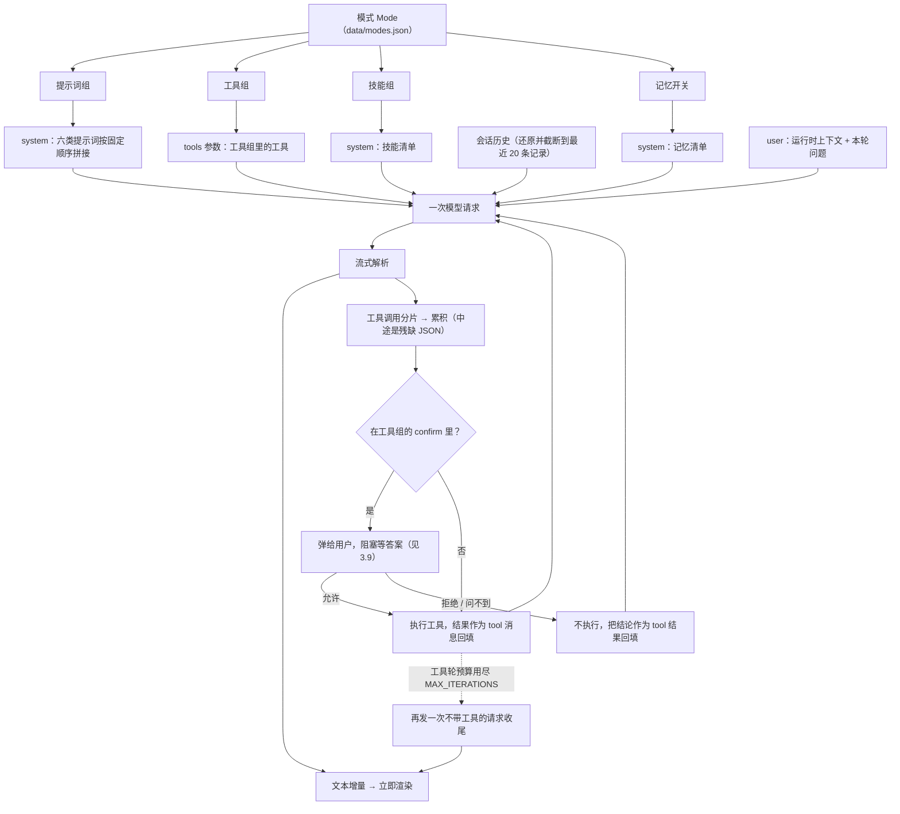

# quill

一个可本地运行、可二次开发的 Agent 应用。**业务层（`src/quill_agent/`）与界面完全分离**，
业务层是纯 Python、不依赖任何界面框架，所以同一份逻辑今天能被 Vue 前端调用，
明天也能被命令行或脚本复用：

```
web/ (Vue)  ──HTTP/SSE──>  server/ (FastAPI)  ──>  src/quill_agent/  (业务层，纯 Python)
```

---

## 目录

- [1. 运行环境要求与运行方式](#1-运行环境要求与运行方式)
  - [环境要求](#环境要求)
  - [快速开始](#快速开始)
  - [常用命令](#常用命令)
  - [桌面壳（可选）](#桌面壳可选)
  - [发布前检查](#发布前检查)
  - [首次使用](#首次使用)
- [2. 目录结构](#2-目录结构)
  - [分层约定](#分层约定)
- [3. Agent 设计逻辑](#3-agent-设计逻辑)
  - [3.1 提示词](#31-提示词)
  - [3.2 工具](#32-工具)
  - [3.3 技能](#33-技能)
  - [3.4 记忆](#34-记忆)
  - [3.5 用户能看到的文件](#35-用户能看到的文件)
  - [3.6 资源分组与模式](#36-资源分组与模式)
  - [3.7 模式：Agent 的一套完整配置](#37-模式agent-的一套完整配置)
  - [3.8 模式如何影响一次对话](#38-模式如何影响一次对话)
  - [3.9 让 Agent 停下来等人](#39-让-agent-停下来等人)
  - [3.10 沙箱：把边界交给内核](#310-沙箱把边界交给内核)
- [4. 业务层对象与函数（二次开发指南）](#4-业务层对象与函数二次开发指南)
  - [4.1 配置 `quill_agent.config`](#41-配置-quill_agentconfig)
  - [4.2 数据模型 `quill_agent.models`](#42-数据模型-quill_agentmodels)
  - [4.3 持久化 `quill_agent.store`](#43-持久化-quill_agentstore)
  - [4.4 会话历史 `quill_agent.history`](#44-会话历史-quill_agenthistory)
  - [4.5 界面偏好 `quill_agent.preferences`](#45-界面偏好-quill_agentpreferences)
  - [4.6 提示词库 `quill_agent.prompts`](#46-提示词库-quill_agentprompts)
  - [4.7 技能库 `quill_agent.skills`](#47-技能库-quill_agentskills)
  - [4.8 记忆 `quill_agent.memory`](#48-记忆-quill_agentmemory)
  - [4.9 接口连通性 `quill_agent.core`](#49-接口连通性-quill_agentcore)
  - [4.9.1 Ollama：本地模型怎么接](#491-ollama本地模型怎么接)
  - [4.10 模型规格快照 `quill_agent.model_catalog`](#410-模型规格快照-quill_agentmodel_catalog)
  - [4.11 Agent 循环 `quill_agent.agent`](#411-agent-循环-quill_agentagent)
  - [4.11.1 交互通道 `quill_agent.interaction`](#4111-交互通道-quill_agentinteraction)
  - [4.12 工具层 `quill_agent.tools`](#412-工具层-quill_agenttools)
  - [4.13 联网搜索 `quill_agent.search`](#413-联网搜索-quill_agentsearch)
  - [4.14 用量统计 `quill_agent.usage`](#414-用量统计-quill_agentusage)
  - [4.15 内容写入的名字校验 `quill_agent.naming`](#415-内容写入的名字校验-quill_agentnaming)
  - [4.16 二次开发：三个常见场景](#416-二次开发三个常见场景)
- [5. 持久层设计](#5-持久层设计)
  - [5.1 数据文件一览](#51-数据文件一览)
  - [5.1.1 并发写同一份文件](#511-并发写同一份文件)
  - [5.2 各文件的数据结构](#52-各文件的数据结构)
  - [5.3 为什么用 JSONL 而不是 JSON 数组](#53-为什么用-jsonl-而不是-json-数组)
  - [5.4 归档机制](#54-归档机制)
  - [5.4.1 导出：会话是产出物，得拿得走](#541-导出会话是产出物得拿得走)
  - [5.5 旧数据兼容](#55-旧数据兼容)
- [6. 界面层：Vue](#6-界面层vue)
  - [6.1 为什么换掉 Streamlit](#61-为什么换掉-streamlit)
  - [6.2 结构](#62-结构)
  - [6.3 三个值得留意的实现点](#63-三个值得留意的实现点)
  - [6.4 组件库：Element Plus（按需引入）](#64-组件库element-plus按需引入)
  - [6.5 启动](#65-启动)
  - [6.6 输入区：两个设计点](#66-输入区两个设计点)
  - [6.7 附件与工作目录](#67-附件与工作目录)
  - [6.8 一个 CSS 坑：grid item 的 `min-height`](#68-一个-css-坑grid-item-的-min-height)
  - [6.9 顶栏：用 Teleport 收拢页面标题](#69-顶栏用-teleport-收拢页面标题)
  - [6.10 侧边栏：「新建任务」是个动作，不是页面](#610-侧边栏新建任务是个动作不是页面)
  - [6.11 品牌素材与主题](#611-品牌素材与主题)
  - [6.12 提示词页：标识是 id，不是名字](#612-提示词页标识是-id不是名字)
  - [6.13 模式页：把三组拼成一个「模式」](#613-模式页把三组拼成一个模式)
  - [6.14 任务页：上下文用量仪表盘](#614-任务页上下文用量仪表盘)
  - [6.14.1 任务清单：把「现在到哪一步了」摊开](#6141-任务清单把现在到哪一步了摊开)
  - [6.14.2 运行跟着会话走，不跟着界面走](#6142-运行跟着会话走不跟着界面走)
  - [6.15 API 设置页：模型从列表里选](#615-api-设置页模型从列表里选)
  - [6.16 组的成员多选：全选](#616-组的成员多选全选)
  - [6.17 两处布局修正：侧边栏滚动与折叠内容缩进](#617-两处布局修正侧边栏滚动与折叠内容缩进)
  - [6.18 用量页：手写 SVG，不引图表库](#618-用量页手写-svg不引图表库)
  - [6.19 模式随会话记忆](#619-模式随会话记忆)
  - [6.20 提示词 / 技能的编辑弹窗：CodeMirror 6](#620-提示词-技能的编辑弹窗codemirror-6)
  - [6.21 几处小修，以及两个容易反复踩的点](#621-几处小修以及两个容易反复踩的点)
  - [6.22 确认卡片：浮在输出区底部，不放弹窗也不进消息流](#622-确认卡片浮在输出区底部不放弹窗也不进消息流)
  - [6.23 停止按钮：和发送按钮共用同一个位置](#623-停止按钮和发送按钮共用同一个位置)
  - [6.24 计划卡片：正文用 Markdown 渲染，另外多一个说明框](#624-计划卡片正文用-markdown-渲染另外多一个说明框)
  - [6.25 消息流跟随最新内容](#625-消息流跟随最新内容)
  - [6.26 联网搜索页：把「搜」和「读」拆成两个工具](#626-联网搜索页把搜和读拆成两个工具)
  - [6.27 任务页的思考开关](#627-任务页的思考开关)
  - [6.28 改动记录器：看得见改了哪几行，也回得去](#628-改动记录器看得见改了哪几行也回得去)
  - [6.29 git 工具：为什么不把 `git` 交给 `run_command`](#629-git-工具为什么不把-git-交给-run_command)
  - [6.30 符号检索：正则，不是 LSP](#630-符号检索正则不是-lsp)
  - [6.31 每条消息的复制与删除](#631-每条消息的复制与删除)
  - [6.32 MCP：工具的来源第一次不只来自本仓库](#632-mcp工具的来源第一次不只来自本仓库)
  - [6.33 跑到一半的对话，也是会话记录](#633-跑到一半的对话也是会话记录)
  - [6.34 并行子代理：一次派多个](#634-并行子代理一次派多个)
  - [6.35 正文和工具调用为什么是穿插的](#635-正文和工具调用为什么是穿插的)
  - [6.36 左右两条常驻面板：公共剪贴板与公共备忘录](#636-左右两条常驻面板公共剪贴板与公共备忘录)
  - [6.37 桌面壳里玻璃板怎么让出标题栏](#637-桌面壳里玻璃板怎么让出标题栏)
- [许可](#许可)

---


## 1. 运行环境要求与运行方式

### 环境要求

| 项 | 要求 |
| --- | --- |
| Python | **>= 3.10**（开发环境用 3.12，见 `.python-version`） |
| 包管理 | [uv](https://github.com/astral-sh/uv)（仓库内已含 `uv.lock`，安装可复现） |
| Node | **>= 20**（只在构建 / 开发前端时需要，见下） |
| 操作系统 | macOS / Linux / Windows 均可。工作目录选择器会按平台自动适配 |

> **Windows 用户**：`make` 不是系统自带的（Git Bash / MSYS2 / chocolatey 里都有）。没有它时，
> 把下面的目标换成命令本身即可：`make dev` → `uv sync --extra dev`；
> `make api` → `uv run uvicorn server.main:app --reload --port 8000`；
> `make build` → `cd web && npm install && npm run build`。
> 另外**沙箱在原生 Windows 上没有后端** —— 那边的默认值因此就是 `off`（改成别的档位会让
> 命令全部被拒）。需要内核级隔离时在 WSL2 里跑，那条路直接复用 Linux 的 `bwrap`（见 3.10）。

### 快速开始

**最省事的一条路：双击启动脚本。** macOS 双击 `start.command`、Windows 双击 `start.bat`、
Linux 跑 `./start.sh` —— 脚本会检查 `uv`、装好依赖、起服务并自动打开浏览器。唯一的前置是
[uv](https://github.com/astral-sh/uv)（它会顺带装好本项目需要的 Python），首次运行要联网下载。

想把命令握在自己手里的话：

```bash
# 1. 安装后端依赖（首次会自动创建 .venv 并下载对应 Python）
make dev

# 2. 复制环境变量模板（可选，不配也能跑）
cp .env.example .env

# 3. 构建前端并启动（构建只需一次，之后直接 make api）
make build && make api     # 浏览器打开 http://localhost:8000
```

`web/dist` 存在时后端会把它一起托管（见 `server/main.py`）—— 不用常驻 Node，也不用开两个
终端。等价的纯命令写法是 `uv run quill serve --open-browser`，它比 `make api` 多做三件事：
端口被占时自动顺延、启动时打印数据根在哪、自动开浏览器。

**改前端代码时：前端开发模式** —— 两个终端：

```bash
cd web && npm install      # 只需一次
make api                   # 终端 A：后端，监听 8000
make web                   # 终端 B：前端，浏览器打开 http://localhost:5173
```

前端开发服务器会把 `/api` 转发给后端，所以浏览器看到的是同源请求，不用配跨域。

### 常用命令

| 命令 | 说明 |
| --- | --- |
| `make install` | 只装运行时依赖 |
| `make dev` | 装运行时 + 开发依赖（pytest / ruff） |
| `make api` | 启动后端（FastAPI，8000）；`web/dist` 存在时连前端一起托管 |
| `make serve` | 同上，但端口被占时顺延、并自动打开浏览器（等价于 `quill serve --open-browser`） |
| `make web` | 启动前端开发服务器（Vue，5173） |
| `make build` | 构建前端产物到 `web/dist` |
| `make cli` | 运行命令行入口 |
| `make test` | 运行单元测试 |
| `make e2e` | 前端端到端冒烟测试（Playwright，用系统 Chrome，不需要后端） |
| `make lint` | 静态检查（ruff） |
| `make fmt` | 格式化代码 |
| `make clean` | 清理缓存与虚拟环境 |

### 桌面壳（可选）

```bash
uv sync --extra desktop    # 装可选依赖（pywebview）
uv run quill-desktop       # 起服务 + 开一个原生窗口
```

它和浏览器版是**同一个后端、同一个地址**：窗口只是把 `quill serve` 那个页面装进系统
WebView（macOS 是 WKWebView、Windows 是 WebView2、Linux 是 WebKitGTK），前端与后端
一行都不用改 —— 调试时照旧可以用浏览器打开同一个地址。

几个行为值得知道：

- **重复启动不会起第二个后端**：先扫一遍默认端口段，认出已经在跑的 Quill 就复用它的
  服务（判据是 `/api/health` 的应答，不是「端口通不通」—— 那会把碰巧占了同一端口的
  别的程序认成自己人）；
- **窗口等服务就绪才开**：首启要播种出厂资源、迁移老数据、连 MCP，耗时不确定，所以按
  `/api/health` 轮询而不是猜一个秒数；
- **关窗带走服务**：走 uvicorn 的退出流程，MCP 用 stdio 起的子进程在 lifespan 里收掉；
- **日志在数据根下的 `desktop.log`**：双击启动没有终端，启动自检与报错只能落到文件里；
- **macOS 上标题栏融进界面**：窗口内容延伸进系统标题栏，那条灰消失，红绿灯浮在界面
  左上角（玻璃板顶到窗口最上边，板内内容位置不变）。它靠 pywebview 的 `frameless` 在
  窗口创建时设好样式位 —— 那个位在窗口显示之后再改是不生效的，来龙去脉见 CHANGELOG
  0.1.21。这是纯观感，拿不到原生句柄或没有 pyobjc 时会安静退回系统标题栏；要主动关掉
  就设 `QUILL_DESKTOP_TITLEBAR=system`；
- **数据根由壳自己钉**：环境里已经有 `QUILL_HOME` 就一个字都不动；否则从解释器位置往上找
  `pyproject.toml`，找到就用那个目录（覆盖「打包产物放在源码目录里跑」这种用法）；都找不到
  才交给平台数据目录。**不能指望 cwd** —— 从访达双击启动时 cwd 是 `/`，数据明明在项目里，
  壳却会去 `~/Library/Application Support/Quill` 翻一个空目录，看起来像「数据全丢了」
  （数据没丢，只是读错了地方，见 4.1）。

打包成 macOS App（未签名，本机试用）：

```bash
make desktop              # 构建前端产物 + 打包，产出 release/Quill.app
open release/Quill.app    # 首次要「右键 → 打开」（未签名）
```

`make desktop` 两步的顺序不能反：打包脚本是把 `web/dist` **复制**进包里，不重新构建前端 ——
所以它自己会先跑一遍 `npm run build`，避免把旧界面打进去。脚本另外还管三件事：

- **复用本机 uv 装过的 Python**当运行时，找不到才去下载（那条路在国内经常只有几十 KB/s）；
- 打完**向 Launch Services 重新登记**一次。打包是先整个删掉再原地重建，不登记的话
  Finder 里会显示通用图标（包里 `.icns` 其实是好的）；
- 处理「一次删除超过 500 个文件要人工确认」这类环境的保护阈值 —— 每次重打都要手动加
  环境变量不该是调用者要记住的事。

`make_desktop.py` 会先找**本机 uv 装过的 Python**当运行时（uv 下的就是
python-build-standalone 的 `install_only` 包，和脚本自己要下的是同一个东西），找不到才去
GitHub 下载 —— 那条路在国内经常只有几十 KB/s。装依赖优先用 uv（并行 + 全局缓存），
没有才退回 pip。

装完会做一次**导入自检**（用随包的运行时导入 pywebview / quill_agent / server）：缺包或
路径摆错当场就报，不必等双击才发现。

产物约 **101 MB**（Python 运行时 + 依赖树 + 前端产物）。脚本会做一轮体积裁剪：`bin/` 里
三份同样的 18 MB 可执行文件合成一份加符号链接、删掉运行时自带的 pip、`libpython` 的
dylib（`bin/python3` 是静态链接的，`otool -L` 验过）、pyobjc 的测试包、tcl/tk 与 tkinter
等 —— 每条都只删「运行时不会碰」的东西，而**裁完必须真跑一次**：自检只验证 import，
WebView 后端要到开窗口那一刻才加载。

Windows / Linux 的打包、代码签名与公证在后面的阶段。

### 发布前检查

```bash
uv run python scripts/check_clean_install.py      # 干净环境装一遍 + 跑测试
uv run python scripts/make_release.py --windows   # 打测试包
```

第一条值得每次发布前跑一次：它新建一个空 venv、按 `pyproject.toml` 装依赖、导入应用、
跑完整测试。**本地环境是测不出依赖问题的** —— 本地装着一堆东西，有些依赖是「借」别人
带进来的（`python-multipart` 就曾经是被另一个包顺带装上的，那个包被拆掉之后它跟着消失，
用户那边直接启动失败）。干净环境才会现形。

**CI 跑的就是本地那几条命令**（`.github/workflows/ci.yml`，push / PR 触发）：后端
`ruff` + `pytest`，前端 `npm ci` + `typecheck` + `build` + `e2e`。所以本地跑绿了 CI 基本
就绿了，唯一差别是 **CI 上没有系统 Chrome** —— 那边用 Playwright 自带的 chromium
（`npx playwright install --with-deps chromium`），而本地用的是系统 Chrome（见
`playwright.config.ts` 里那个 `process.env.CI` 分支）。

### 首次使用

应用启动后需要先配置一个模型，否则任务页无法发起对话：

1. 打开左侧「**API设置**」页 → 「新建连接」
   - 填接口地址（如 `https://api.deepseek.com`）、协议、API Key
   - 点「**获取模型列表**」把该端点的模型拉回来（走 `GET /models`），从下拉里勾选；
     也可直接手敲模型名（下拉支持输入后回车新建）
   - 「上下文窗口」填该模型的窗口大小（tokens），任务页右侧的用量仪表盘按它算占比
2. 回到「**任务**」页 → 在功能区选择模型 → 开始对话

> 配置示例（DeepSeek 官方）
> 地址 `https://api.deepseek.com`，协议 `OpenAI Chat Completions`，
> 模型名 `deepseek-chat` / `deepseek-reasoner`

> 配置示例（本地 Ollama，见 4.9.1）
> 协议选 `Ollama（本地）`，**地址留空即可**（自动用 `http://localhost:11434/v1`），
> Key 不用填，模型名填 `ollama list` 里看到的那些（如 `qwen3:8b`）

---

## 2. 目录结构

```
quill-agent/
├── start.command                 # macOS 双击启动（双击 .command 才会被 Finder 当脚本）
├── start.sh                      # Linux / 终端：./start.sh
├── start.bat                     # Windows 双击启动
│
├── server/                       # 后端：把业务层暴露成 HTTP + SSE
│   ├── main.py                   # FastAPI 应用装配（CORS、路由挂载）
│   ├── stores.py                 # 各存储的构造入口（每次新建，不缓存）
│   ├── schemas.py                # 请求体模型
│   └── routes/                   # 按「前端一个页面 ≈ 一个模块」拆分
│
├── web/                          # 前端：Vue 3 + Vite + TypeScript
│   ├── vite.config.ts            # 含 /api 反向代理
│   ├── dist/                     # 构建产物（make build 生成；**进版本库**，见 1、6.5）
│   └── src/
│       ├── api/                  # 接口封装（REST + SSE 解析）
│       ├── stores/               # 共享状态（会话、主题、公共剪贴板、公共备忘录）
│       ├── components/           # 侧边栏、消息条目、输入区部件、公共剪贴板 / 备忘录、任务清单…
│       └── views/                # 各页面，与路由一一对应
│
├── src/quill_agent/                 # 业务层 —— 纯 Python，不依赖任何界面
│   ├── __init__.py               # 版本号
│   ├── config.py                 # 集中式配置（环境变量 / .env）+ 数据根规则（见 4.1）
│   ├── bootstrap.py              # 首次运行：把出厂资源播种到数据根（只补不缺）
│   ├── defaults.py               # 出厂资源：两个默认模式，以及它们引用的各组与提示词
│   ├── sandbox.py                # 沙箱：执行类工具的内核级边界（见 3.10）
│   ├── models.py                 # 数据模型（Pydantic）：连接、提示词组、工具组、技能组、模式
│   ├── locking.py                # 跨进程文件锁 + 原子写（并发写 data/ 会丢更新，见 5.1.1）
│   ├── store.py                  # 配置类数据持久化（JSON）
│   ├── preferences.py            # 界面偏好（上次选的模型 / 模式 / 工作目录 / 会话草稿）
│   ├── history.py                # 会话历史（JSONL + 归档）
│   ├── prompts.py                # 提示词库：id 文件名 + 元信息承载名字与分类（见 5.2）
│   ├── skills.py                 # 技能库：读写 skills/ 目录（元信息 + 正文）
│   ├── memory.py                 # 记忆：跨会话保留的长期事实（JSON）
│   ├── usage.py                  # 用量统计：按天、按任务汇总 token（扫描会话文件）
│   ├── model_catalog.py          # 模型规格快照：模型名 -> 上下文窗口（查表）
│   ├── naming.py                 # 用户输入的内容名 -> 安全文件名的校验
│   ├── search.py                 # 联网搜索：后端配置 + 两家服务商的调用 + 抓正文
│   ├── core.py                   # 接口连通性测试（拉取模型列表）
│   ├── agent.py                  # ★ Agent 循环：组装上下文 → 请求 → 执行工具
│   ├── interaction.py            # 运行期交互通道：工具问用户并阻塞等答案（见 3.9）
│   ├── cli.py                    # 命令行入口
│   ├── desktop.py                # 桌面壳：复用/启动服务、开原生窗口、macOS 标题栏融合（见 1）
│   └── tools/                    # 工具层
│       ├── __init__.py           # 导出 registry（import 即触发工具注册）
│       ├── base.py               # ToolSpec / ToolRegistry：声明、路由、执行
│       ├── builtin.py            # 通用内置工具（read_skill / create_skill / delete_skill / remember）
│       ├── files.py              # 文件工具（读写搜 / 新建移动复制删除）+ 路径边界校验 + 附件落盘
│       ├── shell.py              # 执行工具：跑命令 / 起后台进程（默认不受工作目录约束，可加沙箱）
│       ├── subagent.py           # 子代理：把一趟独立调研派出去，只把结论带回来
│       ├── todo.py               # 任务清单：把一件事拆成几步，进度摊开给用户看
│       ├── web.py                # 联网工具（web_search / web_fetch）
│       ├── git.py                # 版本控制：status / diff / commit（只提交本地，见 6.29）
│       └── symbols.py            # 代码符号检索：outline / find_symbol（正则启发式，见 6.30）
│
├── scripts/
│   ├── make_desktop.py           # 打 macOS App（make desktop 调它，见 1）
│   ├── make_release.py           # 打测试包（zipfile：中文名在 Windows 上不乱码）
│   ├── check_clean_install.py    # 干净环境装一遍 + 跑测试（发布前跑，见 1）
│   └── windows-测试说明.txt      # 随 Windows 测试包分发的一页说明
│
├── prompt/                       # 提示词正文：<id>.md，名字与分类写在文件头（见 5.2）
│   ├── 身份/  能力/  工具策略/  工作流程/  输出规范/  约束/
│
├── skills/                       # 技能（一个子目录一个技能）
│   ├── 代码审查/SKILL.md
│   └── 提交信息/SKILL.md
│
├── data/                         # 运行时数据；就地运行时用这里，否则在平台数据目录（见 4.1）
│   ├── models.json               # 模型连接配置
│   ├── model_catalog.json        # 模型规格快照（模型名 -> 上下文窗口，可手工编辑）
│   ├── providers.json            # 服务商清单（官方端点 + 协议），和上面那份快照同一次下载写出
│   ├── mcp_servers.json          # MCP 服务器配置
│   ├── prompt_groups.json        # 提示词组（各类选了哪个提示词）
│   ├── tool_groups.json          # 工具组（工具的搭配方案）
│   ├── skill_groups.json         # 技能组（技能的搭配方案）
│   ├── modes.json                # 模式（引用三类组 + 记忆开关 + 偏好模型）
│   ├── memory.json               # 长期记忆条目
│   ├── preferences.json          # 界面偏好
│   ├── search.json               # 联网搜索（后端、各自的 Key、端点）
│   └── conversations/            # 会话历史
│       ├── active/               #   活跃会话
│       └── archived/             #   归档会话
│
├── release/                      # 打包产物（make desktop 生成；不进版本库）
├── tests/                        # 单元测试
├── .env.example                  # 环境变量模板
├── pyproject.toml                # 项目元数据、依赖、ruff / pytest 配置
├── Makefile                      # 常用命令
└── uv.lock                       # 依赖锁定
```

### 分层约定

依赖方向**严格单向**：

```
web/ ──HTTP──>  server/ ──依赖──>  src/quill_agent/
```

- `src/quill_agent/` 内**不允许** import 界面层的东西（HTTP 框架、前端、终端 UI）。这条约束是
  整个架构的支点：它保证业务逻辑能被 UI、CLI、测试、脚本任意复用，也让底层改动不会牵动界面。
- `server/` 与 `web/` 内**不写业务逻辑**，只做「取输入 → 调底层 → 展示结果」。数据读写的代码
  全部在业务层，路由里出现 `open()` / `json.load()` 基本就是分层漏了。

---

## 3. Agent 设计逻辑

先看一张总体流程图。四类资源（提示词 / 记忆 / 技能 / 工具）各自从**模式**里被解析出来，
分别落到 system 消息、`tools` 参数和 user 消息上，然后进入「请求 → 流式解析 → 执行工具 → 再请求」
这个循环：



> system 消息刻意拆成三条（提示词 / 记忆 / 技能清单）而不是拼成一条：三者随模式变化的部分
> 不同，拼在一起的话换个技能组就把整段前缀打乱，模型侧的前缀缓存跟着作废（见 3.1）。

### 3.1 提示词

**核心概念：正文是文件，组合是配置。**

```
提示词正文  →  prompt/<id>.md（文件头写 name / category）  ← 用户直接编辑文件
提示词组（组合）→  data/prompt_groups.json      ← 界面上配置：每类挑一个
```

六类提示词（顺序即拼装顺序）：

| 类别 | 作用 |
| --- | --- |
| 身份 | 模型扮演什么角色 |
| 能力 | 具备哪些能力与知识边界 |
| 工具策略 | 何时使用工具、如何使用 |
| 工作流程 | 处理任务的标准步骤 |
| 输出规范 | 回答的格式与风格要求 |
| 约束 | 安全与合规红线 |

一个「**提示词组**」= 从六类里各挑一个（**都可以不挑**）拼成的一套系统提示词。
六类全不挑也是合法配置，等价于「不带任何系统提示词」的纯问答。

> 这套东西原先就叫「模式」。现在模式指三类组 + 记忆的组合（见 3.6 / 3.7），所以它改名叫
> **提示词组**，数据也从 `data/modes.json` 挪到 `data/prompt_groups.json` —— 那个文件名
> 归了新模式，两边共用一个文件的话新模式一写入就会把提示词组整份覆盖掉。
> 偏好模型一并搬到模式上（见 3.7）。

**几个设计决定：**

- **正文放文件而不是数据库**。提示词是用户要反复迭代的东西，`.md` 文件方便纳入版本控制，
  也能用自己顺手的编辑器改。界面上同样能直接改（见 6.20），但那只是**另一条写入路径**，
  文件始终是唯一的事实来源 —— 界面上改完落下来的还是那个 `.md`。
- **拼装顺序固定按 `PROMPT_CATEGORIES`**，与用户在弹窗里的勾选顺序无关。顺序稳定 → 同一组每次拼出的
  system prompt 完全一致 → 命中模型侧的前缀缓存（省钱、降延迟）。
- **引用的文件被删除不会报错**，只是该类别不参与拼装；界面上会标注「（文件缺失）」。

**运行时上下文不放 system prompt**。当前时间、工作目录、附件路径这些每轮都在变的信息，
放在 user 消息开头。如果塞进 system prompt，前缀缓存会永远失效。见 `agent.build_user_message()`。

### 3.2 工具

**定义只在代码里，没有第二份开关。** 给不给某个工具由模式的工具组决定（见 3.8）——
同一个工具模式 A 要、模式 B 不要，一个全局布尔值表达不了这件事。

```python
@registry.tool(
    description="一句话说清「什么时候该用我」—— 这是模型判断的唯一依据。",
    category="分类（只用于界面筛选，不会发给模型）",
    parameters={"type": "object", "properties": {...}, "required": [...]},
)
def your_tool(...) -> str:
    ...
```

- **`description` 是模型判断要不要调用的唯一依据**，写得越贴合真实场景，调用越准。
- 不在模式的工具组里的工具**不会被发给模型**（`registry.schemas(only=...)`），模型自然不会请求调用它。
- **执行契约**：工具内部任何异常都转成可读文本返回，不向上抛。模型看到错误说明后通常能自行修正，
  而抛异常会直接打断整个 Agent 循环。

**当前工具清单（33 个）：**

| 工具 | 分类 | 说明 |
| --- | --- | --- |
| `list_dir` | 文件 | 列出目录内容：只列一层，带文件大小 |
| `read_file` | 文件 | 读文件内容：带行号、自动截断，可用 `offset` 分页续读 |
| `write_file` | 文件 | 写入 / 覆盖文件：自动创建父目录、原子写入 |
| `edit_file` | 文件 | 局部替换：要求 `old_string` 在文件中唯一 |
| `search_content` | 文件 | 按正则搜索**文件内容**，返回 `文件:行号: 内容` |
| `search_files` | 文件 | 按通配符查找**文件名**，如 `*.py`、`**/*.json` |
| `make_dir` | 文件 | 新建目录（父目录不存在时一并创建） |
| `move_file` | 文件 | 移动 / 重命名文件或目录：**不覆盖**已有目标 |
| `copy_file` | 文件 | 复制文件或目录：**不覆盖**已有目标 |
| `delete_file` | 文件 | 删除文件或**空**目录（非空目录会拒绝） |
| `run_command` | 执行 | 在工作目录里跑一条 shell 命令（见下） |
| `start_process` | 执行 | 起一个长驻进程（dev server / watch），立刻返回进程号（见下） |
| `process_output` | 执行 | 取后台进程自上次之后的新输出，兼报退出码 |
| `stop_process` | 执行 | 停掉一个后台进程（连带清掉它派生的子进程） |
| `list_processes` | 执行 | 列出当前所有后台进程 |
| `spawn_agents` | 子代理 | 派子代理独立跑调研，可一次派几个**并行**；只把结论带回来（上下文压缩用） |
| `todo_write` | 规划 | 把这件事拆成几步、随进度重写清单，用户据此看到进度（见 6.14.1） |
| `ask_user` | 交互 | 向用户提问并停下等他回答（见 3.9） |
| `submit_plan` | 交互 | 交一份实施方案给用户审批，批准了才动手（见 3.9） |
| `read_skill` | 技能 | 读取某个技能的完整说明（技能体系的按需加载入口） |
| `create_skill` | 技能 | 把一套做法总结成技能存进技能库（见 3.3，只新建、不覆盖） |
| `delete_skill` | 技能 | 删除一个技能及其整个目录（不可逆，每次先问用户；见 3.3） |
| `remember` | 记忆 | 写入一条长期记忆（跨会话保留的偏好与事实） |
| `forget` | 记忆 | 按原文忘掉一条记忆（要求一字不差，避免误删） |
| `web_search` | 联网 | 联网搜索，返回标题、地址和摘要（见 4.13、6.26） |
| `web_fetch` | 联网 | 带着一个问题抓一个网页、只取相关的那部分正文（见 4.13、6.26） |
| `recall_history` | 对话 | 按关键词检索更早的对话原文（正文和工具结果都算）—— 历史被截断时的找回入口（见 3.4） |
| `outline` | 代码 | 列出文件（或目录）的符号骨架：类 / 函数 + 行号。**读长文件前先看它**（见 6.28） |
| `find_symbol` | 代码 | 跨文件找符号的定义与引用位置。正则启发式，比 `search_content` 准（见 6.28） |
| `git_status` | 版本控制 | 看当前分支、已暂存 / 未暂存的改动、未跟踪的文件（见 6.29） |
| `git_diff` | 版本控制 | 看尚未提交的改动内容（unified diff），可限定单个文件（见 6.29） |
| `git_log` | 版本控制 | 看最近的提交记录（短哈希 + 日期 + 说明） |
| `git_commit` | 版本控制 | 提交到**本地**仓库：不可逆，每次先问用户；**不 push**（见 6.29） |

> `search_content` 是这批里最关键的一个：没有它，模型要确认「某个函数在哪定义」就只能挨个读文件，
> token 消耗是几十倍。它会自动跳过 `.venv` / `.git` / `__pycache__` 等目录，并按行截断、
> 限制命中数量 —— 这三条都是为了不把上下文撑爆。

> 除了这些**内置**工具，**MCP 服务器**提供的工具也会出现在同一张注册表里（名字形如
> `mcp__<服务器>__<工具>`，分类是 `MCP · <服务器>`）。它们连上之后才注册 —— 见 6.32。

**工具组：工具的唯一搭配单位。** 工具定义里没有第二份开关，给不给由模式的工具组决定（见 3.6 / 3.8）：

```json
{
  "id": "8f2c1a...",
  "name": "文件操作",
  "description": "读写和搜索工作目录里的文件",
  "tools": ["list_dir", "read_file", "write_file", "delete_file"],
  "confirm": ["delete_file"]
}
```

- `tools` **允许为空** —— 「纯对话」这种组要的就是一个都不给，靠全局开关只能挨个关。
- `confirm` 是 `tools` 的**子集**，表示「每次调用都要用户先点头」（见 3.9）。它补上了原先
  缺掉的一档：`run_command` 这类工具本来只能在「加进组 = 把一台机器交出去」和
  「不加 = 一点用没有」之间二选一，有了它才能表达「给，但动手前问我」。
- **组名唯一**：模式编辑界面里同名会让用户分不清两个组各自是什么。
- **成员名必须真实存在**：保存时对着 `registry` 查，查不到直接 400。拼错的工具名不会报错，
  只会让模型端的工具菜单静默少一项，用户还以为它在。`confirm` 只需是 `tools` 的子集 ——
  「不在场却要求确认」是自相矛盾的配置，同样在保存时 400。
- 界面上新建 / 编辑共用一张弹窗表单，成员多选下拉里平铺了分类和简介（见 6.16）。

**文件工具的安全边界：**

所有文件工具都跑在工作目录（`work_dir`）内，路径统一经 `PathGuard` 校验：

```python
resolved = (root / raw).resolve()           # 展开 .. 和符号链接
if not resolved.is_relative_to(root):
    raise ValueError("拒绝访问工作目录之外的位置")
```

`resolve()` 会跟随符号链接，所以「在工作目录里放一个软链接指向外部」这条绕过路径也拦得住
（只做字符串层面判断 `..` 是拦不住的）。

**写操作额外上三道锁**（`make_dir` / `move_file` / `copy_file` / `delete_file`）：

1. **不覆盖** —— `move_file` / `copy_file` 的目标路径必须还不存在。覆盖是这条链上最容易误伤
   的动作，而「复制过去把原来的盖掉」往往不是模型真正想要的；真要替换，先 `delete_file` 是明确的；
2. **父目录必须已存在** —— 顺带把目录建出来听着方便，但一次手滑就能在错的地方铺出一整条路径。
   要建目录，用 `make_dir`；
3. **复制目录时不跟随符号链接**（`copytree(..., symlinks=True)`）—— 跟随的话，目录里一个指向
   工作目录外的链接会把外面那份内容**抄进**工作目录。文件工具承诺的是「只碰工作目录」，
   这条口子必须堵上。

删除只对**空目录**生效：递归删除是另一回事，一次误判就没了整棵目录树，这个工具不承担那种风险。
另外这几个工具都不接受把**工作目录本身**当源或当删除目标。

工作目录可在任务页的 📁 里切换，取值优先级：**界面选择 > 配置项 `WORK_DIR`**。
选过的目录若被删除，会自动回落到配置默认值，不会让工具直接罢工。

**`run_command` 和 `start_process` 不受这条边界约束。** 文件工具的能力边界是工作目录，
而一条命令（`cat ~/.ssh/id_rsa`、`curl …`、`pip install …`）不受它约束 —— cwd 只是它
「从哪里开始」，不是它「只能到哪里」。这件事没法靠参数校验抹平，只能靠三件事：

1. **它是自选的**：工具定义不会自动进入任何模式的工具组，要用必须显式加进去 ——
   这是唯一真正的边界，也意味着用户加它的那一下就是一次知情同意；
2. **对模型说清楚**：description 里点明它不受工作目录限制、点明不可逆操作要先问用户；
3. **机械防护只做「防手滑」**，而且分成两档（见 3.9）：
   - `_reject_reason()` **直接拒绝**交互式程序（`vim` / `top` / `ssh`…）。它们和危险命令不同，
     问用户也没用 —— 用户说允许，它照样在那儿等一个永远不会到来的回车。
   - `_danger_reason()` 认出看着危险的写法（`rm -rf /`、fork 炸弹、`sudo`…）时**弹给用户点头**。
     判定危险的是我们，能不能承担风险的是用户。

   **换个写法就能绕过这两个判断，所以它们都不是安全边界**，只负责拦住「模型一时糊涂写出来的
   那几条」。这条路上真正的边界是第 1 条（得有人把它加进工具组）和**沙箱**（见 3.10）——
   沙箱开启后，命令跑在一个只有工作目录可写、且默认断网的命名空间里，越界写在物理上就失败，
   和模型怎么写命令无关。

另外三条是执行类工具的通用要求，缺一个都会出问题：

- **必须有超时**（默认 30 秒、上限 300 秒）：一条 `sleep 1000` 会把 chat 端点的 worker
  线程占住不放（**后台进程是例外**，它必须活过一轮，见下）；
- **必须杀进程组**：只对 shell 本身发信号，它派生的子进程会变成孤儿继续跑，下一轮再来
  抢端口、抢文件。所以用 `start_new_session=True` 让它自成进程组，超时按组 `SIGTERM`
  → `SIGKILL`；
- **输出必须截断**：`npm install` 的日志动辄几万行，原样回填会撑爆上下文，也会把会话文件
  顶到几 MB。**砍中间而不是砍尾巴** —— 头几行是它在干什么，最后几十行是结论和报错。

`stderr` 并进 `stdout`：构建日志的先后顺序本身就是信息，分开收就得自己去猜它们的相对位置，
而退出码已经能说明成败。ANSI 颜色码会被剥掉 —— 有些工具不管有没有 TTY 都上色，
那些转义序列进了上下文纯属噪声。

**后台进程（`start_process` / `process_output` / `stop_process` / `list_processes`）。**
`run_command` 是「跑完才返回」的同步调用，且封顶 300 秒 —— 起一个 dev server 只有两种
结局：要么把这一轮的 worker 线程占满两分钟后被掐掉，要么超时被杀。可「改完代码重启前端」
这类活，恰恰必须让进程**活过这一轮**。所以后台进程单列一组，几张取舍如下：

| 取舍 | 怎么做的 | 为什么 |
| --- | --- | --- |
| 不给超时 | 不设 `timeout`，只靠 `stop_process` 显式停 | dev server 刚到点就被杀，等于没这个工具（这是「必须有超时」的例外） |
| 输出靠线程搬 | 每个进程一条线程持续读管道，攒进内存缓冲 | 管道缓冲区写满后子进程会阻塞在 write 上假死 —— 没人读的输出会把它憋死 |
| 取输出是增量 | `process_output` 只给「上次之后」的新行 | dev server 日志越滚越长，每次全量回填既费 token 又没信息量 |
| 缓冲封顶 | 每个进程只留最近 500 行 | 模型要看的永远是最近那段报错 |
| 起完先观察 0.5 秒 | 立刻退出的命令不当成后台进程、当场报错 | 命令拼错时会瞬间退出，不点破的话模型会拿着一个死掉的 id 反复取输出 |
| 进程表有上限（8 个） | 满了先回收已退出的，仍满则拒绝并提示先停 | 进程不随对话结束清理（要活到下一轮），只能靠上限兜底防泄漏 |

防手滑那一套**完全共用**：`_reject_reason` / `_danger_reason` 抽成了 `_guard()`，两个入口
同一份判断 —— 后台进程同样不受工作目录约束，放它单独走一套判断，就等于给用户留了一个
没上闸的后门。

### 3.3 技能

**技能是一份「这类任务该怎么做」的说明：平时只占一行，用到时才全文加载。**

```
提示词（每轮全量注入）  →  技能（按需加载）  →  工具（按需执行）
   用户决定                  模型决定              模型决定
```

为什么不直接写成提示词：假设「代码审查」的流程说明有 800 字，塞进 system prompt 后，
**每一轮、每个不相关的任务**都要付这 800 字，模型还得在一堆无关指示里找相关的。
库里放 20 个这类流程就是 1.6 万字的常驻开销，前缀缓存也白搭。技能把这笔账拆成两段付：

| 阶段 | 花多少 | 谁决定 |
| --- | --- | --- |
| 平时 | 一行「名字 + 适用场景」（约 30 字） | 用户（模式的技能组） |
| 用到时 | 全文（可能上千字） | **模型**（判断任务匹配后调 `read_skill`） |

**目录约定**（和 `prompt/` 一个思路：正文是文件，用户在编辑器里维护）：

```
skills/
└── 代码审查/
    └── SKILL.md        ← 目录名就是技能名，入口固定叫 SKILL.md
```

`SKILL.md` = 文件头的元信息块 + 正文：

```markdown
---
description: 当用户要求审查代码、评估一段实现时使用。
---

（正文：这类任务的完整做法，可以写得很长）
```

- `description` 是**模型判断要不要加载的唯一依据**。写「处理代码」是没用的，要写清
  「什么时候用我」—— 和工具的 `description` 同理。
- 元信息块只支持单行 `键: 值`，所以没有引 YAML 解析依赖。没写 `description` 也能用，
  只是模型少了这条线索，技能页会把它标出来。
- **目录里有 SKILL.md 才算技能**，在 `skills/` 下放别的东西（草稿、附件）不会被误认。

**清单单独占一条 system 消息**，不拼进身份提示词。原因和「运行时上下文不放 system
prompt」是同一个：清单会随模式（技能组）变化，跟身份提示词拼在一起的话，换个技能组
就把整段 system prompt 打乱，前面那段的缓存前缀跟着作废。

**技能没有全局开关**，给不给由模式的技能组决定（见 3.8）。`read_skill` 也不再自行
拦截：它本来就随技能组一起下发，模型手上只有组里那几个，想读也读不到别的。

**模型也能自己建技能**（`create_skill`）：用户说「把刚才那套做法记下来」，或者模型刚做完一件
以后还会反复遇到的事，它可以自己总结成技能写进 `skills/`。三条约束，每条都对应一个具体的坑：

| 约束 | 为什么 |
| --- | --- |
| **不覆盖同名技能**（`create_only`） | 模型看不到技能的现有正文。让它「更新」等于让它照着记忆重写一遍 —— 多半会把原来写好的东西弄丢。要改已有技能，那是用户在技能页里做的事 |
| **`description` 必填，且必须写成使用场景** | 它是以后判断「什么时候该用这个技能」的唯一依据。写成内容摘要，等于以后谁也不知道何时该用它 |
| **不自动加进技能组** | 技能给不给由模式的技能组决定（和工具一个道理，见 3.8）。工具偷偷改用户的组配置，等于绕开了「谁来决定这个模式有哪些能力」这件事 —— 模型可以建技能，但「下次这类任务用它吗」仍然得用户点头 |

所以 `create_skill` 的返回值是**半句结果 + 半句交代**：建好的技能落在哪个文件、现在能不能生效，
不能生效时该请用户去哪儿勾（`tools/builtin._skill_group_hint`）。少了后半句，模型会以为自己
已经「学到」了 —— 而下一轮它照样读不到，看上去就像技能凭空消失。为此 `ModeContext` 多带了一个
`skill_group_id`：运行本身不用它做任何判断，只为让这句交代能指名道姓（「去把 X 加进组 Y」）。

**模型也能删技能**（`delete_skill`），方向和 `create_skill` 正相反 —— 删除不可逆，所以它
**每次都要用户点头**：工具内部自己走 `interaction.confirm`，做法照抄 `run_command` 对危险命令的
处理，没问到就按拒绝处理。两道闸都是防手滑：名字必须与清单里**完全一致**，差一个字就回「没找到」，
**技能不存在时不弹确认题** —— 否则用户容易对着一道没意义的题顺手点掉。删除只动 `skills/` 下的目录，
不替用户改技能组：组里若还列着它，会留下一条失效引用（见下面的「技能组」）。

**技能组：技能的唯一搭配单位。** 和工具组同构 —— 同样是 `id / name / description`，
成员字段叫 `skills`（存技能名），约束也一致：成员可为空、组名唯一。唯一的差别是**校验依据**：
工具名对着代码里的注册表查，技能名对着 `skills/` 目录查（技能由用户建目录维护，删掉目录后
组里会留下失效引用）。数据结构见 5.2 的 `skill_groups.json`。

### 3.4 记忆

记忆不是一个东西，而是**三个不同的问题**。这个项目按性质分别处理：

| 类型 | 解决什么 | 实现 |
| --- | --- | --- |
| 工作记忆 | 当前对话装不下 | 会话历史 + 截断 / 还原（见第 5 节） |
| 程序性记忆 | 「这类任务怎么做」 | **技能**（见 3.3） |
| 长期记忆 | 跨会话的事实与偏好 | `data/memory.json` + `remember` 工具 |

**工作记忆**是一套「忘记」的机制。每轮只带一部分历史，且上一轮的工具调用会被还原成
`assistant.tool_calls` + `tool` 消息一起发过去（见 `agent.build_history_messages`）——
模型因此记得自己查过什么，不会反复调用同一个工具。

**带多少，按窗口算而不是按条数算**：

| 情况 | 规则 |
| --- | --- |
| 模型配了上下文窗口（见 4.10） | 历史最多占窗口的 `HISTORY_BUDGET_RATIO`（一半），超出就从最老的开始丢 |
| 窗口没配 | 退回 `MAX_HISTORY_RECORDS`（默认 20 条）—— **不猜窗口**：猜小了白丢历史，猜大了请求被拒 |

为什么不能用固定条数：条数和 token 完全不成比例 —— 20 条闲聊是 2k token，20 轮读代码的
可以是 20 万。只按条数截，结果就是「会不会撑爆窗口全看运气」。token 用字符数折算估算
（`CHARS_PER_TOKEN`，**不引 tokenizer** —— 那对本地小应用太重），系数取得偏保守：
宁可贵估、少带一点历史，也不能低估到让请求被拒。

最后一条**无论多大都留着**：它通常就是「上一轮发生了什么」，丢掉它模型会直接失忆 ——
那是截断最不该造成的结果。

**截掉了，但取得回来 —— `recall_history`。** 截断只决定「发给模型多少」，不决定「能取回
多少」：原文一行都没删，一直在会话文件里。所以给了模型一个工具，让它按关键词去更早的对话里
捞原文（正文和工具结果都算），命中片段带「第 N 条 · 角色」的定位返回。这两件事是配套的：

- 历史被截时，请求里会插一句 system 提示，告诉模型「你看到的不是全部，需要时用
  `recall_history`」。没有这句话，模型会对着残缺的历史装作记得，甚至编出「我们之前说过……」——
  它不是撒谎，是真看不到。
- 检索匹配的是**关键词全部命中**（不是语义相似度）。对话历史里的检索需求大多是精确回忆
  （某个文件路径、某条报错原文、某个参数值），关键词匹配对这类需求又快又准，而且**零依赖**：
  不需要 embedding 模型或向量库，也不把对话内容发给任何第三方 —— 这对一个本地优先的应用
  是重要的。模糊语义查询它确实不擅长，真需要时再加一个可插拔的检索引擎不迟。

**压不动的时候：把早期历史压成摘要。** 截断是「丢掉」，摘要则是「提炼」—— 两者用的是
同一把尺子（超出预算的那部分），所以不会出现「明明超了却没压」或者「没超却白压一次」。

| 环节 | 做法 |
| --- | --- |
| 触发 | 组装上下文时判断：预算装不下，且可压的≥ `SUMMARY_MIN_RECORDS`（3 条） |
| 压谁 | 最早的、超出预算的那一段；最近 `SUMMARY_KEEP_RECENT`（8）条**永远留原文** |
| 怎么压 | 调模型生成要点（专门提示词要求保留：决定、文件路径、未完成的计划、报错原文） |
| 存哪 | 会话文件里追加一条 `{"role": "summary", ...}` 记录 —— **只追加，原文一句不删** |
| 生效 | 最新那条摘要替代它之前的全部记录，作为一条 system 消息发出 |
| 失败 | 退回按预算截断，**这一轮照跑不误**（摘要生成失败不该毁掉对话） |

四个值得说明的取舍：

- **压缩是滚动累积的**：新摘要的输入 = 上一版摘要 + 这次的增量，所以不必每次从头重压
  （全量重压更准，但被压的原文可能已经大到超出窗口，压缩请求自己就发不出去）。
  `covers` 字段记着「覆盖到第几条」，`_split_for_summary` 据此只压增量。
- **原文永不删除**：压缩只是「发给模型多少」的取舍，不是数据销毁。用户随时能翻原文，
  模型也能用 `recall_history` 把细节捞回来 —— 摘要负责主线，检索负责细节，两者互补。
- **界面上要能看见**：压缩发生时消息流里插一张「更早的 N 条对话已压缩为摘要」的卡片
  （可展开看摘要正文）。不告诉用户的话，下次打开会话发现模型不记得前面的事，
  只会以为是数据被弄丢了。
- **`covers` 只用来给模型和界面定位**，运行本身不靠它做判断。

**开销上限：一轮最多花多少 token。** 在「偏好设置 → 对话」里填一个数字，留空（或 0）
表示不限制。

它和 `MAX_ITERATIONS` 是**两条不同的闸门**：那个管「最多几步」，管不住「花了多少钱」——
两次请求的输入可以差两个数量级（一次问答几千 token，一次读大文件几十万）。

**这一条才是主闸门，步数那条是兜底**（和 Claude Code 的 `maxBudgetUsd` / `maxTurns` 同构）：
真跑飞了，该先撞上的是预算，而不是「数到第几步」。所以 `MAX_ITERATIONS` 放得很宽
（默认 30），配了预算基本轮不到它。

既然它是主闸门，就不能只做「硬停」——用到上限的**八成**时会先**提醒模型收尾**
（`BUDGET_WARN_RATIO` / `BUDGET_WARNING`）：把剩下的活压缩到最少几次调用内做完。
硬停很亏：那一刻工具刚跑完、结果也回来了，却没有下一次请求去消化它。提前提醒，
模型能自己收拢到预算之内（这是 Claude Code 里 `TOKEN_BUDGET` 的做法）。

检查点放在**每轮模型请求之后、执行工具之前**：超了就别再动文件、跑命令了 —— 那些副作用
没人再消化。这里和步数兜底用尽时的做法**故意相反**：那边会再发一次「不带工具的
收尾请求」（别浪费已经执行的工具结果），这边直接停（别再花钱了）—— 目的相反，行为也就该相反。
真走到这一步说明预警没拦住（比如单次请求就超了），再花钱就是扔。

读的是偏好文件而不是 `.env`：阈值这种东西用户会想边用边调，而改 `.env` 要重启进程。
坏值一律当「不限制」—— 一个数字填错不该让对话直接跑不起来。

**长期记忆**解决的是另外两件事：窗口一过就忘、换个会话就从零开始。它的机制刻意做得跟
技能一样 ——

```
技能：模型按需加载「怎么做」    →  方法
记忆：常驻清单「关于用户的事实」 →  事实
```

都存成数据、都由模式决定给不给、都作为独立的一条 system 消息进上下文。两个取舍值得说明：

- **写入是显式的**：模型必须主动调 `remember` 工具，而不是系统自动抽取。自动抽要额外调
  一次模型，而且用户看不见它到底记了什么、错在哪 —— 记忆一旦成了黑盒，错了就没法纠正，
  会一直污染后续对话。
- **遗忘也是显式的**：模型要调 `forget` 工具，而且 `text` 必须和记忆原文**一字不差**。
  不做模糊匹配，是因为模型看到的本来就是清单里的原文、照抄并不难；而按「包含」匹配会让
  「忘掉 A」顺手把「A 和 B」一起删掉 —— 删除不可逆，这里宁可让它多失败一次。工具描述里
  还写了条否定边界：只在用户明确要求时删，不能因为自己觉得某条过时就动手。
- **不做自动淘汰**：条数到上限（`MAX_MEMORIES`，默认 50）后**拒绝写入**，让用户去清理，
  而不是悄悄扔掉最旧的。记忆是用户的资产，丢哪条该由人决定。

记忆页把每条都摆出来：能看、能关（关掉不等于删除，留着以后还能用回来）、能删。

> ⚠️ **别把记忆当成授权。** 它只是提示。文件工具的权限始终由 `PathGuard` 兜底，
> 不会因为记忆里写了一句「以后不用确认」就放开。

### 3.5 用户能看到的文件

| 路径 | 谁维护 | 作用 |
| --- | --- | --- |
| `prompt/<id>.md` | **用户 / 界面** | 提示词正文。文件名是后端生成的 id（全 ASCII），**名字与分类写在文件头的元信息块里** —— 因此改名字不会破坏引用，中文名也不进路径（见 5.2 / 6.12） |
| `skills/<技能名>/SKILL.md` | **用户 / 界面** | 技能正文。新建目录即新增一个技能，目录名就是技能名 |

> 标「用户 / 界面」的两处，两条写入路径是等价的：界面的「添加 / 编辑」最终就是写这两个
> 文件（见 6.20），用外部编辑器改完刷新页面即可，两边不会各存一份。
| `data/models.json` | 界面 | 模型连接配置（地址、Key、模型名） |
| `data/prompt_groups.json` | 界面 | 提示词组（各类选了哪个提示词 + 功能简介） |
| `data/modes.json` | 界面 | 模式（引用三类组 + 记忆开关 + 偏好模型） |
| `data/tool_groups.json` | 界面 | 工具组（工具的搭配方案） |
| `data/skill_groups.json` | 界面 | 技能组（技能的搭配方案） |
| `data/memory.json` | 界面 / 模型 | 长期记忆条目（模型用 `remember` 写入，界面可管） |
| `<工作目录>/.attachments/` | 程序 | 上传附件的落脚处；同名覆盖，内容就是原文件 |
| `data/preferences.json` | 界面 | 上次选的模型 / 模式 / 工作目录、各会话的输入草稿 |
| `data/conversations/**` | 界面 | 会话历史与归档 |
| `.env` | 用户 | 环境变量（可选）。参考 `.env.example` |

> ⚠️ **`api_key` 以明文存储在 `data/models.json` 中。** `data/` 已在 `.gitignore` 里，不会被提交，
> 但文件本身在你的磁盘上是明文。生产环境请改用环境变量或密钥管理服务。

### 3.6 资源分组与模式

早期「模式」只等于「提示词的组合」。这有个明显漏洞：**选了纯问答模式，工具、技能、
记忆照样全量拼进上下文** —— 模式只管住了提示词，管不住另外三类资源。

所以每类资源都需要一层「组」作为搭配单位，再用一个**模式**把四类搭配固定下来：

| 资源 | 搭配单位 | 状态 |
| --- | --- | --- |
| 提示词 | **提示词组**（`data/prompt_groups.json`） | **已实现** |
| 工具 | **工具组**（`data/tool_groups.json`） | **已实现** |
| 技能 | **技能组**（`data/skill_groups.json`） | **已实现** |
| 记忆 | **一个开关**（不做分组） | **已实现** |

记忆这一格和另外三类不同：记忆条目本身就是「一句话一条」，再套一层组只会让界面多两跳
才能关掉它。所以模式里它就是一个布尔值：**开了就带上，关了这个模式就不记得用户**
（`data/memory.json` 里每条自己的开关仍然管着单条记忆）。

一个组 = 组名 + 功能简介 + 成员名列表（工具组装工具名，技能组装技能名）。三个设计点：

- **成员列表允许为空**。这是把资源从「全局开关」升级成「组」的核心动机 ——
  「纯对话」组要的就是一个都不给；靠全局开关只能挨个关，换模式还得再挨个开回来。
- **组名唯一**。模式编辑界面里同名会让用户分不清两个组各自是什么，所以保存时就拦下。
- **成员名必须真实存在**。拼错的工具名会让模型端的工具菜单静默少一项，用户还以为它在。
  工具名对着注册表查，技能名对着 `skills/` 目录查。

> 两类组的实现是同构的（`ToolGroupStore` / `SkillGroupStore`），差别只有校验依据。
> 之所以没有抽成泛型基类：两者的领域含义不同，而且在只差一个校验函数的阶段，
> 直白的两份比一层抽象更好读。

**提示词组是这四类里唯一「成员不是平铺列表」的**：它的成员是「类别 → 提示词名」的映射，
从六类里各挑一个（可以都不挑）。因为六类提示词是分工不同的角色（身份 / 能力 / 工具策略 /
工作流程 / 输出规范 / 约束），而不是一堆可以随意混搭的同类项 —— 用平铺列表就表达不了
「这一类挑谁」。

### 3.7 模式：Agent 的一套完整配置

模式 = 三类组（提示词 / 工具 / 技能）+ 记忆开关 + 偏好模型，存在 `data/modes.json`。

```python
Mode(
    id="c61121ecffb7...",         # 界面上作为「模式 ID」展示，便于对照日志
    name="标准 Agent",
    description="全套配置",
    prompt_group_id="...",        # 三类组都按 id 引用（不是组名）
    tool_group_id="...",
    skill_group_id="",
    memory_enabled=True,
    preferred_model="5382674b...::deepseek-flash",
)
```

**为什么存 id 而不是组名**：组改名是常事（「文件操作」改成「文件读写」），
存名字的话每次改名都要回头修所有模式。存 id 则改多少次都不影响引用。

**为什么模式是必选项**（任务页没有「不用模式」这个选项）：没有模式就意味着没有提示词、
没有工具、没有技能、没有记忆 —— 那已经不是这个 Agent 了。让这种状态可选中，用户
只会以为「工具坏了」。真想要纯问答，就建一个四项全空的模式（示例里的「纯问答」）：
**它是配置出来的，不是「没配置」**。

**四个字段都可以空**，空 = 这一类什么都不给。解析逻辑见 `agent.resolve_mode()`。

> 引用被删掉的组（`tool_group_id` 指向一个已经不存在的组）不会报错，只当这一类没选。
> 用户看到的是「这个模式的工具没了」，而不是一轮跑不起来的对话。

**偏好模型从提示词组搬到了模式上**：提示词组只决定「用哪些提示词」，不该顺带决定
用哪个模型；而「这个 Agent 配哪个模型」正是模式该管的事。

#### 出厂资源：两个默认模式

新装一份应用时用户手上是空的，而任务页**必须选中一个模式**才能对话 —— 也就是说，不预置
的话，「装好」和「能用」之间隔着一整套配置的搭建：建六条提示词、拼成组、从 27 个工具里
挑、最后组装成模式。所以出厂就带两套能立刻用的搭配（见 `quill_agent/defaults.py`）：

| 模式 | 提示词组 | 工具组 | 技能组 | 记忆 |
| --- | --- | --- | --- | --- |
| **全量 Agent** | 全量提示词组（六类各一条） | 全量工具组（注册表里全部工具） | 全量技能组 | 开 |
| **仅问答** | 空 | 空 | 空 | 关 |

「全量工具组」的工具清单是**从注册表现取的**，不是手抄一份：抄的话，以后每加一个工具它
就悄悄少一个 —— 而它叫「全量」，用户没有任何理由去核对它是不是真的全。

两个模式的 `preferred_model` 都留空（= 沿用任务页当前选中的模型）：出厂时不知道用户配了
哪个模型，硬指一个只会让默认模式一装上就是坏的。

**它们不能删。** 四类数据（模式、提示词组、工具组、提示词）都带一个 `builtin` 标记，
出厂资源的这个值是 `True`：

- 硬约束在**存储层**（`store.reject_if_builtin`）：接口回 400 并说清是哪个资源；
- 界面那一层只是**不提供删除入口**（删除按钮置灰 + 一个「内置」标签）。

两层都要，是因为它们挡的不是同一件事：只有界面的话，一次误调接口就能把它删掉，而用户要
等到下次启动、发现模式引用的组不见了才知道；只有存储层的话，用户点下去只会拿到一句 400
的文案 —— 那是失败的体验，不是保护。

这个标记**不由界面写入**：请求体里根本没有这个字段。也正是因为**编辑是放开的**，路由更新
时必须从已有条目把它带过来 —— 否则改一次描述会把它重置成 `False`，等于顺手把保护拆了，
而且全程没有任何提示。播种时除了「缺了就补」，还会**把被抹掉的标记改回来** —— 少了它，
一条出厂资源就成了「用户可以删掉」的，而那恰好是这个字段要防的事。

> 播种**不覆盖**已有内容：同 id 的条目存在就一个字节都不动。用户可能改过它的描述、甚至
> 改过内置提示词的正文 —— 那是他的东西（和 `bootstrap` 对 `prompt/` 目录同一条原则）。

### 3.8 模式如何影响一次对话

模式**在每一轮请求时解析**（不是在保存时固化），解析结果是一个 `ModeContext`：

```
Mode(prompt_group_id, tool_group_id, skill_group_id, memory_enabled)
        │  agent.resolve_mode()
        ▼
ModeContext(prompts={类别: 提示词名}, tools=[工具名], skills=[技能名], memory_enabled=bool)
        │
        ▼
组装上下文（顺序策略不变，见 3.1 与 agent.py 顶部注释）
    system: 身份 → 能力 → 工具策略 → 工作流程 → 输出规范 → 约束
    system: 记忆清单        ← 只在 memory_enabled 时
    system: 技能清单        ← 只含技能组里的技能
    tools:  工具组的工具    ← 不给就是空（模型连工具菜单都看不到）
    user:   运行时上下文 + 本轮问题
```

**工具和技能不再有全局开关**（整套机制连同 `tools.json` / `skills.json` 已从代码里移除）。原因很直接：
同一个工具，模式 A 需要、模式 B 不需要 —— 一个全局布尔值表达不了这件事，而且会让
「组里明明选了却用不了」变成无从排查的静默失败。

> 一个例外：**技能组里给了技能，就一定会附上 `read_skill` 工具**（`SKILL_READER_TOOL`），
> 哪怕工具组里没有它。技能清单要求模型「用 read_skill 读取正文」，工具却不在场的话，
> 模型会去调一个不存在的工具。这里选择让技能可用，而不是严格执行工具组。

### 3.9 让 Agent 停下来等人

一根通道，三种用法，按落地顺序排：

| 用途 | 谁发起 | 在哪一节 |
| --- | --- | --- |
| **执行前确认** | 系统（工具组的 `confirm` / 工具自己判定危险） | 见下 |
| **模型主动提问**（`ask_user`） | 模型 | 见下 |
| **审批实施方案**（`submit_plan`） | 模型 | 见下 |
| **停止正在跑的一轮** | 用户（界面上的停止按钮） | 见下 |

前三个走的是「问一句、等答案」，第四个走的是「叫醒正在等的那个、同时别再往下跑」——
共用同一份阻塞与唤醒机制，所以放在一起讲。

#### 要解决的问题：`run_command` 没有中间档

`run_command` 加进来之后，「加进工具组」就等于「把一台机器交给模型」。中间没有档位 ——
要么全信，要么别给。

现在有第三档：工具组的 `confirm` 列出「每次调用都要用户点头」的工具。命中时循环**停在那里**，
前端弹出一张卡片（要执行的命令、为什么判定有风险），用户点「允许」才继续。

#### 为什么不能直接阻塞

agent 循环是一个**同步生成器**，而它在执行工具时本身就处在生成器内部。它被卡住的那一刻，
连 `yield` 都做不到 —— 问题根本发不出去：

```
生成器 ──yield──┐
                ├──> queue ──> SSE ──> 浏览器
ask() ──publish─┘   （生成器被阻塞时，这一路照样通）
```

所以问题不能走生成器，只能走**旁路**：一条属于本次运行的队列。生成器被卡住时，
`ask()` 自己往队列里塞一个事件；HTTP 层从队列里读并推给浏览器。用户回答后，
另一个请求把答案写回来，阻塞解除，工具拿到答案继续跑。**生成器全程不中断。**

这条改动落在 `server/routes/chat.py`：`StreamingResponse` 不再直接迭代生成器，而是
`_pump` 在自己的线程里跑生成器、把事件推进通道，`_sse`（async 生成器）从队列里取。
顺带把「拼 SSE 文本」从生成器里挪到了 `_sse` —— 于是生成器产出的事件和 `ask()` 塞进来的
问题在传输层是**同一种格式**，只有一份拼装逻辑。

#### 为什么工具签名一个字没改

工具是 `fn(**args) -> str`，参数从模型的 JSON 里解出来。往这个契约里塞一个「运行上下文」
意味着 `registry.execute()` 和全部 26 个工具都要改签名 —— 而绝大多数工具根本用不上它。

改用 `ContextVar`：`_pump` 在自己的线程里 `activate` 一次，谁要用谁自己 `interaction.confirm(...)`。
每个线程天然有一份独立上下文，`finally` 里 `deactivate` 即可。（用 ContextVar 而不是
`threading.local`：将来若把 runner 换成 async task，这里一行不用改。）

#### 两条独立的确认路径

| 路径 | 谁决定 | 拦在哪 |
| --- | --- | --- |
| 工具组的 `confirm` | **用户**（配置） | `agent._execute()` —— 它知道这一轮解析出的 `confirm` 集合 |
| `run_command` / `start_process` 认出危险命令 | **工具自己** | `shell._guard()` —— 它认识「`rm -rf /` 长什么样」 |

两者**可以叠加**，也可以单独用。第二条是顺手把一个遗留问题修掉的：原先 `run_command` 对
灾难性命令是**硬拒绝**，理由写的是「换个写法就能绕过，所以不把它当安全边界」。有了确认机制，
它就该升级成**问一句** ——

> **判定危险的是我们，能不能承担风险的是用户。**

同样是「防手滑」，从一刀切变成一次知情授权。用户说允许就执行。

#### 三条边界上的规定

- **问不到 = 拒绝。** 没有通道（CLI、单元测试）或等待超时，一律按拒绝处理。
  一条被判为危险的命令，在没人点头的情况下执行，是这个机制最坏的失败方式。
- **超时必须存在**（默认 10 分钟）。用户关掉页面走人，这一轮不能把 runner 线程永久占住 ——
  那是「暂停等人」最容易踩的坑。
- **答案要带问题 id。** 服务端按 `(run_id, question_id)` 匹配，对不上就拒。因为
  「用户点允许的同时那一轮刚好超时结束」是**正常竞态**：只按 run 匹配的话，这个迟到的答案
  会落到下一轮提问上。这种情况接口返回 `accepted: false` 而不是 404 —— 前端不该为一个
  正常竞态弹错误提示。

还有一条是给模型看的：被拒绝时，工具结果里明确写着「**不要换个写法再试一次**」。
模型很擅长换个拼法重试，而那等于绕开用户刚刚做出的决定。

#### 代价（选它而没选另一条路）

另一条路是「挂起-恢复」：暂停时结束这次请求、把未完成的一轮存盘，用户回答后发新请求恢复。
好处是不占线程、能跨重启，但要持久化「跑了一半的一轮」（`steps` 现在只存**已执行**的调用，
恢复时要同时表达「已执行」和「等待中」），循环也得变成可重入的。**而它的收益对一个
本地单用户、用户就坐在屏幕前的应用几乎等于零。**

所以选了阻塞式。代价是明确的：**服务重启会丢掉正在跑的那一轮**（已落盘的用户消息还在，
会话文件不会坏，但这一轮的答案没了）。

**换成挂起-恢复的触发条件**：① 要部署成多人服务；② 出现「暂停后关掉页面、第二天回来接着答」
的真实需求；③ 提问超时被要求设到小时级。到那时 `Interaction` 的 `ask` / `answer` 接口不用变，
只是背后从「阻塞」换成「挂起 + 恢复」。

#### 它顺带解锁的东西

`ask_user`（模型主动提问）、`ExitPlanMode`（先给计划再动手）、运行取消 —— 都只需要往
同一条通道上再挂一个工具或一个事件。下面两个已经做了。

#### 模型主动提问：`ask_user`

和确认是**同一条通道、相反的发起方**：确认是系统在执行前拦一下，`ask_user` 是模型自己
决定要问。所以它复用 `ask`（不复用 `confirm`），前端也复用同一张卡片 —— 区别只在
`kind`：`confirm` 渲染成按钮组，`ask` 有选项时也渲染成按钮，没选项才退回输入框。

要写好这个工具，**难点全在 description 上**：模型天然倾向于多问（问了就不用担责任），
而每次都问会把对话变成审讯。所以描述里明确列了「值得问的」和「不该问的」：

- 值得问：需求有几种合理理解且结果差别很大；要动用户的东西但不确定是哪一个；
  需要只有用户才知道的信息（环境地址、账号、业务规则）。
- 不该问：只是想让用户替你拿主意、能自己查的、问「我可以开始了吗」。

另外三条设计：

- **`options` 是可选的，而且鼓励给。** 给了就渲染成按钮，点一下答完 —— 比打字快，
  也答不偏。答案确实是有限几个的时候，这是明显的更优解。
- **返回值必须给「接着怎么办」。** 没通道（CLI / 单元测试）、超时、用户交了个空白 ——
  三种情况都不能只报「失败」：模型会原地卡住，或者把问题原样再问一遍（那也是白问）。
  所以每种都附一句「自己拿主意，并说明你的假设」。
- **答案带「用户回答：」前缀。** 这句话会原样进 `tool` 消息，不加前缀的话，
  用户说的话和工具自己的输出长得一模一样，模型分不出来。

**提问次数不用另外设闸**：每次提问都占一轮工具预算，`MAX_ITERATIONS` 天然把它限住了。
加一个「最多问几次」的计数器只会多一个要同步的状态。

#### 审批实施方案：`submit_plan`

「先给计划、用户批准、再动手」那件事。

**这里最要紧的一句：没有「计划存在哪儿」这个问题。**

我一开始以为这是个要设计的难点 —— 计划是不是要落成一份状态？批准之后怎么恢复？
要不要存「当时用的是什么模式 / 什么模型」？后来发现这些疑问全来自一个错误的前提：
**以为批准一定会打断运行。** 而阻塞式通道不打断运行 —— 它只是让那个工具调用多花一点时间。

于是：

| 原本要设计的 | 实际怎么解决的 |
| --- | --- |
| 计划存哪儿 | 不存。它就是 `submit_plan` 的一次**工具调用参数**，随步骤记进会话文件 |
| 批准之后怎么恢复 | 不用恢复。`submit_plan` 返回一个字符串，循环接着往下跑 |
| 恢复时用哪个模式 / 模型 | 没有「恢复时刻」，还是同一轮，用的还是同一套配置 |
| 计划与消息怎么关联 | 不用关联。它本来就在那一轮里 |

这就是那个「暂停等人」的机制值钱的地方：**它把一类需要状态机的问题，变成了一个普通的
函数调用。** 代价和确认机制共用同一份：服务重启会丢掉正在等审批的那一轮。

`submit_plan` 和 `ask_user` 是同一条通道的两种问法，别混用：一个是「请批准我要做的事」，
一个是「请告诉我该做什么」。描述里也写了：**要让用户在几个方案里挑，那是提问，用 `ask_user`。**

**Plan Mode 本身不需要写代码。** 它就是用户建的一个模式：

- **工具组**只放读的那几个（`list_dir` / `read_file` / `search_content` / `search_files`）
  + `submit_plan` + `ask_user`；
- **提示词组**里放一段「先把现状看清楚，别急着改；给出计划前不要动任何文件」。

「调研阶段不能写文件」这条约束**由工具组天然保证** —— 写工具压根没发给模型。
不需要再实现一个「计划模式下禁止写入」的运行时开关，那反而是把同一件事说两遍。

这也意味着**不该给它做一个预设模式**：模式是用户的配置，往 `data/modes.json` 里塞一条
预设，等于把「你自己的搭配」变成「程序替你选好的搭配」。

**没有通道时（CLI / 单元测试）不能默许它动手** —— 那正好把这个工具要防的事放了进去
（「先问再动」变成「不问就动」）。这种情况下的退路是：让它把计划作为本轮回答直接输出，
并说明自己还没有动手；用户回一句「做吧」，下一轮再执行。多一次往返，但语义是对的。

**顺带把工具轮预算提了几次（5 → 10 → 30），最后还改了它的定位。**

先是从 5 提到 10：一轮「调研 → 交计划 → 等批准 → 动手 → 验证」真实要 5～6 格
（调研那几轮常一次读好几个文件，一批只算一格），留 5 格时计划刚批准就快到顶，
模型会被迫在半路上收尾。

后来提到 30，并且**不再把它当主闸门，而是当兜底**。起因是「探路型」任务 ——
光摸清项目结构、读文档、确认工具链就能吃掉十格，正事还没开始
（2026-09-21 那个 PPT 任务，十格全花在探路上，PPT 一行没写就被迫收尾）。
真正该管住成本的是 token 预算（每轮请求的大小能差两个数量级，步数管不住），
所以现在由预算当主闸门、并在用掉八成时提醒模型收尾，这个数字只负责兜住跑飞。

#### 停止正在跑的一轮

「停止」比它看起来微妙，因为**卡住的地方不止一处**：模型正在生成、工具正在执行、
或者正停在确认卡片上等人。所以取消要做两件事：

1. **立一个标记** —— `agent` 循环在「每轮请求前」和「每个工具执行前」各查一次；
2. **把正在等的提问唤醒** —— 否则用户在一个等待确认的轮次上按停止，什么都不会发生
   （那一轮卡在 `wait()` 里，标记立得再多也看不见）。

被唤醒的 `ask()` 返回 `None`，也就是走「问不到」那条路 —— **不必为取消单独造一套返回值**，
调用方照常处理「没问到」就行。

三个约定：

- **接口是「请求停止」，不是「已经停了」。** `/chat/cancel` 返回 `true` 只代表标记立起来了；
  正在跑的那次模型请求会先跑完，循环才在下一个检查点退出。所以前端**不在这里解锁输入框** ——
  真正的结束信号始终是流里收到 `done`。
- **检查点放在循环顶部，不是工具执行之后。** 这样「模型正在生成的这一次」也会被掐掉，
  而不是等它把整轮跑完。
- **一批工具里取消，剩下的不执行。** 它们的副作用已经没人要了。

一次成功取消的现场（真跑出来的）：正文长度停止增长、`已取消这一轮` 的提示出现、
停止按钮让位给发送按钮、输入框解锁。

#### 还没做的

**长驻、可来回的子代理**。现在的 `spawn_agents` 是「派出去、等它跑完、把结论带回来」——
够用，但主代理和它之间只有**一次**交接。真正的子代理会话还要能追加指令、能看它的进展、
能中途插手，这需要一条能双向传上下文的通道；而现在这条通道只够「停下来问用户一句」，
不够传递上下文。

### 3.10 沙箱：把边界交给内核

#### 要解决的问题：审批挡不住「不小心」

3.2 里那三道锁，前两道（`_reject_reason` / `_danger_reason`）是**软约束** —— 正则匹配出来的，
换个写法就绕过去了。第 1 条（必须显式加进工具组）是真边界，但它是个**全有或全无**的开关：
加进去之后，那条命令对整个文件系统都畅通无阻。

于是缺口就出现了：**用户想让 Agent 改代码、跑测试，就必须把一整台机器交出去。**
沙箱补的正是中间那一档 —— 给，但只给工作目录。

#### 沙箱和审批是两件事

这是整个设计里最容易混的地方：

| | 回答的问题 | 谁在保证 |
| --- | --- | --- |
| 审批（见 3.9） | 要不要问用户一声 | 应用层：`interaction` 阻塞等人点头 |
| 沙箱（本节） | 命令**够得着什么** | **内核**：命名空间 + 只读挂载 |

两者正交，可以任意组合。而且顺序上**沙箱是审批的前提** —— 只有当越界的后果被物理限制住，
「每次都问」才有放松的余地。

#### 分档

| `SANDBOX_MODE` | 能写哪 | 网络 | 典型场景 |
| --- | --- | --- | --- |
| `off` | 全盘 | 通 | 不隔离。**Windows 上的默认值**（那边没有后端） |
| `read-only` | 什么都不行 | 默认断 | 读代码、做分析 |
| `workspace-write` | 只有工作目录 | 默认断 | 改代码、跑测试。**Linux / macOS 上的默认值** |

`SANDBOX_NETWORK=true` 可单独放行网络（默认 `false`）—— 装依赖那一下确实需要，
但数据外传是这类 Agent 最实际的风险，不该是默认值。

#### 在界面上改：顶栏那个锁

档位和网络开关都能在界面上改（顶栏右侧那个带框的按钮），**改完下一条命令就生效**，
不必重启。

按钮文字按档位换色（不隔离橙 / 工作区可写蓝 / 只读绿，见 `style.css` 的 `--sandbox-*`）：
这正是「边界此刻有多松」的读数，要点开弹窗才知道就失去意义了。

| | 存哪 | 谁优先 |
| --- | --- | --- |
| 界面设的 | `data/preferences.json` | **优先** |
| `.env` 里的 `SANDBOX_MODE` / `SANDBOX_NETWORK` | `.env` | 回落值（界面没设过时用它） |

界面那份**故意盖过** `.env`：两者回答的不是同一个问题 —— `.env` 是「这台机器部署时的
默认」，界面是「用户此刻要什么」。后者更具体、也更晚表达。

它**不放**输入框上方那一排（模式 / 模型 / 工作目录 / 附件）：那一排全是「这一轮」的选择，
而沙箱是**整台机器**的边界，改完对所有任务生效、正在跑的那一轮也会换档。放一起的话，
用户会以为它只对当前这次对话起作用。

偏好里的值坏了（有人手改了文件）就退回 `.env`，而不是报错 —— 和别处的约定一致（一个填错的
偏好不该让命令全跑不了）。但接口层会**拒收**拼错的档位（422），不给它静默回落的机会：
回落的方向恰好是「不隔离」，那等于让用户以为开着沙箱、实际在裸跑。

**为什么这个安全设置要给界面，而不像别的设置那样只留 `.env`**：档位天然是按任务变的
（读代码 / 改代码 / 装依赖要的边界各不相同）。要是改一次就得重启进程，用户遇到命令被拦时的
理性选择就是干脆一关了之 —— 那才是最坏的结果。

#### 怎么实现的：两个后端

按平台自动选，不用配。启动自检会把用的是哪一个报出来。

**Linux —— [bubblewrap](https://github.com/containers/bubblewrap)（`bwrap`）**。
选它而不是自己写 `seccomp-bpf` 规则，理由很直接：**写错的沙箱比没有沙箱更危险** ——
它会给出虚假的安全感，而 bwrap 已经在无数发行版里被验证过。核心就是一条命令：

```bash
bwrap --die-with-parent \
  --ro-bind / /                 \  # 整个文件系统先只读挂进来（白名单的起点）
  --dev /dev --proc /proc       \
  --tmpfs /tmp                  \
  --tmpfs ~/.ssh --tmpfs ~/.aws \  # 密钥目录直接盖成空的
  --bind "$WORK_DIR" "$WORK_DIR" \ # 再把工作目录「抬」成可写（顺序不能反）
  --unshare-net --unshare-pid   \  # 断网 + 看不见别的进程
  --chdir "$WORK_DIR" -- /bin/sh -c "<命令>"
```

几个刻意的选择：

- **先全只读、再开口子**（`--ro-bind / /` → `--bind $WORK_DIR`）。反过来的话，每加一条规则
  就多一个忘记关的洞。而且顺序错了会直接失效：`--bind` 必须排在 `--ro-bind` 之后，
  否则会被盖回只读。
- **盖住密钥，而不是盖住整个 `$HOME`**：`~/.ssh`、`~/.aws`、`~/.config/gcloud` 这类
  读到就等于失守，用空目录盖掉 —— **不是靠权限位，是让它在这个进程的视野里根本不存在**。
  但 `pip` / `uv` / `npm` 的缓存也住在家里，全盖掉会让每次安装从零开始。
- **`--unshare-pid`**：看不见的进程也就杀不掉。
- **命令不再走 `shell=True`**：命令字符串已经明确交给 `/bin/sh -c` 了，再让 `subprocess`
  自己猜一次 shell，猜错的那次会把 `bwrap` 当成命令名。

#### 没有后端时：拒绝，而不是裸跑

**没有任何后端可用时，命令被直接拒绝**，回执里说明原因 —— 代码里刻意**没有**
「那就算了、直接跑吧」这个分支。理由：用户既然显式配了沙箱，偷偷不套比不做沙箱更糟，
因为它给了虚假的安全感。

也正因如此，**默认值是 `off`** —— 默认开着会让 macOS / Windows 上的开发和测试当场不可用。
配置写错（比如 `workspace-writ`）会在启动时直接报错，而不是悄悄降级成 `off`：
降级的方向恰好是「不隔离」，那个方向不能静默。

`bwrap` 光在 `PATH` 里还不够 —— 装了不等于能用（Ubuntu 24.04 起
`kernel.apparmor_restrict_unprivileged_userns=1` 会挡住非特权 user namespace）。
所以启动时会**真跑一次探测**，把失败翻译成人话，而不是把内核报错原样丢给模型。

**macOS —— Seatbelt（`sandbox-exec`）**。系统自带的策略引擎，profile 用 Scheme 语法写。
思路和 bwrap 一致：从 `(deny default)` 起步，再逐条开口子。有一条规则语义要记住：
**后写的覆盖先写的** —— 所以「读盘整个放开、再把 `~/.ssh` 关掉」必须按这个顺序写，
反过来就等于没关（见 `_seatbelt_profile`）。

`sandbox-exec` 被 Apple 长期标为 deprecated，所以探针是必需的：它在系统里躺着，
不等于这套 profile 语法在这个系统版本上还认。

#### 已知边界

- 沙箱只换了「怎么起进程」，**输出截断、超时、杀进程组**这些逻辑一个字没变；
- 沙箱**不管文件工具** —— 它们走 `PathGuard`，本来就是硬边界（见 3.2）；
- **两个后端的隔离语义有几处不一样**（做不到完全一致，理由都在 `sandbox.py` 的注释里）：
  bwrap 能给沙箱一个干净空的 `/tmp`，Seatbelt 只能「允许 / 拒绝某个路径」，做不到
  「换一个」。所以 macOS 那边**是放行 `$TMPDIR` 和 `/tmp`，不是隔离它们** ——
  不这么做的话 python 会直接报「没有可用的临时目录」，构建和跑测试全线失败。
  这是有意的放宽：临时文件不是秘密，而少了它沙箱根本没法用；
- Windows 没有能对标 bwrap / Seatbelt 的现成原语（`AppContainer` 的能力模型是「全有或全无」，
  表达不了「只有这个目录可写」；`Windows Sandbox` 是轻量 VM，太重；完整性级别粒度太粗），
  建议在 WSL2 里跑 —— **那条路要过三道坎**：
  ① WSL2 内核得够新（老内核没开完整的 `CONFIG_USER_NS`，用 `wsl --update` 换掉）；
  ② 发行版的 userns 限制（Ubuntu 24.04 起 AppArmor 会挡非特权 user namespace）；
  ③ `bwrap` 要装，而且代码放 Linux 侧家目录（`/mnt/c/...` 又慢、权限语义也不对）。
  **过不去也不要紧**：`_bwrap_probe` 会真跑一次并把原因报出来，命令被**拒绝**而不是偷偷裸跑。
  想要原生支持的话，得拼「受限 Token + 合成 SID」（Codex 就是这条路），是个独立工程；
- `WORK_DIR=/` 时不会把工作目录抬成可写（否则等于把整个文件系统重新挂成 rw）——
  这是个错配置，出错时倒向安全的方向：退化成只读。

---

## 4. 业务层对象与函数（二次开发指南）

业务层的对外接口都通过模块级导入暴露，没有额外的门面层 —— 直接 `from quill_agent.xxx import yyy` 即可。

### 4.1 配置 `quill_agent.config`

```python
from quill_agent.config import get_settings

settings = get_settings()   # 全局唯一实例（带缓存，避免重复解析 .env）
```

| 字段 | 默认值 | 说明 |
| --- | --- | --- |
| `app_name` | `quill` | 应用名 |
| `home` | 见下（平台数据目录 / 就地目录） | **数据根目录**：`data/`、`prompt/`、`skills/` 都挂在它下面 |
| `work_dir` | 启动时的当前目录（不可用时退到 `~/Quill`） | **文件工具的工作目录，同时是安全边界** |
| `sandbox_mode` | `off` | **执行类工具的沙箱档位**：`off` / `read-only` / `workspace-write`（见 3.10） |
| `sandbox_network` | `false` | 沙箱内是否放行网络 |
| `models_path` | `data/models.json` | 模型配置 |
| `prompt_groups_path` | `data/prompt_groups.json` | 提示词组 |
| `modes_path` | `data/modes.json` | 模式 |
| `tool_groups_path` | `data/tool_groups.json` | 工具组 |
| `skill_groups_path` | `data/skill_groups.json` | 技能组 |

**表里那些相对路径都相对于 `home`，而不是 cwd。** 「相对于谁」这件事只在
`_anchor_to_home` 一个地方决定，理由很实际：双击启动 / 打包分发时 cwd 不可控
（可能是安装目录，也可能是用户主目录），相对 cwd 的话数据会散落各处；装在
`C:\Program Files` 下更惨 —— 写文件会被 Windows 静默重定向到 VirtualStore，用户
永远找不到自己的配置。显式传绝对路径（例如 `MODELS_PATH=/etc/quill/models.json`）
则原样保留。

`home` 的取值顺序（`QUILL_HOME` 环境变量 > 下面两条自动判断）：

1. **`QUILL_HOME`** —— 显式指定，永远听它的（桌面壳也走这条：壳知道自己的数据该放哪，
   不指望 cwd 猜）；
2. **当前目录是本项目的源码树 / 解压出来的发布包**（`pyproject.toml` 与 `src/quill_agent`
   同时存在），**而且写得进去** —— 判定为「就地运行」，数据就放在旁边。这是刻意保留的
   向后兼容：早期版本所有路径都相对 cwd，开发者和从解压目录试用的人，数据本来就散在
   仓库里，直接改到平台目录会让那些配置看起来「消失」；
3. 其余情况用**平台数据目录** —— 双击启动 / 桌面版走的就是这条：

   | 平台 | 位置 |
   | --- | --- |
   | macOS | `~/Library/Application Support/Quill` |
   | Windows | `%APPDATA%\Quill` |
   | Linux | `$XDG_DATA_HOME/quill`（默认 `~/.local/share/quill`） |

   老版本的数据根是 `~/.quill`：首次在新位置启动时会**自动复制过去**（只补不覆盖、
   旧目录保留 —— 回退到老版本时那边还是完整的一份），启动日志里会写明这次搬了什么。

「就地」的判据从「有 `data/` 或 `prompt/`」收窄成了「像不像源码树」：前者在**首次运行**
时还不成立（于是同一个仓库会先落到平台目录、第二次才就地），而它想表达的本来就是
「这里是不是本项目的目录」。**可写性**那一条则是给桌面版准备的：安装目录里同样带着源码，
但它在 macOS 的签名包内、Windows 的 Program Files 下都不可写 —— 少了这一条，数据会往
只读目录里写，而 Windows 上这一步还会被静默重定向到 VirtualStore，用户完全看不出来。

首次运行会把出厂资源播种到数据根（见 `quill_agent.bootstrap`），**只补缺失的、绝不覆盖**：
用户改过的提示词是资产，升级时被出厂版本盖回去比没有默认值还糟。启动日志里会写明数据根在
哪、这次补了什么。

播种分两条路：

1. **目录**（`prompt/`、`skills/`）—— 逐文件复制，已存在的一律跳过；
2. **JSON 里的出厂条目**（两个默认模式，以及它们引用的各组与内置提示词，见
   `quill_agent.defaults`）—— 有固定 id，所以是按 id 补进列表；已经存在的只把出厂标记
   修回来（这些资源不可删除，理由见 3.7「出厂资源」）。
| `skills_dir` | `skills` | 技能目录（一个子目录一个技能） |
| `memory_path` | `data/memory.json` | 长期记忆 |
| `search_path` | `data/search.json` | 联网搜索（后端、各自的 Key、端点） |
| `preferences_path` | `data/preferences.json` | 界面偏好 |
| `conversations_dir` | `data/conversations` | 会话目录 |
| `prompt_dir` | `prompt` | 提示词目录 |

所有字段都能用**同名大写环境变量**覆盖（如 `WORK_DIR`、`MODELS_PATH`）。测试时如需重新解析，
调用 `get_settings.cache_clear()`。

> `work_dir` 的默认值取**进程启动时**的当前目录（`default_factory=Path.cwd`，实例化配置时
> 求值一次）。用 `Path(".")` 的话要到每次访问才解析，中途有别处 `chdir` 就会悄悄改变边界 ——
> 而这是个安全边界，不该有这种隐式行为。正式使用建议在 `.env` 里显式配 `WORK_DIR`。

### 4.2 数据模型 `quill_agent.models`

| 对象 | 说明 |
| --- | --- |
| `ModelConfig` | 一条连接配置：`id / name / base_url / protocol / api_key / models[] / context_windows{}`（后者是**模型级**的：模型名 → 窗口大小，见 4.10） |
| `ModelChoice` | 一次具体选择：`config`（连接）+ `model`（模型名） |
| `PromptGroup` | 提示词组（原「模式」）：`id / name / description / prompts[]`（`prompts` 是提示词 **id 列表**，同一分类可以选多条） |
| `ToolGroup` | 工具组：`id / name / description / tools[] / confirm[]`（成员可空、组名唯一、成员名须在注册表里、`confirm` 须是 `tools` 的子集） |
| `SkillGroup` | 技能组：`id / name / description / skills[]`（同上，成员名须在 `skills/` 目录里） |
| `Mode` | 模式：`id / name / description / prompt_group_id / tool_group_id / skill_group_id / memory_enabled / preferred_model` |
| `Protocol` | 协议枚举（`OPENAI` / `ANTHROPIC` / `OLLAMA`）。`.label` 给出正式名：OpenAI 侧是 **Chat Completions**（`/v1/chat/completions`），Anthropic 侧是 **Messages**（`/v1/messages`），Ollama 侧是 **本地服务**（见 4.9.1）—— 「OpenAI 协议」并不是标准叫法。另有 `openai_compatible`（是否复用 OpenAI SDK 链路）与 `default_base_url`（地址留空的默认值）两个属性，把「这个协议怎么连」收拢在枚举上 |
| `protocol_options()` | 下发协议清单（`value / label / default_base_url / hint`），界面下拉直接用 —— 前端不再硬编码一份协议表 |
| `model_choice_key(config_id, model)` | 生成模型选择的**稳定标识** `"{连接id}::{模型名}"` |
| `check_api_key(protocol, api_key)` | 按协议校验 Key 格式，通过返回 `None` |

> `model_choice_key` 这个「连接 id + 模型名」的标识很重要：它解决了**列表下标会漂移**的问题
> （删掉一个连接，原本的「第 3 个」可能变成「第 2 个」，用户的选择就悄悄换了对象）。
> 任务页的模型选择、提示词组的偏好模型都用这个口径，两边可以直接互相赋值。

### 4.3 持久化 `quill_agent.store`

几个结构相似的存储类，接口统一：

```python
store.list()                  # 读全部
store.get(id)                 # 按 id 取，找不到返回 None
store.add(...)                # 新增，返回新对象（id 由内部生成）
store.update(item)            # 按 id 覆盖更新
store.remove(id)              # 按 id 删除
```

| 类 | 存什么 | 文件 |
| --- | --- | --- |
| `ModelStore` | `list[ModelConfig]` | `data/models.json` |
| `PromptGroupStore` | `list[PromptGroup]`（提示词组） | `data/prompt_groups.json` |
| `ModeStore` | `list[Mode]`（模式） | `data/modes.json` |
| `ToolGroupStore` | `list[ToolGroup]` | `data/tool_groups.json` |
| `SkillGroupStore` | `list[SkillGroup]` | `data/skill_groups.json` |

另外两个存储类不在这个文件里（它们各有自己的领域逻辑），但共用同一套读取方式：
`MemoryStore`（`memory.py`）、`PreferenceStore`（`preferences.py`）。

**读取统一走 `read_json()`**：文件不存在、内容为空、读取出错、JSON 损坏，一律退回
默认值，而不是把异常抛到界面上。这些文件用户会直接编辑 —— 为了一个手滑写坏的括号
让整个应用打不开，代价太大。

> 损坏的文件会被改名成 `xxx.corrupt` 留档。不能只是忽略：否则下一次保存就把用户
> 原来的数据永久盖掉了。

### 4.4 会话历史 `quill_agent.history`

```python
from quill_agent.history import ConversationStore

store = ConversationStore(settings.conversations_dir)
store.ensure_dirs()

conv_id = store.create()               # 新建空会话，返回 id
store.append(conv_id, {"role": "user", "content": "你好"})
messages = store.load(conv_id)         # -> list[dict]

store.list_active()                    # list[ConversationMeta]，按最近更新倒序
store.list_archived()                  # 同上，时间是「归档时间」

store.archive(conv_id)                 # -> bool：True 已归档，False 是空会话被直接删除
store.restore(conv_id)                 # 归档恢复
store.remove_archived(conv_id)         # 永久删除单条
store.remove_all_archived()            # 清空归档，返回删除数量
```

`ConversationMeta` 提供：`id` / `title`（首条用户消息截断）/ `updated_at` / `updated_text` / `archived_text`。

### 4.5 界面偏好 `quill_agent.preferences`

```python
from quill_agent.preferences import PreferenceStore, draft_key

prefs = PreferenceStore(settings.preferences_path)
prefs.get("model")            # 读不到时返回 ""
prefs.set("model", "c1::m-a")
prefs.remove("model")

draft_key("20260918-043332-0307")   # -> "prompt_draft::20260918-043332-0307"
```

这是个极简键值存储（值统一按字符串处理）。**文件损坏、类型不符、JSON 解析失败都退回默认值**，
绝不因为一个偏好文件坏掉就让页面起不来。

### 4.6 提示词库 `quill_agent.prompts`

```python
from quill_agent.prompts import PROMPT_CATEGORIES, PromptLibrary

library = PromptLibrary(settings.prompt_dir)
library.ensure_dir()
library.list_items()             # 全部提示词的元信息（按分类顺序 + 名字排序）
library.get("8f3a2b1c")          # 一条的元信息，不存在返回 None
library.read("8f3a2b1c")         # 正文，不存在返回 None

created = library.create(name="Agent助手", category="身份", content=正文)
library.save(created.id, name="助手", category="输出规范", content=正文)   # 改名 + 换分类
library.delete(created.id)
```

**标识是 id，不是名字**（文件名就是 id，见 5.2 / 6.12）。所以：

- `name` 与 `category` 只是元信息，写在文件头的 `---` 块里，**改名、换分类都不会让引用失效**；
- 名字不再受文件名规则约束（`clean_name` 只要求非空、能压成单行、不超过 60 字），
  重名也是合法的 —— 表格里并排显示，用户自己看得见；
- `create()` / `save()` 会校验分类必须是 `PROMPT_CATEGORIES` 里的一个，返回 `PromptDetail`；
- `migrate_layout(root)` 负责把旧的「目录当分类」结构搬成 id 文件，返回
  `({(分类, 名字): id}, 搬了几条)` —— 后一项正是提示词组换引用时要用的映射。

### 4.7 技能库 `quill_agent.skills`

```python
from quill_agent.skills import SkillLibrary, split_frontmatter

library = SkillLibrary(settings.skills_dir)
library.ensure_dir()
library.list_names()                  # 全部技能名（= 目录名），按名称排序
library.list_meta()                   # list[SkillMeta]：名字 + 适用场景
library.read("代码审查")               # 正文（不含元信息块），不存在返回 None
library.exists("代码审查")             # 目录和 SKILL.md 都在才算数
library.meta("代码审查")               # SkillMeta，不存在返回 None

library.save("代码审查", "什么时候用我", 正文)                    # 覆盖写入
library.save("代码审查", "什么时候用我", 正文, create_only=True)   # 新建；重名报错
```

`split_frontmatter(text)` 把 `SKILL.md` 拆成 `(元信息 dict, 正文)`。它只认单行
`键: 值`；没有元信息块（或有开头没结尾）时返回 `({}, 原文)` —— 宁可少解析，
也不要把正文误当成元信息吃掉。

反方向的 `compose_skill(description, body)` 把拆开的两部分拼回文件内容，
**界面上编辑技能走的就是这一对函数**：

```python
from quill_agent.skills import compose_skill, split_frontmatter

meta, body = split_frontmatter(原始文件)     # 打开编辑器时：拆
新内容 = compose_skill(界面上的使用场景, 界面上的正文)   # 保存时：合
```

**元信息块由代码拼，不让用户直接编。** `split_frontmatter` 只认单行 `键: 值`，
用户在编辑器里多写一行、缩进一下，解析就会**静默失败** —— `description` 丢掉，
而它正是模型判断「什么时候该用我」的唯一依据。所以界面上 `description` 是独立的
输入框、正文只编 body，用户没有机会把结构弄坏。`description` 为空时 `compose_skill`
不写元信息块（保持「没有块」这种合法形态）。

拼清单的 `build_skill_catalog()` 不在这里，而在 `agent` 层 —— 它按模式选中的技能名拼，
属于「组装上下文」的职责，和 `build_system_prompt()` 并列。

### 4.8 记忆 `quill_agent.memory`

```python
from quill_agent.memory import MemoryStore

store = MemoryStore(settings.memory_path)
store.list()                        # list[MemoryItem]，新的在前
store.enabled()                     # 只取参与注入的那些
store.add("偏好简洁回答")             # 新增；重复 / 超长 / 超上限会抛 ValueError
store.forget("偏好简洁回答")          # 按原文忘掉；一字不差才对得上，否则抛 ValueError
store.set_enabled(item_id, False)   # 关掉（不等于删除）
store.remove(item_id)               # 删除
store.clear()                       # 清空，返回删掉的条数
```

`MemoryItem` 有四个字段：`id` / `text` / `enabled` / `created_at`。`created_at` 不是装饰 ——
记忆会过时（「我在用 Python 3.10」，升级之后这条就是错的），时间是最基本的判断依据。

`add()` 抛出的 `ValueError` 文案是**直接给模型看的**：`remember` 工具会把它转成文本回给
模型，模型据此决定是换个说法重试、还是提醒用户去清理。

拼清单的 `build_memory_block()` 在 `agent` 层，和 `build_skill_catalog()` 并列。

### 4.9 接口连通性 `quill_agent.core`

```python
from quill_agent.core import test_connection, fetch_models

result = test_connection(base_url="https://api.deepseek.com", api_key="sk-...")
result.ok          # bool
result.message     # "连接成功" / "连接失败"
result.models      # 拉取到的模型名列表
result.detail      # 原始错误信息（排查用，界面不展示）
```

实现走 `GET /models`，**不消耗 token**。并非所有服务都实现了这个端点（部分中转站只有
`/chat/completions`）——失败时改用界面上的手动录入即可。支持的范围是「OpenAI 兼容」这一侧：
官方 OpenAI，以及 Ollama（它自带兼容层，见 4.9.1）；Anthropic Messages 是另一套请求体，
没有等价的列表端点。

### 4.9.1 Ollama：本地模型怎么接

Ollama 有自己的一套原生接口（`/api/chat`），**同时**提供了 OpenAI 兼容层
（`/v1/chat/completions`）。这里接的是后者 —— 单独为它写一套协议适配不值得，兼容层能覆盖
全部功能（流式输出、工具调用、用量统计）。

于是「支持 Ollama」在代码里只落成 `Protocol` 枚举上的三个属性：

| 属性 | 作用 |
| --- | --- |
| `openai_compatible` | 为真就复用 OpenAI SDK 那条链路。**判定收拢在这里**，不再由 `core.fetch_models` 与 `agent._run_stream` 各写一句 `is not Protocol.OPENAI` —— 那种写法最怕的就是漏改一处：界面能选、一调用却报「暂未实现」 |
| `default_base_url` | `http://localhost:11434/v1`。地址留空时用它 —— 没人愿意去背这个地址，而这正是本地服务才有的「人人如此」的地址 |
| `API_KEY_HINTS[Protocol.OLLAMA]` | 「本地服务一般不校验 Key，留空即可」。`check_api_key` 本来就允许空串；Ollama 的格式校验只拦明显填错的输入（带空格 / 换行），而不是按某个前缀去卡 —— 卡错了会把一个本来能用的本地服务挡在门外 |

界面上的协议下拉由 `GET /protocols` 下发（`value / label / default_base_url / hint`），
选中 Ollama 之后地址会自动填好、Key 输入框的提示也跟着变。

### 4.10 模型规格快照 `quill_agent.model_catalog`

上下文窗口大小是**模型的属性，不是连接的属性** —— 同一条连接下的多个模型窗口常常不一样
（一条中转站可能同时挂着 64k 和 200k 的模型）。所以它是 `ModelConfig.context_windows`
里的一个映射，而不是连接上的一个数字。

取值的顺序是「**接口 → 快照 → 留空**」：

| 层 | 来源 | 说明 |
| --- | --- | --- |
| 1 | 端点返回 | `GET /models` 里有些服务会带上窗口（OpenRouter / vLLM / Groq / LM Studio / LiteLLM 代理），字段名各家不同，按候选表宽松解析（见 `core.CONTEXT_KEYS`） |
| 2 | 本地快照 | `data/model_catalog.json`，一份「模型名 → 窗口」的表。**官方 OpenAI / Anthropic / DeepSeek 的 `/models` 问不出来，所以这一层通常才是主要来源** |
| 3 | 留空 | 前面都没有就空着，界面显示「—」 |

```python
from quill_agent.model_catalog import ModelCatalog, refresh

catalog = ModelCatalog(settings.model_catalog_path)
catalog.available                 # 快照能不能用（同步过、且解析出条目）
catalog.lookup("gpt-4o-2024-11-20")   # -> 128000；查不到返回 None

refresh(settings.model_catalog_path, settings.model_catalog_url)   # 拉一份新的，返回 (ok, 文案, 条数)
```

**为什么不像别的 Agent 那样内置一份写死的表。** OpenCode 这类工具「从来不用手填」，
靠的是构建时从 [models.dev](https://models.dev) 生成一份快照打进产物、运行时查表。这里
做法一样，但**不把快照放进仓库**：模型规格变得很快（同一家的模型半年前 64k、现在 128k），
一份会随版本过期的内置表给出的正是「看起来对、其实是错」的值。所以快照是一份**运行时
数据**（`data/`，已 gitignore），由用户在「API 设置」页点一次「同步模型库」拉下来，
也可以自己手写（就是个 `{模型名: 窗口}` 的 JSON）。拉不到不影响任何功能。

**查表只做归一化后的精确匹配，不做模糊匹配。** `normalize()` 会小写、去 vendor 前缀、
点 / 下划线转连字符、剥掉末尾的日期尾巴（`-2024-11-20` / `-20241022` / `-0324`），
于是 `anthropic/claude-sonnet-4-20250514` 和 `claude-3.5-sonnet` 都能命中
`claude-sonnet-4-5` / `claude-3-5-sonnet` 这一行。

但**不往前缀 / 包含上靠**：`gpt-4` 是 8k、`gpt-4-1106-preview` 是 128k，两个名字互为
前缀而窗口差了 16 倍。模糊匹配在这种地方一定会命中错误的行，而错的值比空值更糟 ——
用量仪表盘会给出一个看着合理的占比，用户以为还有空间，实际早就超了。

> `-preview` / `-mini` / `-v3` 这类后缀**不剥**：它们后面是不同的模型，不是版本尾巴。

### 4.11 Agent 循环 `quill_agent.agent`

这是整个业务的入口，也是**二次开发最可能改的地方**。

```python
from quill_agent.agent import Notice, ReasoningDelta, ToolStep, Usage, run_agent_stream

for event in run_agent_stream(
    prompt="帮我看看当前目录有什么",   # 本轮用户输入
    files=[],                          # 上传的文件列表
    mode=mode,                          # Mode | None（决定提示词/工具/技能/记忆）
    choice=model_choice,                # ModelChoice | None
    history=[{"role": "user", "content": "..."}],
):
    if isinstance(event, Notice):
        ...        # 系统提示：没选模型 / 调用失败 / 模型空回答。不是模型输出
    elif isinstance(event, ReasoningDelta):
        ...        # 思维链增量（推理模型才有），累积起来展示
    elif isinstance(event, str):
        ...        # 文本增量，直接追加渲染
    elif isinstance(event, Usage):
        ...        # 运行中的上下文读数（context_tokens），实时刷新用量仪表盘
    else:
        ...        # ToolStep：一次工具调用已完成（name / arguments / result）
```

**为什么是生成器**：一次流式响应里可能**同时**有文本增量和工具调用增量，两者处理方式完全不同 ——
文本可以立刻往外吐（用户看到逐字输出），工具调用只能累积（分片到达，中途是残缺 JSON），
必须等整条流结束才能执行。生成器让调用方按类型分派，UI 想怎么渲染都行。

事件一共五类：**文本增量**（`str`）、**思维链增量**（`ReasoningDelta`）、
**工具调用记录**（`ToolStep`）、**系统提示**（`Notice`）、**运行中的用量**（`Usage`）。

这五类是**生成器产出**的。还有些事件由工具**自己**在运行途中插入 —— 走的是交互通道
（`interaction.current().publish(...)`），不经过生成器：任务清单更新的 `todo`、子代理
进度的 `subagent`、确认 / 提问的 `question`。它们和生成器事件在传输层是同一种格式，
最终都由 `_sse` 统一拼出去（见 4.11.1）。`todo` 的载荷是 `{"items": [...]}` —— 一份
**完整**清单，前端直接覆盖，不做增量合并（理由见 `tools/todo.py` 开头）。

`Notice` 和文本增量刻意分开，因为它**不是模型输出** —— 界面要单独标黄渲染，而且不能写进
会话历史：否则「请先选择模型」这类提示会被当成模型说过的话，下一轮又塞回上下文里污染对话。

模型一个字都没说时（推理模型把输出预算全花在思考上时会出现）也会产出一个 `Notice`，
否则界面上就是一个空气泡，用户不知道发生了什么。所有异常同样走 `Notice`，不向上抛。

**「工具调用漏进正文」也要认出来。** 有些模型不把调用放进 `tool_calls`，而是当成正文吐出来
（DeepSeek 的原生标记、Qwen 的 `<tool_call>` 块，乃至没有任何标签的**裸 JSON**）。这时
`tool_calls` 是空的，循环会把这一轮误判成「模型答完了」—— 工具没执行、审批没弹出，用户只
看到一段乱码。所以有两条判定，**只在「这一轮 `tool_calls` 为空」时才走**：

| 判定 | 认什么 | 怎么认 |
| --- | --- | --- |
| `leaked` | 带标签的调用块 | `TOOL_CALL_LEAK_MARKERS` 前缀匹配（DeepSeek DSML、`</invoke>`、`<function_calls>`、`<tool_call>`）—— 流式阶段就截断，标记之后的内容一个字都不进正文 |
| `_looks_like_tool_call` | **裸 JSON**（`[{"name": …, "arguments": …}]`） | 形状启发式，且**仅当工具菜单非空**时才算 |

第二条是实测补上的：`qwen3-4b-function-calling-pro`（Ollama）在真实工具组下稳定吐裸 JSON，
前缀匹配完全认不出来 —— 用户只看到一串 JSON、工具一个都没跑，也不知道为什么。启发式刻意
保守（要求正文以 `[` / `{` 开头，且同时出现 `name` 与 `arguments`/`parameters`）：误判的代价
只是多一句提示，而漏判的代价是用户对着一串 JSON 发呆。

两条命中时给的是同一句 `Notice`：**「模型把工具调用写成了普通文本，这一轮没有执行任何工具。
可以重试，或换一个函数调用更稳定的模型。」**

`ReasoningDelta` 是推理模型的思考过程。DeepSeek 系在 `delta.reasoning_content` 里返回它，
少数中转站叫 `reasoning` —— 两者都用 `getattr` 兜底读取：它不是 OpenAI 的标准字段，
SDK 未必保留，取不到就静默跳过，不影响正文。思考过程按增量产出，界面累积后存进消息的
`reasoning` 字段供折叠回看，但**不进历史** —— 回传它既浪费上下文，也可能干扰后续推理。

> 一个细节：思考过程**不算**「模型回答了」。模型只思考不输出正文时，仍然会触发上面那条
> 空回答提示 —— 用户要的是答案，不是思考过程。

其他可用的函数：

| 函数 | 说明 |
| --- | --- |
| `resolve_mode(mode)` | 把模式解析成 `ModeContext`（提示词 / 工具 / 技能 / 记忆开关） |
| `build_system_prompt(prompts)` | 按固定顺序把选中的提示词片段拼成 system prompt |
| `build_user_message(prompt, attachments)` | 拼装运行时上下文（时间 / 工作目录 / 附件路径）+ 本轮问题（**只有文本部分**） |
| `image_content(text, attachments)` | 把正文与图片附件拼成请求体的 `content`；没有图片时原样返回字符串 |
| `build_history_messages(history, *, context_window)` | 把会话记录还原成 API 消息（含 `tool` 消息），并按 token 预算截断 |
| `_execute(slot, confirm)` | 执行一次工具调用；命中 `confirm` 时先让用户点头（见 3.9） |
| `_preview(name, arguments)` | 把一次调用压成确认卡片上那段给人看的说明 |

工具轮次上限由 `MAX_ITERATIONS` 控制（默认 30），它是**防跑飞的兜底**而不是主闸门 ——
管住成本的是 token 预算（见 7.x「开销上限」），那里会在用掉八成时先提醒模型收尾。
注意它计的是**工具轮次**而不是请求次数：兜底触发后会再发一次**不带工具**的请求，
强制模型基于已有信息收尾 —— 整个循环因此最多请求 `MAX_ITERATIONS + 1` 次。
这样就不会出现「工具已经执行、副作用已经发生，结果却没机会被模型看到」的浪费。
发给模型的历史按 token 预算截断（窗口 × `HISTORY_BUDGET_RATIO`）；模型没配窗口时退回
`MAX_HISTORY_RECORDS`（默认 20 条记录）。

> `history` 参数收的是**会话记录**（界面口径，可能带 `steps` / `ts`），不是现成的 API 消息 ——
> 还原与截断都由 `build_history_messages` 负责，调用方不需要先清洗字段。

**用量与耗时**由一个 `RunStats` 对象带出来：

```python
stats = RunStats()
for event in run_agent_stream(..., stats=stats):
    ...
print(stats.total_tokens, stats.context_tokens, stats.elapsed)
```

生成器没法「返回」值，而这两项都要等流结束才知道，所以只能由调用方创建、由
`run_agent_stream` 就地填充。`elapsed` 在任何结束路径上都会补上（内部用 `try/finally`
包了一层）。用量依赖接口支持 `stream_options`：少数网关不认这个参数，第一次失败后
会自动退回普通请求并**记住结果**，不会每轮都白试一次。

`context_tokens` 和计费三项是**两个口径，别混用**：一次对话里模型可能被请求十来次
（每执行一轮工具就要再问一轮），而每轮都要把同一份上下文重发一遍，所以
`prompt_tokens` 是**累加**出来的账单（用量页读它），`context_tokens` 只记**最后一次**
请求的输入量 —— 那才是「上下文现在有多大」（仪表盘读它，见 6.14）。混用的话，读一次
代码就能让占比虚高十倍以上，而且随每轮工具次数的多少来回跳。

**想要运行中的实时读数就接 `Usage` 事件。** 上面那套 `RunStats` 要等整轮跑完才填好 ——
只读它，界面在整个跑的过程中都只能显示上一轮的旧值，跑完才「啪」地跳一下。而 `Usage`
是**每请求完一次模型就播报一次**（带那一刻的 `context_tokens`），界面据此把读数一路刷上去。
它只带这一个字段、也**不落盘**：累加的账单要等结束才准，实时界面上也用不到它。

**附件分两条路：文本落盘给路径，图片直接变成内容块。**

- **文本类附件**（`.md` / `.py` / `.csv`…）保存在 `<工作目录>/.attachments/` 下，user 消息
  里给出路径 —— 模型用现成的 `read_file` 就能读。落盘而不是把内容直接塞进消息，是为了不
  破坏「文件工具只能访问工作目录」这条唯一的安全边界。
- **图片**（png / jpg / gif / webp）走另一条路：它没法变成文本，只能在组装消息时作为
  `image_url` 内容块交给模型的视觉能力（`agent.image_content()`）。

**图片为什么不做成一个工具。** 工具的结果契约是「返回一段文本」（`registry.execute()` 的
返回值直接进 `tool` 消息），所以没有任何一个工具能把图像递给视觉能力 —— 这是契约层面的
限制，不是偷懒。硬要做就得改工具契约、再在 `tool` 消息后面补一条 user 消息，而不少服务
并不接受这么发图。

几条相关取舍：

- **只发本轮的图片，历史里的不重发**：一张截图一两千 token，而历史最多带 20 条记录，
  全带着等于把每一轮的固定成本永久抬高。这和「附件是这一轮的输入」是同一个口径。
- **没有图片时 `content` 仍然是字符串**：请求体和以前一字不差，不必为一个偶尔才用到的
  能力买单。
- **只收两家接口都认的格式**（png / jpg / jpeg / gif / webp）：`bmp` / `tiff` 放进去只会
  换来一个 400。单张上限 4 MB —— base64 之后还要再涨三分之一，而它每一轮都要发出去。
- **模型不支持图片时会响亮地报错**，不会静默降级：「调用模型失败」比「模型假装看不见图」
  好排查得多。
- **`read_file` 读到图片 / 二进制时给一句明确的回执**，而不是笼统的「不是 UTF-8 文本文件」——
  原先那句话等于什么都没说，模型读完还是不知道该干什么。

> PDF 仍然读不了：抽文本要引一个解析库，这一版没做。它现在的回执会明说是二进制读不了，
> 而不是含糊地失败。

### 4.11.1 交互通道 `quill_agent.interaction`

设计说明在 3.9，这里只列接口：

```python
from quill_agent import interaction

# 工具里（或任何跑在 runner 线程里的代码）
approval = interaction.confirm(text="允许执行吗？", detail="$ rm -rf /")  # True / False / None
answer = interaction.ask(kind="ask", text="要哪个环境？", options=("测试", "生产"))
```

| 函数 | 说明 |
| --- | --- |
| `activate(channel)` / `deactivate(token)` | 把通道绑定到当前线程；**必须成对，`deactivate` 放 `finally`** |
| `current()` | 当前通道；没有时返回 `None` |
| `ask(kind, text, detail, options, timeout)` | 提问并阻塞；**问不到返回 `None`** |
| `confirm(text, detail, timeout)` | 是非题；`True` 允许 / `False` 拒绝 / **`None` 问不到** |
| `cancelled()` | 用户是否要求取消当前这一轮；没有通道时永远 `False` |

`Interaction` 上另有三个方法，`agent` 循环和 HTTP 层用：`cancel()`（立标记 + 唤醒正在等的
提问）、`is_cancelled()`、`waiting()`。

两个约定值得记住：

- **没有通道时不抛异常，返回 `None`。** 「没法问」是这类场景的常态（CLI、单元测试都没有通道），
  不该被当成错误。但调用方必须处理这个分支 —— `ask_user` 该退回「自己拿主意」，
  确认题该退回「拒绝」。
- **`None` 和 `False` 必须分开。** 前者是「当前界面根本没法确认」，后者是用户的决定；
  提示语完全不同，用户才知道下一步该干什么。

### 4.12 工具层 `quill_agent.tools`

```python
from quill_agent.tools import registry, ToolSpec

registry.all()                          # list[ToolSpec]，全部工具
registry.schemas(only=[...])            # 转成 API 的 tools 参数（只含名单里的工具）
registry.search(keyword="", category="") # 名称模糊 + 分类精确
registry.categories()                    # 现有分类
registry.execute("read_file", '{"path": "README.md"}')   # 执行，异常转文本
```

### 4.13 联网搜索 `quill_agent.search`

```python
from quill_agent.search import SearchConfig, SearchError, SearchStore, fetch_page, search

config = SearchStore(settings.search_path).load()  # 后端 / 各自的 Key / 端点
hits = search("今天的科技新闻", config=config)       # list[SearchHit]
text, title = fetch_page("https://example.com")    # (正文纯文本, 标题)
```

| 对象 | 说明 |
| --- | --- |
| `SearchBackend` | 枚举：`TAVILY` / `BOCHA`。`value` 是**持久化用的键**，`label` / `endpoint` / `hint` 供界面用 |
| `SearchConfig` | `backend` / `keys` / `base_url` / `max_results` |
| `SearchHit` | `title` / `url` / `snippet`（摘要，不是正文） |
| `SearchStore` | 单个对象的 JSON 读写 —— 和另外几个 store 不同，它存的不是一列 |
| `SearchError` | 唯一的异常出口。消息是**给模型和用户看的**，调用方直接当结果文本返回即可 |

**配置只存一份，不是一列。** 「用哪个后端」全局只有一个答案，做成列表就还要多一套
「选中的是哪个」。

**`keys` 是「后端 -> Key」的字典，不是一个字段。** Tavily 和博查之间切来切去是常事，
只留一个字段的话，切一次就把另一边填过的 Key 抹掉了。

**`base_url` 一开始就留着。** 它是给「自建 / 中转」留的口子 —— 将来接 SearXNG 这类
需要自己起实例的后端也挂在这里，那时只需多写一个解析函数和一个枚举项，不用动存储格式。

**多支持一家 = 多写一个解析函数。** `_BACKENDS` 是一张 `SearchBackend -> 函数` 的表。
两家响应的字段名不一样（Tavily 是 `title` / `url` / `content`，博查是 `name` / `url` /
`snippet` + `summary`），但结构是一样的，所以解析抽成了
`_hits_from(pages, *, title_key, url_key, text_keys)`。

**不引第三方库。** 搜索接口就是两个 POST，为它拉一个依赖不划算；正文提取用标准库的
`html.parser` 也够 —— 目标是文章页，不是要跟浏览器比 DOM 还原度。用 `html.parser` 而不是
正则还另有一层原因：正则剥标签会把 `<script>` 里的内容一起当正文（那段代码里往往有
`if (a < b)`），遇到属性值里带 `<` `>` 也会错位。

三个实现上的取舍：

| 点 | 做法 | 为什么 |
| --- | --- | --- |
| 重试只挑「可能会自己好」的错 | 网络抖动 / 超时 / 429 / 5xx 退避重试一次；4xx 立刻抛 | Key 不对时重试多少次都是同一个结果，白等两轮只会让用户以为卡死了。对端说了什么就转述什么（`{"msg": …}` 和 `{"detail": {"error": …}}` 两种形状都抠一遍），不自己编一句「请求失败」 |
| 摘要按字数压 | 一条最多 400 字 | 搜索接口给的摘要偶尔很长（博查开了 `summary` 尤其如此），五条就是几千字，会挤掉模型本来该用来干活的上下文 |
| 编码按「响应头 → meta → gb18030」猜 | 见 `_decode` | 中文站点用 GBK 的还不少，一律按 UTF-8 解会得到一屏乱码 —— 那句乱码最后会被当成摘要交给模型，等于白抓 |

**不做 SSRF 拦截。** 这个 Agent 本来就带着 `run_command`，能 `curl` 任何地址，在这儿堵
没有意义（只拒掉非 http/https 的协议，那是为了给出可读的报错）。真正的边界始终是
「给不给模型这个工具」—— 由工具组决定。

### 4.14 用量统计 `quill_agent.usage`

```python
from quill_agent.usage import build_report

report = build_report(store, days=7)    # store = ConversationStore(settings.conversations_dir)

report.dates     # ["2026-09-13", ..., "2026-09-19"]，折线的横轴
report.series    # [ModelSeries(model="deepseek-flash", values=[...])]，一条线一个模型
report.tasks     # [TaskUsage(...)]，一行一个任务
```

| 对象 | 说明 |
| --- | --- |
| `ModelSeries` | 一个模型在窗口内的每日用量，`values` 与 `dates` 一一对应 |
| `TaskUsage` | `conversation_id / title / models / created_at / tokens / archived` |
| `UsageReport` | 上面三样：`dates` / `series` / `tasks` |

**只算 token，不算钱。** 各家怎么计价、有没有缓存折扣、什么时候调价，是供应商自己的
事；token 数才是唯一准确、且各家口径一致的东西。所以这里没有单价、没有币种、没有汇率。

**不另立账本，直接扫会话文件。** token 早就随消息落盘了（`stats`），再存一份只会多出
一处会对不上的地方。代价得说清：**「清空归档」会把这些记录一起删掉，历史用量跟着变小**。
要留住历史就得另立账本，那是以后的事。

三个实现上的取舍：

- **折线的窗口和表格的范围不是一回事**：折线只画最近 `days` 天（默认 7），表格始终覆盖
  全部会话（含归档）—— 用量页要能翻到更早的任务，而不是只能看最近七天。
- **窗口内一次都没用过的模型不画**：全是 0 的线只会占着图例干扰阅读。这条同时把
  「没有模型信息的老记录」挡在了折线外面。
- **按模型分组靠记录里的 `model` 字段**，而它是后加的：在它之前产生的记录读不到模型名，
  只进表格的合计。这个字段只能在**落盘时**记下 —— `stats` 里只有 token 数，而一个会话
  中途可以换模型，事后没法反推（见 5.2）。

会话的创建时间不在 `stats` 里，也不需要新字段：会话 id 的前半段就是创建时刻
（`ConversationMeta.created_at` 直接解它），比文件 mtime 可靠 —— 归档会把 mtime 改成
归档那一刻。

### 4.15 内容写入的名字校验 `quill_agent.naming`

提示词和技能都是「名字就是文件名 / 目录名」的目录约定，而这两个名字**直接来自界面
输入框**。不拦的话，`../..` 之类的输入会写到 `prompt/` 和 `skills/` 之外去 —— 和文件
工具的 `PathGuard` 是同一个问题的两个面：那边防的是模型给的路径，这边防的是用户给的
名字。

```python
from quill_agent.naming import safe_name

safe_name("  Agent助手  ")   # -> "Agent助手"
safe_name("../逃出去")       # ValueError（文案可直接展示给用户）
```

规则只有一条：**名字只能是一个名字，不能是一段路径**。具体挡掉五类：

- 空、纯空白、超过 60 字符；
- 以点开头（会造出隐藏文件，也让 `.` / `..` 这类路径片段混进来）、以点结尾
  （Windows 上会被静默去掉，文件建出来跟预期的名字不一样）；
- 含 `/ \ : * ? " < > |` 及控制字符（含换行）—— 各平台非法字符取并集，这个项目是跨平台的；
- Windows 保留设备名（`CON` / `NUL` / `COM1`…），那边根本建不出同名文件；
- 两端空白会被去掉，所以 `"  助手  "` 和 `"助手"` 指向同一个文件。

路由层把它抛的 `ValueError` 原样转成 400，所以界面上看到的拒绝理由就是上面这些文案
本身，不需要前端再各写一份规则。

> 只校验**写入**。读取路径（`path_of` / `exists`）保持宽松：技能组里可能已经存着一条
> 历史的引用，读的时候抛异常会让整个页面 500，而正确行为是「这个引用失效了」。

### 4.16 二次开发：三个常见场景

**① 新增一个工具**（最常见）

在 `src/quill_agent/tools/builtin.py` 里加一个函数 + 装饰器，工具页会自动出现它：

```python
@registry.tool(
    description="把文本转成大写。当用户要求转换文本大小写时使用。",
    category="文本",
    parameters={
        "type": "object",
        "properties": {"text": {"type": "string", "description": "要转换的文本"}},
        "required": ["text"],
    },
)
def to_upper(text: str) -> str:
    return text.upper()
```

要点：返回 `str`；异常自己转成可读文本（不要抛）；`description` 写清「什么时候用」。

**② 给数据模型加字段**

以「模式加记忆开关」为例，改动链条是固定的三步：

1. `src/quill_agent/models.py` —— 加字段，**给默认值**（保证旧数据能读进来）
2. `src/quill_agent/store.py` —— 如果 `add()` 是显式参数，补上它
3. `server/schemas.py` + `server/routes/models.py` —— 让接口收得进来、发得出去
4. `web/src/views/ModesView.vue` —— 弹窗里加控件，保存时写进去

**③ 换持久化方案**

只需替换 `src/quill_agent/store.py` 的实现（比如改成 SQLite 或远端 API）。
页面代码调用的是 `list / get / add / update / remove` 这套薄接口，不受影响 ——
这也是刻意把这些类写得这么薄的原因。

---

## 5. 持久层设计

### 5.1 数据文件一览

```
data/
├── models.json           # 模型连接配置
├── model_catalog.json    # 模型规格快照（模型名 -> 上下文窗口）
├── prompt_groups.json    # 提示词组（原「模式」，启动时自动迁移过来）
├── tool_groups.json      # 工具组（工具的搭配方案，模式的一部分）
├── skill_groups.json     # 技能组（技能的搭配方案，模式的一部分）
├── modes.json            # 模式（引用三类组 + 记忆开关 + 偏好模型）
├── memory.json           # 长期记忆条目
├── preferences.json      # 界面偏好
├── search.json           # 联网搜索（后端、各自的 Key、端点）
└── conversations/
    ├── active/           # 活跃会话
    │   └── 20260918-034512-a1b2.jsonl
    └── archived/         # 归档会话
        └── 20260918-030000-c3d4.jsonl
```

### 5.1.1 并发写同一份文件

`data/` 下的东西全是「读全量 → 改内存 → 整文件覆写」，而**真的会并发**：后端把同步路由
跑在线程池里，同一瞬间可能有两个请求各改一个键；用户也可能在服务开着时自己跑脚本、
或再起一个实例。所以两个机制必须都在（见 `quill_agent.locking`）：

| 机制 | 解决的问题 |
| --- | --- |
| `file_lock(path)` | **丢失更新**：两边各自读到同一份基线，后写的把先写的整份覆盖掉 |
| `atomic_write_text(path, text)` | **读到中间态**：`write_text` 是先截断再写，另一个进程此刻读会拿到空文件 —— 它对空文件的处理是「退回默认值」，接着可能把默认值写回去，配置整份消失 |

几个容易踩的点：

- **读必须和写在同一个锁里**。先在锁外读基线、再进锁写回，等于没锁 —— 两边照样会各自读到
  同一份旧数据。所以 `add` / `update` / `remove` 里的「读」都在 `with file_lock(...)` 里面，
  重名校验也一样（校验和写入之间被插进一次别人的写入，校验就白做了）。
- **锁是跨平台的**：POSIX 用 `fcntl.flock`，Windows 用 `msvcrt.locking`；两边都不可用时
  降级为不加锁而不是报错 —— 少一层保护好过整个应用在这台机器上不可用。
- **Windows 上替换被占用的文件会失败**，所以 `os.replace` 撞上 `PermissionError` 时会短暂
  重试：另一个进程恰好在这几十毫秒里读同一个文件，是正常会发生的事。

### 5.2 各文件的数据结构

**`models.json`** — 数组，每个元素是一条连接

```json
[
  {
    "id": "5382674b1ed6462bbd5005d9b4dc5cef",
    "name": "deepseek官方",
    "base_url": "https://api.deepseek.com",
    "protocol": "openai",
    "api_key": "sk-...",
    "models": ["deepseek-v4-pro", "deepseek-flash"],
    "context_windows": { "deepseek-v4-pro": 1000000, "deepseek-flash": 1000000 }
  }
]
```

`context_windows` 按**模型名**给窗口，缺某个模型就是「不知道」（界面显示「—」，
仪表盘不按它算占比）。不要因为它是个映射就觉得麻烦 —— 一条中转站同时挂 64k 和 200k
的模型是常事，一个连接级的值根本表达不了。

**`prompt_groups.json`** — 数组，每个元素是一个提示词组

```json
[
  {
    "id": "286d7e6ed0d2450d9fade2f43e356b19",
    "name": "严谨分析",
    "description": "偏保守、重推理的回答风格",
    "prompts": ["8f3a2b1c", "5d9e0f12", "a1b2c3d4"]
  }
]
```

`prompts` 是提示词 **id 列表**（允许为空 = 不带任何系统提示词的纯问答）；
`description` 是功能简介（后加的字段，老数据默认空串）。
**这里没有 `preferred_model`** —— 它搬到了模式上（见 3.7）。

**同一分类可以选多条**：早先的写法是 `{类别: 名字}`，等于「一个分类只能选一条」，想在
一个分类里同时用两段内容就只能把它们合并进一个文件。换成 id 列表后这个限制自然消失，
而且改名不再破坏引用（名字只是展示用的，见 6.12）。老的 `settings` 字段会在启动时
由 `store.migrate_prompt_group_refs()` 换成 id（见 5.5）。

**`modes.json`** — 数组，每个元素是一个模式

```json
[
  {
    "id": "c61121ecffb7...",
    "name": "标准 Agent",
    "description": "全套配置",
    "prompt_group_id": "286d7e6ed0d2450d9fade2f43e356b19",
    "tool_group_id": "8f2c1a...",
    "skill_group_id": "",
    "memory_enabled": true,
    "preferred_model": "5382674b...::deepseek-flash"
  }
]
```

三类组都按 **id** 引用（不是组名），空串表示这一类什么都不给；`memory_enabled`
关掉时这个模式就不带记忆清单；`preferred_model` 为空串表示不指定（此时沿用任务页
当前选的模型）。解析逻辑见 `agent.resolve_mode()`，设计理由见 3.7。

**`tool_groups.json`** — 数组，每个元素是一个工具组

```json
[
  {
    "id": "8f2c1a...",
    "name": "文件操作",
    "description": "读写和搜索工作目录里的文件",
    "tools": ["list_dir", "read_file", "write_file"]
  }
]
```

`tools` **允许为空** —— 「纯对话」这种组要的就是一个工具都不给，这正是把工具从
「全局开关」升级成「组」的核心动机（见 3.6）。组名不允许重复：模式编辑里同名会让
用户分不清两个组各自是什么。

**`skill_groups.json`** — 结构同上，把 `tools` 换成 `skills`（存技能名）

```json
[
  {
    "id": "3a91f0...",
    "name": "写作相关",
    "description": "生成各类文本",
    "skills": ["代码审查", "提交信息"]
  }
]
```

约束也一致：`skills` 可为空、组名唯一。技能名必须真实存在 —— 校验依据是 `skills/`
目录（技能由用户建目录维护，删掉目录后组里会留下失效引用）。

**`memory.json`** — 数组，每个元素是一条记忆

```json
[
  {
    "id": "3912a8f0c4d94d1e8f7b6a5c4d3e2f10",
    "text": "偏好简洁回答，不要啰嗦的总结",
    "enabled": true,
    "created_at": "2026-09-18T14:30:00"
  }
]
```

记忆的开关**内联在条目里**：条目本来就是程序（`remember` 工具）写进来的，不是用户
手写的文件，所以 `enabled` 直接放在每条上，改一条就是改一处，不需要另开一个开关文件。

`created_at` 用来判断记忆是否过时；界面按它显示记录时间。单条数据坏掉只跳过那一条，
其余照常读出。

**`preferences.json`** — 扁平键值对象

```json
{
  "model": "5382674b...::deepseek-flash",
  "mode": "286d7e6ed0d2450d9fade2f43e356b19",
  "work_dir": "/Users/you/projects/demo",
  "mode::20260918-043332-0307": "c61121ecffb3496d80ae37ee6686af41",
  "prompt_draft::20260918-043332-0307": "写到一半的内容"
}
```

两类键都按会话隔离，所以在会话 A 里写一半切到 B，两边互不影响：

- `prompt_draft::<会话id>` —— 输入框草稿。
- `mode::<会话id>` —— 这个任务记住的模式（见 6.19）。**不带前缀的 `mode` 键不再读也不再写** ——
  只要还拿它当回落值，「切到另一个任务却还是上一个任务的模式」就会原样复现。老数据里可能
  还留着它，不影响（没人读）。

**`search.json`** — 单个对象，不是数组（见 4.13）

```json
{
  "backend": "tavily",
  "keys": {
    "tavily": "tvly-xxxx",
    "bocha": "sk-xxxx"
  },
  "base_url": "",
  "max_results": 5
}
```

`keys` 按后端分别存：两边都填好之后随时切换，不会互相覆盖。`base_url` 留空表示用内置
地址。文件损坏或字段写错（比如 `max_results` 填了非数字）时**退回默认值**而不是报错 ——
配置类数据坏掉的代价不该是「这一页打不开」，重新填一遍即可。

**`conversations/*.jsonl`** — 一个会话一个文件，**一行一条消息**

```jsonl
{"role": "user", "content": "你好", "ts": "2026-09-18T04:33:32"}
{"role": "assistant", "content": "你好！有什么可以帮你的？", "ts": "2026-09-18T04:33:35", "model": "deepseek-flash", "steps": [], "stats": {"prompt_tokens": 812, "completion_tokens": 12, "total_tokens": 824, "context_tokens": 812, "elapsed": 2.4}}
{"role": "assistant", "content": "", "ts": "2026-09-18T04:34:02", "steps": [], "notices": ["模型没有返回任何内容。可以重试，或换一个模型 —— 推理模型有时会把输出预算全用在思考上。"]}
{"role": "user", "content": "读一下附件", "ts": "2026-09-18T04:35:10", "files": ["quill-attachment.txt"]}
{"role": "assistant", "content": "我先把这件事拆成几步。", "ts": "2026-09-18T04:35:20", "steps": [], "todos": [{"content": "读附件", "status": "completed"}, {"content": "整理要点", "status": "in_progress"}], "stats": {"prompt_tokens": 900, "completion_tokens": 20, "total_tokens": 920, "context_tokens": 900, "elapsed": 1.8}}
```

**会话 id 就是文件名**（`时间戳-随机后缀`），所以按文件名排序即按时间排序，不需要额外的索引文件。

`steps` 里是这一轮的工具调用。界面用它做折叠展示；发给模型时由 `agent.build_history_messages`
还原成 `assistant.tool_calls` + `tool` 消息，而不是被丢掉。每条 step 另带一个 `elapsed`
（这次调用花了多久），回看时能看出是哪一步慢。

`stats` 是这一轮的用量与耗时，只用于界面展示（消息下方的 `⏱ 2.4s · 824 tokens`），
组历史时同样不带 —— 它在发给模型的消息里没有任何意义。

`todos` 是这一轮列过的任务清单（模型没列过就是空数组）。和 `stats` / `notices` 一样**只给界面
回看用、不进历史** —— 清单是「说给用户听的过程」，回传给模型没有意义。落盘而不是只在运行中
显示，是为了**跑完还看得到它当初打算做哪几步**（见 6.14.1）。

`model` 是这一轮用的模型名，**落盘时就记下**。用量页要按模型分组，而 `stats` 里只有
token 数、认不出是哪个模型花的 —— 一个会话中途可以换模型，事后也没法反推（见 4.14）。
老记录没有这个字段，用量页会把它们显示成「—」。

`notices` 是系统提示（没选模型、调用失败、模型空回答）。界面把它们标黄渲染；这类记录的
`content` 是空的，组历史时会被 `build_history_messages` 跳过 —— 提示不会污染上下文。

`reasoning` 是推理模型的思维链全文，只用于折叠回看，同样不进历史。

`files` 只出现在**带附件的用户消息**上，记的是文件名而不是内容 —— 附件已经落盘到工作目录的
`.attachments/` 下，模型拿到的是那里的路径（由 `build_user_message` 写进消息正文）。这个字段
纯粹是给界面回看的：不记的话，界面上完全看不出这条消息带过附件，**而模型明明看得见**，两边
对不上。它也不进历史（组历史只认 `role` / `content` / `steps`）。

### 5.3 为什么用 JSONL 而不是 JSON 数组

对话是**只追加**的：新消息永远加在末尾。

- JSONL 追加一行是 `O(1)`；JSON 数组每次都要读出全部、追加、再整体写回 —— `O(n)` 且中间崩溃会毁掉整个文件
- 某一行的 JSON 写坏了只丢那一条消息，其余照常读出；数组格式则整个文件报废

### 5.4 归档机制

归档就是文件在两个目录之间移动：

- **归档**：`active/` → `archived/`，并显式更新文件的 `mtime`。
  （`Path.replace()` 只是改名，不会更新 `mtime`，不显式处理的话「归档时间」显示的会是最后一条消息的时间。）
- **恢复**：`archived/` → `active/`，同样不动 `mtime` —— 消息时间应该保持真实。
  代价是恢复后的会话按原时间排序，可能排在列表靠后。
- **空会话归档 = 直接删除**：一条消息都没有的会话没有归档价值，不产生空文件。
- **永久删除会话时同步清理它的草稿与模式偏好**，避免偏好文件里堆积孤儿键。
  （归档 / 恢复不动它们：会话还在，只是搬了个目录。）

### 5.4.1 导出：会话是产出物，得拿得走

`GET /api/conversations/{id}/export`，两种格式：

| 格式 | 给谁用 | 内容 |
| --- | --- | --- |
| `markdown`（默认） | 人读 | 正文照抄；工具调用收进 `<details>` 折叠块；每条助手消息末尾一行 `耗时 · tokens · 模型` |
| `json` | 程序用 | 原始记录，一个字段不落（含 `steps` / `stats`） |

两个取舍：

- **正文照抄、过程收起**：对话本身要能直接读；工具调用是过程 —— 回看时通常不关心，
  但删掉就丢了信息，所以收起来而不是丢掉。
- **用普通链接让浏览器下载**，不写一段 `fetch`：进度、保存对话框、大文件都是浏览器的事。
  响应带 `Content-Disposition`，点一下落成 `quill-<会话id>.md`。

渲染函数放在业务层（`history.render_markdown`）而不是服务层：它是纯数据渲染、和界面无关 ——
以后 TUI 想导出会用同一个。

### 5.5 旧数据兼容

所有新增字段都带默认值，且用 `model_validator(mode="before")` 兜底老格式：

- `ModelConfig.models` 早期叫 `model`（单个字符串），现在会自动迁移成列表
- `ModelConfig.protocol` 缺失时默认按 OpenAI 处理
- `ModelConfig.context_window`（连接级的一个数字）会摊给当时配的每个模型，写进
  `context_windows` —— 它本来就是「这个连接的这些模型都是这个窗口」的意思（见 4.10）。
  老数据如果连这个字段都没有（更早的版本不写它），迁移后就是空映射，界面显示「—」
- `Mode.preferred_model` 缺失时默认空串；`PromptGroup` 去掉了这个字段，老数据里
  残留的 `preferred_model` 键会被 Pydantic 忽略（不会报错）

> 文件改名/搬家的那一次是**启动时迁移**（`store.migrate_prompt_groups`），不属于
> 「字段级兼容」：旧版 `modes.json` 里装的其实是一批提示词组，会被搬到
> `prompt_groups.json`，把 `modes.json` 这个文件名让给新模式。只有确认旧文件
> 装的是提示词组（元素带 `settings` 而不是 `prompt_group_id`）且目标文件还不存在
> 时才搬，所以重复调用是安全的。

**读旧数据不会报错，也不会自动改写文件** —— 直到用户下次编辑该条记录才会写入新字段。

---


## 6. 界面层：Vue

### 6.1 为什么换掉 Streamlit

不是审美问题，是性能：

| Streamlit 的做法 | 后果 |
| --- | --- |
| 每次交互**重跑整个脚本** | 打字时每个字符都要往返一次；页面一复杂就卡 |
| 状态存在服务端 `session_state` | 输入框、选择器全靠 workaround 兜（切页丢状态、弹窗要靠条件渲染维持） |
| 高度布局要覆盖内部 CSS / JS | 依赖非公开接口，Streamlit 一升级就坏 |

换成 Vue 之后前两条从根上消失：**状态在浏览器内存里，改一个字段只重渲染用到它的
组件**。打字时零网络请求，草稿直接存 `localStorage`（比写回服务端还快）。

### 6.2 结构

后端在 `server/`，按「前端一个页面 ≈ 一个路由模块」拆分 —— 界面怎么用，接口就怎么给，
而不是照抄业务层的模块划分。前端 `web/src/` 四个目录：`api`（接口）、`stores`（共享状态）、
`components`、`views`（与路由一一对应）。

**数据都在服务端**：会话文件、模型配置、技能、记忆都在 `data/` 和 `skills/`，前端不持有
权威副本，刷新页面重新拉。

### 6.3 三个值得留意的实现点

**为什么用 SSE 而不是 WebSocket**：推送是方向单一的（服务端把过程吐给前端），前端没有
东西要实时回传。SSE 就是普通 HTTP 响应，浏览器原生支持、`curl` 就能调试 —— 为这点需求
上 WebSocket，多出来的复杂度不划算。

**SSE 解析必须处理「半截 JSON」**：网络分块不会正好切在事件边界上。所以要拿 buffer 攒着、
只解析完整的事件块（`api/chat.ts`），直接对每次 `read()` 的结果 parse，迟早会抛错。

**流要有「静默超时」，收尾还得「不被僵死的连接拖住」**：`reader.read()` 在没有数据时一直挂着是
长连接的**常态**（等模型吐第一个字、等工具跑完），所以不能加总时长超时。但对端**休眠 / 网络中断**
时它同样会一直挂着 —— TCP 半开连接不会立刻报错，界面于是永远停在「等待模型响应」、输入框锁死。
所以计时口径是「**多久没收到任何数据**」（`streamChat` 的 `IDLE_TIMEOUT_MS`，360 秒，照后端
工具执行上限 300 秒留的余量），超时就报错收尾。

光有超时还不够：**`finally` 里的 `reader.cancel()` 不能 `await`**。僵死连接上它可能永远不
resolve，把整个收尾流程（连同刚抛出的那个超时异常）一起拖住 —— 于是「超时了也回不来」。改成
不 await、尽力而为即可：取消成功则连接关闭，没成功也随流对象被 GC 回收。

**`markdown-it` 关掉了内联 HTML**（`html: false`）：模型输出、读到的文件内容都不可信，
允许内联 HTML 等于把 XSS 的口子开在聊天框里 —— 而 agent 恰恰会把外部内容一路带进消息流。

### 6.4 组件库：Element Plus（按需引入）

界面用 Element Plus，并且是**按需引入** —— 只有真正用到的组件和样式会进产物，
比全量引入小一个数量级。配置在 `vite.config.ts`，两个插件分工不同，缺一不可：

| 插件 | 负责 |
| --- | --- |
| `unplugin-auto-import` | 函数式 API（`ElMessage`、`ElMessageBox`） |
| `unplugin-vue-components` | 模板里的 `<el-xxx>` 标签 |

它们会在项目根生成 `auto-imports.d.ts` 和 `components.d.ts` 两个声明文件，
**这两个文件要一起提交** —— 否则在没跑过 dev server 的环境里，类型检查会因为
找不到 `el-button`、`ElMessage` 而报一堆错。

> 代价要心里有数：代码里看不到 `ElMessage` 的 import，读的时候得知道它从哪来。
> 这是为了产物体积换来的。

### 6.5 启动

```bash
make build  # 构建前端产物（只需一次）
make api    # 后端 8000 —— 它会把 web/dist 一起托管，浏览器打开 8000 就是完整应用
```

改前端代码时用开发模式（两个终端，Vite 把 `/api` 代理到 8000，所以浏览器看到的是同源请求）：

```bash
make api
make web    # 前端 5173
```

后端的托管是**条件注册**的：`web/dist/index.html` 存在才挂那条兜底路由，开发模式下接口行为
完全不变。兜底路由必须注册在**所有 API 路由之后**（FastAPI 按注册顺序匹配），并且显式让
`/api/*` 返回 404 —— 否则一个不存在的接口会返回「200 + 一坨网页」，调用方很难看出问题。
静态文件路径也要做一次「解析后仍在 dist 内」的校验，避免 `../` 穿越。

**前端 e2e 冒烟测试**（`make e2e`）。它补的正是上面这条链路**以前完全没有自动化**的缺口 ——
2026-09 排查「界面卡死」时全靠手工在浏览器里点，中途还几次被过期的快照文件误导。

几条约定值得记住：

- **只打前端**：所有 `/api/*` 都由 `page.route` 拦掉（`web/e2e/mock-api.ts`），所以**不需要
  后端、也不需要模型**，跑一条只要两三秒。后端已经有单测覆盖，这里盯的是「界面 + SSE 解析 +
  渲染」这条链路。
- **匹配要用「路径以 `/api/` 开头」**，不能用 glob `**/api/**`：后者会把前端自己的模块请求
  也拦下来（`/src/api/chat.ts` 的 URL 里就含 `/api/`），模块拿到一段 JSON、应用直接挂不起来，
  而报错只是一句难懂的 MIME type 警告。
- **用系统已装的 Chrome**（`channel: 'chrome'`），省掉 `npx playwright install` 那几百 MB。
  换到 CI（没有系统 Chrome）时才需要装一次 `chromium` 并改配置。
- `webServer` 用**独立端口 5199**，不去碰用户可能正开着的 5173。
- 产物（`test-results/`、`playwright-report/`）已在 `.gitignore` 里。

### 6.6 输入区：两个设计点

**功能选择区贴在输入框上方**，而不是页面顶部。提示词组、模型、工作目录、附件是「组成这一轮
请求的东西」，和输入框放在一起，改完就发，不必在两个地方之间来回看。

**发送按钮内嵌在输入框右下角，而且是个圆形图标按钮**（纸飞机图标）—— 一整块带字的主色
按钮搁在输入框里太抢眼。`el-input` 没有放按钮的插槽，所以是绝对定位 + 给 `textarea` 留一块
底部 padding：

```css
.box :deep(.el-textarea__inner) {
  padding: 8px 12px 42px; /* 第 4 行的高度正好让按钮待着，不压住第三行文字 */
}
.send {
  position: absolute;
  right: 8px;
  bottom: 8px;
}
```

只写绝对定位会压住第三行文字 —— **多出来的那段 padding 才是关键**。
换成图标后文字没了，要补一个 `title="发送"`，否则鼠标悬停没有任何提示。

### 6.7 附件与工作目录

两者都是「后端本来就有、前端漏接」的功能（业务层的 `save_attachments` / `set_work_dir`
一直都在）。补的时候业务层一行没改。

**附件走 multipart，而不是拆成两个接口。** 先传文件拿路径、再带路径发消息也能做，但那样
「文件属于哪一轮」就得靠额外状态去维系；一轮请求带齐，语义最清楚。

后端为此加了一个适配壳（`server/routes/chat.py` 的 `Attachment`）：`save_attachments()`
是按鸭子类型写的（有 `name`、能 `read()` 就行），补个同样形状的壳就能复用 ——
**附件怎么落盘只有业务层那一份实现**。

> 壳里包的是 `UploadFile.file`（底层同步文件对象）而不是 `UploadFile.read()`：
> 后者是 async，而 chat 端点是同步 `def`（跑在线程池里），没有 await 可用。

**工作目录选择器刻意做成两步**：点目录只是「进去看看」，要真正切换得再点一下「用这个目录」。
它同时是文件工具的安全边界，误点一下就换掉边界的代价太大。

路径显示**直接折行，不用省略号**。从左省略得靠 `direction: rtl`，而 RTL 上下文里行首标点
算「行尾」—— 显示出来的路径会把开头的 `/` 挪到末尾，不再是能照着输入的正确路径。

**选目录的方式按环境自动切换**（业务层的 `system_dir_picker_command()` 一直在做这件事，
`GET /workdir` 把它探测的结果一并返回给界面）：

| 环境 | 点工作目录按钮的结果 |
| --- | --- |
| 本机跑（终端里有图形会话） | 直接拉**系统目录对话框** —— macOS 用 `osascript`、Windows 用 PowerShell、Linux 用 `zenity` |
| 云端部署 | **浏览器里的目录浏览**（服务器上弹的窗用户根本看不见）|

> 拉系统对话框是**阻塞调用**，后端会一直等到用户关掉窗口（`POST /workdir/pick`），
> 界面得为此显示等待状态。

**只有空会话能换工作目录**（前后端都拦）。工作目录是文件工具的安全边界，聊到一半再换，
历史里还留着旧目录下文件的内容，而新目录里的同名文件完全是另一个东西 —— 模型会拿着旧
内容当新文件的答案，这种错极难从对话里看出来。
后端为此刻意要界面把 `conversation_id` 传上来：服务是无状态的，它自己不知道当前在聊哪个会话。

### 6.8 一个 CSS 坑：grid item 的 `min-height`

任务页曾经整块撑破视口、输入框凭空消失，根因就一行：

```css
.main {
  min-height: 0; /* 少了它，主区高度会变成 1362px（视口只有 720px） */
}
```

`.main` 是 grid item，而 **flex / grid item 的 `min-height` 默认是 `auto` 而不是 `0`**。
`auto` 对它们意味着「不得小于内容的最小尺寸」，所以是**内容撑破容器**、而不是容器约束内容。
外层 `.shell` 又是 `overflow: hidden`，超出的部分被直接裁掉，连滚动条都没有。

同项目里 `.page` 从来没出过这个问题，因为它有 `overflow-y: auto` ——
**`overflow` 不为 `visible` 时，`min-height: auto` 会自动解析成 `0`**。

记住这条规则：*容器高度由外部决定、而内部需要滚动或裁剪时，必须显式写 `min-height: 0`
（纵向）或 `min-width: 0`（横向）。*

### 6.9 顶栏：用 Teleport 收拢页面标题

各页的标题和说明原本写在自己页面内部（`.page-head`），会跟着内容一起滚走。现在统一渲染在
顶栏里，位置固定。

**实现是 `<Teleport to="#page-head-slot">`。** 标题和提示天然属于页面 —— 只有页面自己知道
要说什么（记忆页的提示还带动态的「当前 3 / 5 条启用」）—— 但它们得渲染在滚动区之外。
Teleport 正是为这种「逻辑上属于 A、DOM 上要放进 B」的场景准备的。

顶栏内的样式写在 `App.vue` 的**非 scoped** `<style>` 里：Teleport 过去的节点，其 `data-v`
属性仍属于各自的页面组件，scoped 规则选不中它们。这顺带定下了分工 —— **顶栏长什么样由顶栏
决定**，页面只管按 `<h1>` 和 `.hint` 两个约定写内容，不必六个页面各写一遍边距和字号。

两个配套细节：

- 顶栏和侧边栏品牌区共用 `--topbar-height`（60px）。两者在视觉上是**同一条横带**，
  各写一个数迟早会错位 —— 差 4px 都看得出来。
- 标题搬走之后，工具页/归档页那行筛选控件要把 `margin-left: auto` 去掉，否则会被推到
  最右侧、左边留一大片空白。

> 顶栏的目标元素不能用 `v-if` 包住：Teleport 在子组件挂载时就要求目标已存在。

### 6.10 侧边栏：「新建任务」是个动作，不是页面

原来导航里有一项「任务」，点它只是切回任务页。但真实用起来不会这样操作：想继续聊就直接点
侧边栏的会话，想开新的才会想到「新建」——「切回任务页」这个动作本身是多余的。

所以：

- 导航里的「任务」换成了顶部的**「新建任务」主色按钮**（按下去 = 起一个新会话 + 跳回任务页）
- 会话列表标题行上的 `＋` **删掉** —— 它和上面那个按钮是同一个动作，两个入口只会让人犹豫该点哪个

按钮做成一整块主色，是为了让它和下面那排平级的导航项**看起来不一样**：它承载的是这个应用
最常用的动作，不该长成一个普通的页面入口。

> 顺带修了个小毛病：连点几下「新建任务」不会再堆出一串空会话 —— 当前已经是空会话时直接复用
> （空会话标题都一样，清理起来很烦）。

### 6.11 品牌素材与主题

**素材来源与放置**：设计稿在 `quill-source/`（图标 SVG / icns / 配色图 / 导出脚本）。
它**不参与构建**，用到的东西复制一份到 `web/` 里：

| 素材 | 去处 | 用在哪 |
| --- | --- | --- |
| `quill-icon-02c.svg`（小尺寸简化版） | `web/src/assets/quill-icon.svg` | 侧边栏 LOGO |
| 同上 | `web/public/icon.svg` | favicon（矢量，各尺寸都清晰）|
| `quill-icon-02a.svg`（1024 详细版） | `web/src/assets/quill-icon-large.svg` | 设置页「关于」区块 |
| `png/Quill_256.png` / `Quill_32.png` | `web/public/` | apple-touch-icon / 老浏览器兜底 |

> 两个版本的区别是**细节量**：02c 去掉了羽毛上的细枝，缩小到 16px 还看得清轮廓；
> 02a 保留全部细节，只在放得大的地方用。

**配色**取自 `color.jpg` 与图标 SVG：深海军蓝 `#1B3A5C`、中蓝 `#3A6588`、
赭金 `#C8933F`、米白 `#F5F0E6`、浅米 `#E0CCAF`、灰蓝 `#535762`。
两套主题都建立在它们之上，整体走「纸感」——浅色像米白纸张，深色像靛蓝夜色。
色值集中在 `web/src/style.css` 顶部的 `:root` 里，**组件里不写死任何颜色**。

**主题实现**：往 `<html>` 挂 `class="dark"`，颜色全靠 CSS 变量切换。组件里因此
没有一处「如果是深色就换个色」的判断 —— 加第三套主题只需要补一组变量。

三个值得留意的点：

- **`--on-accent`**：压在主色上的文字色。浅色模式主色是深蓝、配米白字；深色模式
  主色换成暖金，文字反而要用深色 —— 两个值必须分开定义，写死 `#fff` 会在其中一套里糊掉。
  深色下主按钮的字色也据此覆盖了（`html.dark .el-button--primary`），否则 Element 默认的
  白字压在金底上对比度不够。
- **深色模式要换主色**：深海军蓝在深底上对比度不足，按钮会「糊」进背景。深色下主色**不再
  用亮蓝** —— 亮蓝偏冷，铺开（用户消息气泡就是整块主色）会发刺；改用暖金 `#c79a4e`，与品牌
  的金色同源，深靛蓝底上既暖又稳。金色另提亮一档 `#d9a04a`。
- **防白闪**：主题必须在样式表生效**之前**就挂到 `<html>` 上，这段逻辑内联在
  `index.html` 里 —— 外链模块要等下载解析完才执行，那时深色用户已经看过一闪的白屏了。

**Element Plus 的变量被接到了我们的语义色上**（`style.css` 里那段以
`:root, html.dark` 开头的规则）。表格、输入框、下拉、开关这些不用逐个写样式就能
融入主题。同时引入了 EP 官方的 `dark/css-vars.css` —— 必须在 `style.css` **之前**，
后者会用同一批选择器覆盖它。

主题选择存在 `localStorage` 的 `quill:theme`，三档：浅色 / 深色 / 跟随系统（默认）。
选「跟随系统」时会监听 `prefers-color-scheme` 的变化实时切换。

### 6.12 提示词页：标识是 id，不是名字

页面分上下两半：**上「提示词组」**（组名 / 功能简介 / 提示词 / 编辑·删除），
**下「提示词库」**（分类 + 名称 + 操作；展开行按需取正文，行上可编辑可删除，右上角可添加 ——
见 6.20）。和工具页、技能页同一套骨架：组是搭配单位，下面的列表是素材，上面的组从里面挑。

**这页的结构动过一次：提示词的标识从「名字」换成了「id」。** 原先的约定是
`prompt/<类别>/<名字>.md` —— 目录当分类、文件名当名字。它留了两个后患：

1. **中文路径**。最阴的一条是 Unicode 规范化：macOS 存 NFD、Linux / Windows 存 NFC，
   同一个中文目录名在两个系统上是**不同的字节序列**，git 会当成两个文件，克隆/同步时
   冒出「幽灵重命名」。此外还有 Windows 命令行的 GBK 编码、git 的八位转义显示、
   打包时的 UTF-8 标志位。
2. **改名会破坏引用**。名字一旦就是文件名，重命名就等于换了个标识 —— 所有引用它的
   提示词组会静默失效（组里显示「文件缺失」，而用户多半要等到某个模式跑得不对劲才发现）。

现在文件是 `prompt/<id>.md`（id 是 8 位十六进制，全 ASCII），名字与分类写在文件头的
`--- name / category ---` 块里。于是：改名字、换分类都只动元信息，引用不动；同一个分类
也能选多条（组的引用变成了 id 列表，不再是「类别 → 名字」的映射）。

> 换结构对老数据是安全的：启动时 `bootstrap.migrate_legacy_layout()` 先把旧目录搬成 id 文件，
> 再拿「(分类, 名字) → id」的映射把组里的引用换掉 —— **两件事必须一起做**，分开做会停在
> 「文件搬了、引用全悬空」的中间状态。两步都幂等，重复启动无副作用。

组表格里要能看出「这条已经被删了」：`refsOf(ids)` 拿当前库查一遍，查不到就渲染成
`已删除（id）`。

**删除提示词必须级联到引用它的组**（`PromptGroupStore.drop_prompt`）。这里原先写的是
「不自动清理，留一条标红的缺失让用户自己决定」—— 那个决定是错的：引用按 **id** 存，
界面 `refsOf` 查不到名字就**根本不渲染它**，而保存时 `form.prompts` 又把它原样写回去 ——
于是那条引用**看不见、也删不掉**，用户没有任何手段处理它。留给用户的选择，前提是他真能做
这个选择；做不到的话那就是个坑，不是选择权。

后端把动过的组名回传（`used_by`），界面在成功提示里点名：**顺手改了哪几个组要让人知道**，
否则他只知道「删了」，不知道某个组少了一条提示词。

**已经躺在文件里的**悬空引用由启动自检清理（`_prune_dangling_prompt_refs` →
`prune_missing`）：更早的删除没做级联，那些 id 会一直留着，等着用户来问「我明明删了」。
清理是幂等的，无变化不写盘。

**复用**：提示词组没有另起一套数据，用的就是原先「模式」的记录
（`PromptGroupStore` / `data/prompt_groups.json` / `/prompt-groups` 接口）。那套记录本来
做的就是这件事 —— 挑几条提示词拼一套 —— 只是当时叫「模式」。**加一套新存储只会让同一件事
在两个地方存两份，以后必然对不上。**

> 换名对老数据也是安全的：启动时 `store.migrate_prompt_groups()` 会把旧版 `modes.json`
> （元素带 `settings`、不带 `prompt_group_id`）搬到 `prompt_groups.json`，只在目标文件
> 不存在时才搬（见 5.5）。**唯一语义变化**是 `preferred_model` 搬到了模式上（见 3.7）。

两处 `el-table` 的老坑也在这个页面上复现了（`DefaultRow` 与新加的字段）：

- 插槽里的 `row` 是 `Record<string, any>`，**整个对象**传给要求具体类型的函数过不了类型检查
  （`DefaultRow` 不能赋给 `PromptGroup`）→ handler 按字段拆开收，反正本来也只用到那几个。
- 模板表达式里**不能用 TS 类型注解**（`@expand-change="(row: X, e: Y) => ..."` 会报
  `TS1005: ',' expected`）→ 直接绑函数名，让它自己从事件签名里推断。

### 6.13 模式页：把三组拼成一个「模式」

模式是任务页的必选项，页面就是围绕「怎么把资源拼起来」做的（设计理由见 3.7 / 3.6）。
一个模式 = 提示词组 + 工具组 + 技能组 + 记忆开关 + 偏好模型，后四项都可以留空，
所以「纯问答」模式就是三个组都不选、记忆关掉。

页面仍是「搜索 + 添加 → 表格」那套骨架，表格列是：
模式 ID / 模式名 / 模式简介 / 提示词组 / 工具组 / 技能组 / 记忆 / 偏好模型 / 操作。
弹窗（新建、编辑共用一张表单）里：模式名、模式简介**必填**，三类组各一个下拉（可清空），
一个「启用记忆」开关，一个「偏好模型」下拉。

几个值得留意的实现点：

- **组按 id 引用，表格却要显示名字** → 需要一张「组 id → 组名」对照表。后端在
  `GET /modes` 里连着 `modes` 一起把 `groups` 返回来，省掉前端再拉三份列表；
  组名查不到就显示「（组已删除）」，空 id 显示「—」。这样删组不会让模式串味。
- **偏好模型的口径**：模式和会话里选的模型都用 `"连接id::模型名"`，同一口径才能直接
  互相赋值（理由见后端的 `model_choice_key`）。切模式时若带偏好模型就跟着换，没带就
  保持当前选择不动（`session.persistMode`）。注意它只在**主动切模式**时生效 ——
  切换任务时恢复那个任务自己的模式，不会顺带换掉模型（见 6.19）。
- **改完要刷新全局选项**：任务页的模式选择器读的是同一份 `/modes` 数据，模式页增删改后
  会 `loadOptions()`，否则选中项可能指向刚被删掉的模式。
- **重名交给后端判**：模式名唯一性由后端校验，报错文案前端原样弹出，不在前端猜。
- 这里也踩了 `DefaultRow` 不能赋给具体类型、模板里不能写 TS 注解这两个坑 —— 处理方式和
  提示词页一样（见 6.12）。

### 6.14 任务页：上下文用量仪表盘

顶栏是全局的、页面自己的信息只能挤进去，所以「这一轮上下文用了多少」这类**随会话变化**的读数
就近放在任务页里（`ContextMeter.vue`）：一个 `<el-progress type="dashboard">` 占比圆环 +
`xxk/xxk` 文字。

它和**思考开关**一起被包在 `.meter-group` 里，由这一组的 `margin-left: auto` 推到功能区那一行的
最右侧。`margin-left` 写在**组**上而不是各自元素上：写在「思考」自己身上只会把它单独推到最右，
和仪表之间被工作目录、附件那一排隔开 —— 那就不是「一组」了。两者并排是因为都属于「这一轮的
运行参数」（思考开关紧贴在读数最左边的「缓存」旁边）。

放这一行而不是单独起一条侧栏，是因为它读的窗口大小就来自同一排的**模型选择** —— 换个模型，
抬头就能看到占比跟着变；单独一条侧栏反而把它和「因」隔开了。也因此它做得很紧凑：40px 的圆环
+ 右侧两行小字。圆环里不放百分比（40px 的圈塞不下，只会糊成一团），占比看环、读数看右边，
百分比放到 `title` 里悬停可见。窄窗口（< 720px）只留圆环、舍掉文字。

两个数字的来源是关键：

- **分子（占用）运行中取流里播报的实时读数，其余时候取最近一条带 `stats` 的 assistant
  消息的 `stats.context_tokens`**。两者是同一个口径 ——「**最后一次请求**发出去的全部上下文
  有多大」（system + 历史 + 这一轮用户消息 + 目前为止的工具结果），也是唯一准确的现成数据；
  区别只在**新鲜度**：消息上的 `stats` 要等这一轮落盘（`done`）才有，只读它的话，整个跑的
  过程中读数都停在上一轮、跑完才跳一下。因为一轮里模型会被请求多次（每执行完一轮工具再问
  一次），上下文是**一路长上去**的，所以后端每拿到一次用量就播报一个 `usage` 事件
  （见 4.11 的 `Usage`），前端存进 `session.liveUsage` 优先采用 —— 读数因此是跟着涨的，
  多轮工具调用也不再是「一个数卡住不动」。**切会话时它跟着会话走**：每个会话有自己的一份
  读数，切走再切回来还是它（见 6.14.2）。跑完则**不清**：它和刚落下的值本来就相等，留着
  反而能保住中途出错 / 被取消那一轮已经长到的大小。
  **两个来源都不能读 `prompt_tokens`**：一轮里每请求一次都要把同一份上下文重发一遍，那个
  字段是累计的账单（用量页读它）。拿它当占用，读一次代码（十来轮工具调用）就能把读数累到
  真实的十倍以上；而且每轮的请求次数不一样，读数会在几条消息之间忽高忽低，看起来像上下文
  自己在大幅涨落（见 4.11 里两个口径的区别）。老记录没有 `context_tokens` 字段，退回
  `prompt_tokens` 顶上 —— 偏高，但比显示 0 更像「有数据」，发下一条消息就正常了。
- **分母（窗口）取当前所选模型自己的窗口大小**（在「API 设置」里按模型填，见 4.10）。
  各家、甚至同一条连接下的不同模型窗口都不一样，而模型名是任意字符串、没法可靠推断，
  所以做成显式可配项 —— 取值顺序是「接口 → 本地快照 → 留空」。**留空时显示「—」
  而不是拿默认值凑**：编一个数是错的，而错的占比会让人以为上下文还有空间。

颜色随占用率变化：< 70% 用主色，70~90% 用 `--el-color-warning`，> 90% 用 `--el-color-danger`。

### 6.14.1 任务清单：把「现在到哪一步了」摊开

一轮长任务里，模型心里有一份计划，用户看不到 —— 中间十几分钟的调用在界面上只是一串看不懂
的工具名。`todo_write` 把那份计划变成看得见的东西：模型每推进一步就重写一次清单，
`TodoList.vue` 据此渲染进度条（完成数 / 总数）。

三处实现要点：

- **实时靠 `todo` 事件，回看靠消息上的 `todos`。** 前者在运行中由工具经交互通道推出来
  （见 4.11），实时刷新进度；后者随这一轮的消息落盘（见 5.2 会话文件），切走再回来还在。
  两条路不是重复：一条要活在被工具阻塞的生成器之外，一条要活过这一轮。
- **运行中的清单挂在 store 上（`session.liveTodos`），不挂在消息上。** 流式正文此刻正在抢
  消息对象，再往同一条消息上写清单，两处状态会互相打架。跑完 / 开新一轮时清空，
  **出错或被取消时不清** —— 和 `liveUsage` 同一个道理（见 6.14），保住已经跑出来的进度。
  换会话也不清，而是跟着会话走（见 6.14.2）。
- **运行中那份浮在输出区底部，而且默认折叠。** 浮起来是因为它回答的是「现在还剩几步」，
  翻上去看历史时不该看不见（和确认卡片同一个理由，见 6.22）。折叠是因为十几项的清单摊开
  会把输出区吃掉一大块，而多数时候用户只想知道还剩几步 —— 收起时只剩「完成数 / 总数」
  一行，点开才展开（`TodoList` 的 `collapsible`）。**消息里那份定稿不折叠**：回看历史时
  要一眼看全。
- **提交的是完整清单，前端直接覆盖，不做增量合并。** 全量提交是幂等的：重复调用、漏掉一次、
  多个调用乱序到达，最终结果都只取决于最后一次提交，不会留下幽灵条目（详见 `tools/todo.py` 开头）。

### 6.14.2 运行跟着会话走，不跟着界面走

**切换会话不等于中断正在跑的那一轮。** 去看一眼别的任务，回来时它该还在跑 —— 而不是被掐断、
助手回复消失、上下文读数归零。

这条规则落在 `session.ts` 的一个 `Map<conversationId, ActiveRun>` 上：一轮的全部状态（运行 id、
正在生成的那条消息、中断句柄、实时用量、清单、待答问题）都存在它所属的会话下面。界面上的
`busy` / `phase` / `liveUsage` / `liveTodos` / `pendingQuestion` 只是**当前会话那一份的投影**：

| 时机 | 做什么 |
| --- | --- |
| 切走（`loadMessages`） | 不管旧的那一轮，只把界面状态换成新会话的（新会话没在跑就是空） |
| 流的事件到达 | 先写进 run，再（**仅当正看着这个会话时**）同步给界面 —— 切走期间照常累积 |
| 切回（`attachRun`） | 把读数、清单、待答问题接回来，并把**还没落盘的那条助手消息重新挂回消息列表** —— 否则切回来只看得到自己的提问 |

之前这里是单个 `AbortController`，切会话直接 `abort()`：那个设计把界面和运行绑成了一件事，
于是「切出去再切回来」等于把这一轮丢掉。用 Map 还顺带支持了同时跑两个会话（后端本来就是一
请求一 run），谁也不会覆盖谁。

两个连带点：

- `answerQuestion` 回答完之后，除了清界面上那张卡片，**也要清 run 里那份** —— 不然切走再切
  回来，`attachRun` 会把已经答过的问题重新挂上。
- 停止按钮作用于**当前会话自己的**运行，不是"那个正在跑的"：切到别的任务后点停止，停的是这个
  任务的东西。

**同一会话不允许并发**（`sendMessage` 开头那道守卫）。`runs` 是「一个会话 → 一个 run」，同会话再
发一条就会把前一条的记录**覆盖**掉；而先结束的那一轮 `finally` 又会把后来者的记录删掉 —— 两轮
互相踩，界面收不了尾（卡在「等待模型响应」、输入框锁死，只能刷新）。

界面上输入框在 busy 时本就禁用，所以真人点不出来；这道守卫拦的是**绕过界面**的那条路（脚本、
自动化直接调 `sendMessage`），而且拦在消息上屏**之前** —— 否则会留下一条永远没有回复的提问。

`finally` 里也据此只清理**自己那一份**（`runs.get(id) === run` 才删），并按「这个会话现在还有没有
run」重算界面状态（还有别的 run 就接回它，而不是无条件解锁）—— 这是守卫之外的防御：将来若有人
改动、真的造出并发，也不会再退化成「转圈消失 / 提前解锁 / 永久卡住」。

「运行跟着会话走」还带出两件界面上的事，它们是这条规则的**直接后果**，不是为了好看才加的：

- **会话列表里，正在跑的那一项转个圈**（`session.runningIds`）。既然切走不会中断，那切走之后
  用户就需要知道「那个任务还在不在跑」。`runs` 这个 Map 本来是模块级的（里面装着
  `AbortController` 这类东西，不该被 Vue 代理一层），所以每次增删都顺手同步一份 id 列表给
  界面 —— 界面上要渲染的本来也就只是这几个 id。
- **输入框上方显示这一轮跑到哪一步了**（`RunPhase`）。它回答的是「是不是卡了」：事件流有几处
  **是静默的** —— 请求发出到模型吐第一个字（首字延迟十几秒很常见）、工具执行中（联网搜索、
  扫大目录）。少这行字，用户只能盯着不动的界面猜自己该不该刷新。

阶段从哪来（纯前端状态机，事件驱动）：

| 事件 | 阶段 | 文案 |
| --- | --- | --- |
| 刚发出请求 | `connecting` | 正在连接… |
| `start` | `waiting` | 等待模型响应… |
| `reasoning` | `thinking` | 正在思考… |
| `text` | `generating` | 正在生成… |
| `tool_start` | `tool` | 正在执行 xxx… |
| `tool` | `waiting` | （工具跑完，下一步又是问模型） |
| `question` | `asking` | 等待你的回答… |

**阶段旁边还有一行小字报「跑了多久 / 跑到第几圈」**（形如 `3:07 · 第 9/30 轮`，见
`runMetaText`）。它回答的是另一个问题：上面那行阶段文案只说「现在在干嘛」，一个十几分钟的
任务从头到尾都是同一句话 —— 跑了多久、还剩多少余地，仍然得猜。

- **用时每秒走字**：只在事件到达时更新是不够的，长时间静默（等首字、等慢工具、等子代理）
  恰恰最需要看到「它还在跑」，而那时候事件流是断的。所以忙的时候起一个 1 秒的定时器，
  空闲时立刻停掉。
- **轮次来自 `Round` 事件**（每轮请求前播报一次），而且刻意由**我们自己数** ——
  `usage` 得等对接方返回用量，有些服务不给；轮次是我们数的，一定有。
  `index > total` 表示预算用尽后的收尾轮（它不带工具），界面显示「收尾中」。

`asking` 阶段那行会**高亮**，浏览器标签页标题也会变成「⚠ 等待你的确认」：实测中确认卡片
静静躺在浮层里，人盯着上面那行「正在思考…」看了十分钟都没注意到它，而模型一直在等。

**`tool_start` 是这件事带出来的一个新事件**：`ToolStep` 是执行**完之后**才产的，而中间那几秒
到几十秒事件流一个字都不吐。所以让 agent 在执行前先播一条 —— 它只带工具名、不落盘，唯一的
用途就是让界面能说一句「正在执行 xxx」。没有它，「等待模型响应…」会在工具执行期间一直挂着，
正是在最需要提示的时候指错方向。

两个实现细节：

- **同一种阶段不重复写。** `text` 事件每个分片来一次，而 `generating` → `generating` 这种赋值
  会白白触发重渲染（`phase` 是个新对象，Vue 认不出它们相等）。所以 `setPhase` 先比 `kind`，
  相同就跳过 —— `tool` 例外，连着两个工具时名字要跟着换。
- **它是「当前会话」的投影**，和别的实时字段一样由 `attachRun` / `syncRunState` 维护：切到没在
  跑的会话，这行字就不该留着。

> 排查时踩到过的一个坑，记在这里省得下次再迷惑：agent 的流式正文是**按句子边界 flush** 的
> （见 `agent._run_stream` 里的 `_HOLD_CHARS`），不是每个 delta 都往外发。所以拿"没有句末标点
> 的短文本"去验证运行中的界面，会看到正文一直为空 —— 那是设计如此（前端 Markdown 更适合整句
> 渲染），不是事件丢了。

**缓存命中率常驻在圆环左边**（`xx% 缓存`）。它回答的是「这份上下文里有多少是复用来的」——
命中越高越省钱也越快，而这个数只有和上下文占用摆在一起才读得懂（分子分母是**同一次请求**的
输入量）。

三个决定：

- **拿不到数据时显示 `—`**：不填 0%，也**不整块藏起来**。「服务商不报这个字段」和
  「这次真的没命中」是两回事，摆个 0 会被当成后者；但它又在功能区最左边，藏起来会让
  整组读数随着「有没有会话、这一轮跑没跑过」横跳。判断依据是 `used`（上下文读数）有没有值。
- **分子分母必须来自同一次请求**。一轮里模型会被请求多次（每执行完一轮工具再问一次），
  跨请求取的话，分母换了而分子还是旧的就成了假数；从消息里读也一样 —— 两个数得来自
  **同一条消息**。所以后端把 `cached_tokens` 与 `context_tokens` 归在同一个「最后一次请求」
  的口径下（见 `RunStats` 的字段说明）。
- **两条来源都跟上下文读数一致**：运行中读流里播报的（`session.liveCached`），
  跑完读消息的 `stats.cached_tokens`。

> 各家报缓存的字段不统一：OpenAI / Ollama 是 `prompt_tokens_details.cached_tokens`，
> DeepSeek 另有一个 `prompt_cache_hit_tokens`（见 `agent._cached_tokens`），两个都试一遍。
> 都不认时就当 0 —— 界面那块自然不显示。

### 6.15 API 设置页：模型从列表里选

**手敲模型名太容易出错** —— 差一个字符就连不上，而报错通常指不到「名字拼错了」这一点上。
所以模型名做成可筛选的多选下拉：

- 「**获取模型列表**」按钮调 `POST /models/test`（就是连通测试那个端点），把返回的模型名灌进
  下拉当选项；
- 下拉同时开了 `allow-create`，**仍可手动输入后回车新建** —— 有些中转站没有 `/models` 端点，
  或列表里就是没有目标模型。

协议下拉的选项**由后端下发**（`GET /protocols`）：展示名用各家对自家接口的正式叫法
（**OpenAI Chat Completions** `/v1/chat/completions`、**Anthropic Messages** `/v1/messages`、
**Ollama（本地）**）。前端不再维护一份 `PROTOCOL_LABELS` —— 后端加协议时界面自动多出一项。
下发的还有 `default_base_url` 与 Key 提示：选中 Ollama 会把地址填成
`http://localhost:11434/v1`（只在这个地址为空、或还留着上一个协议的默认地址时才动手，
用户自己填过的地址不覆盖），Key 输入框的 placeholder 也跟着协议变。

**表单收进了弹窗。** 这一页原先上半屏常驻一张添加表单、下半屏才是列表 —— 但配好之后
日常只是「看列表」，那张表单白占一半高度。现在页面只剩「计数 + 新建按钮 + 列表」，
新建和编辑共用同一个弹窗（编辑 = 带着初值打开同一张表单，`editingId` 空串表示新建）：

- 编辑按钮只传 `id` 过去，函数内部再从本地列表取回整条记录。`el-table` 插槽给的 `row`
  是宽泛的 `DefaultRow`，整个对象传给要求 `ModelConfig` 的函数过不了类型检查（见 6.12）。
- 打开编辑时把该连接已有的模型名灌进下拉的 `candidates`，不然选项列表是空的 ——
  已选中的值虽然仍会显示成标签，但再想从下拉里补一个就没得选了。
- 「连通测试」留在弹窗表单里（它只测当前填的地址和 Key，属于这张表单的一部分），
  底部的「创建 / 保存」跟着 `editingId` 换文案。

**上下文窗口是「一个模型一个输入框」**，不是整条连接填一个（理由见 4.10）：

- 选完模型后，下方按模型逐个列出输入框，右边标注这个值的来源（`来自接口` /
  `来自模型库` / `手动`）—— 用户得知道这个数从哪来，才好判断要不要信。
- 自动填充只对**用户没改过**的模型生效（一个 `touched` 集合记着改过哪些）。少了这一步，
  用户清空一个输入框之后，下一次填充又会把它填回来，看起来就像「改了没用」。
- 填充顺序是「接口 → 快照」：拉列表时服务端就把两者合并好一起返回；此外还有一个
  **不依赖端点**的 `POST /model-catalog/lookup`，打开已有连接、或从下拉里新选一个模型
  时用它补 —— 这时端点可能压根没被拉过，本地快照照样能给值。
- 表格里的「上下文」列给出去重后的集合（`64k / 200k`），一个都没填就是「—」。
- 「同步模型库」是这一页唯一会访问外部网络的按钮（默认 models.dev），必须用户点它才跑。

### 6.16 组的成员多选：全选

工具组、技能组弹窗里挑成员时，下拉上方给一行「已选 x / y」+ **全选 / 清空**。工具组的下拉
选项里还平铺了**分类标签和简介** —— 光看工具名（如 `read_file`）不容易判断它做什么，尤其是
给不熟悉这套工具的人配组时。下拉被 teleport 到 `body`，选项样式够不到组件的 scoped 作用域，
所以 `.tool-opt-popper` 那几条写在全局 `style.css` 里。

### 6.17 两处布局修正：侧边栏滚动与折叠内容缩进

**侧边栏在矮窗口下会丢掉内容。** 品牌区、导航项、「会话」标题都是高度固定且
`flex-shrink: 0` 的，窗口一矮（或浏览器放大），它们的总高就超过可视区；而 `.sidebar`
是 `overflow: hidden`，超出部分被直接裁掉 —— 连滚动条都没有，下面的东西就这么消失了。

修法是给品牌区以下的内容包一层滚动容器（`.scroll-body`）：

```css
.scroll-body {
  display: flex;
  flex: 1;
  flex-direction: column;
  min-height: 0;
  overflow-x: hidden; /* 纵向给了 auto，横向会跟着变成 auto，容易平白多一条横向滚动条 */
  overflow-y: auto;
}
```

配套的是把会话区从 `min-height: 0` 改成 `min-height: 132px`。**不能写 0**：会话区被压成
0 高时它的内容会溢到导航项上叠成一团，而写死一个下限后，窗口不够高就由外层 `.scroll-body`
接通滚动 —— 两种高度下都不会丢东西（正常高度时外层不出滚动条，会话列表仍在自己那一格里滚）。

**思考过程比正文靠左 14px。** 实测过一组几何：折叠框内容区 `.el-collapse-item__content`
只有 `padding-bottom`，**没有左右内边距**，所以思考过程正文的 `left` 是 260；而下面回答气泡
靠自己的 `padding: 10px 14px` 缩进，正文 `left` 是 274 —— 同一个版心里，思考过程反而凸出去
14px，看着像掉出去了。而且在同一个折叠块里，工具调用的 `<pre>` 自带 10px 内边距，只有
思考过程是贴边的。

修法是给折叠块补上与气泡一致的左右内边距 —— **标题和内容都要补**：

```css
.folds :deep(.el-collapse-item__header),
.folds :deep(.el-collapse-item__content) {
  padding-left: 14px;
  padding-right: 14px;
}
```

只缩内容是不行的：那样标题反倒成了更靠左的那个，一个块里出现两条不齐的左边线。

`el-collapse-item__content` 是 Element Plus 的内部节点，所以要 `:deep()`。
这类「靠覆盖组件库内部类名实现的排版」迟早会随升级失效，改动前先量一遍实际几何，
别凭感觉调。

### 6.18 用量页：手写 SVG，不引图表库

页面分两块：上半是折线（横轴日期、纵轴 token，**一个模型一条线**），下半是按任务的表格。
只统计 token，不折算金额（理由见 4.14）。

**为什么手写 SVG**：引 echarts / chart.js 要给产物添几百 KB，还得在运行时把 CSS 变量
读出来再喂给它，主题才能跟着切；而这张图的形状是固定的（几个点、几条线），手写反而更短 ——
颜色直接写 `var(--chart-n)`，跟着主题走，一行适配代码都不用加。

调色板 `--chart-1..6` 放在 `style.css`，**深浅两套**（深色必须另配一份：那几个颜色压在
深底上会发闷、彼此也难区分）。色号按线的顺序循环分配，所以模型顺序必须稳定 ——
`usage.py` 用带序的 dict 累积，先出现的模型排前面。

几个具体决定：

- **平滑用单调三次插值（Fritsch–Carlson）**，不是最常见的「控制点取中点」。后者会在
  数据贴近 0 时过冲，把线甩到轴下面去 —— 而 token 用量出现负数是说不通的。单调插值保证
  相邻两点之间不额外产生极值。
- **纵轴上限取「好看的整数」**：直接拿峰值当上限会得到 3721 这种读不出来的刻度；折半找
  步长又会让曲线只占半屏。做法是先估一个粗步长、向上取到最近的整步长，再乘以格数。
- **宽度用 `ResizeObserver` 量，不用 `viewBox` 缩放**：后者会把字和线一起拉变形。
- **悬停靠一层透明 `<rect>` 收事件**：鼠标划过点与点之间的空白也仍然算「在图里」，
  否则提示框会一路闪烁。提示框自己 `pointer-events: none` —— 它压在图上，不设的话
  鼠标一移过去就会被它挡住、触发覆盖层的 `mouseleave`。
- **一条线都没有时不画空坐标系**，直接给空状态。

> 现存的历史记录都没有 `model` 字段（它是这次才加的），所以刚打开用量页会看到折线是空的、
> 表格里的模型名是「—」。发起几轮新对话之后折线才有数据。这是刻意的：宁可显示「没有」，
> 也不要把无法归属的 token 随便摊到某条线上。

### 6.19 模式随会话记忆

原先模式是一个**全局**偏好（`preferences.mode`），切任务时不会跟着变：在任务 A 选了模式 A，
切到任务 B 还是模式 A。而模式是「这个任务在用哪套配置聊」，它属于任务。

改法是按会话记（`mode::<会话id>`），`loadMessages()` 时把它取回来。

**关键取舍：不做全局回落。** 第一版曾拿 `preferences.mode` 当「这个会话还没记过」的兜底，
结果「切到 B 却还是 A」原样复现 —— 那个兜底值恰恰就是从 A 带过来的。现在没记过就落回
默认模式（列表里的第一个），绝不拿别处的选择来兜。

另外两个决定：

- **新建任务显式继承当前模式**：刚在别处选好的模式，多半还想接着用。但要把它写进新会话
  自己的键，之后改这个任务的模式不影响别的任务。
- **取回模式时不套用它的偏好模型**：那会让「切个任务」顺带把用户手选的模型换掉，而用户要的
  只是模式跟着任务走。偏好模型只在**主动切模式**时生效（见 6.13 那条）。

生命周期上：归档 / 恢复**不动**这个键（会话还在，只是搬了个目录，恢复后模式应该原样回来）；
只有**永久删除**和**清空归档**才清掉，免得在偏好文件里留孤儿键。

### 6.20 提示词 / 技能的编辑弹窗：CodeMirror 6

两个页面的「提示词库」「全部技能」那一行最右侧各有一个添加按钮，列表行上有「编辑」，
新建 / 编辑共用同一个弹窗（和 API 设置、工具组同一套路）。写入接口两处：
`POST /prompts` + `PUT /prompts/{category}/{name}` 在 `server/routes/models.py`（提示词一直
归那一片），`POST /skills` + `PUT /skills/{name}` 在 `server/routes/tools.py`。
名字在路径里，前端统一 `encodeURIComponent`。

**编辑器选的是 CodeMirror 6，而且异步加载。** 备选还有两个，都没选：

| 方案 | 体积 | 评价 |
| --- | --- | --- |
| `el-input type="textarea"` | 0 | 零依赖，但没行号、没高亮、撤销栈也简陋，写上千字的提示词很难受 |
| Monaco | 2MB+ | IDE 级编辑器，为编辑几个 `.md` 文件不值 |
| **CodeMirror 6** | 实测 612 KB / gzip 210 KB | 行号、Markdown 高亮、搜索（Ctrl+F）、自动折行都是现成的 |

612 KB 不算小，所以**特意让它成为一个独立 chunk**：组件由
`defineAsyncComponent(() => import(...))` 加载，而 `el-dialog` 在第一次打开之前不渲染内容 ——
这几百 KB 只在**真正点开弹窗时**才下载。实测分包结果印证了这一点：入口包还是 331 KB、
`ChatView` 还是 123 KB，和接编辑器之前完全一样，多出来的只有那一个
`MarkdownEditor-*.js`。

**配色不写死。** CodeMirror 的高亮走 `HighlightStyle`（它生成 CSS 类），外观走内部类名 ——
两处都直接写 `var(--…)`，和折线图的 `--chart-n` 是同一个用法。CSS 变量在生成的样式里
照样会解析，所以**一套代码就够两套皮肤**，切主题不需要重建编辑器。

> 代价是那些内部类名（`.cm-gutters` / `.cm-activeLine` / `.cm-selectionBackground`…）
> 属于非公开接口，升级 CodeMirror 后要回归看一眼。
> 其中 `.cm-selectionBackground` 必须带 `!important` —— 它由 `drawSelection` 画在选择层上，
> 优先级高于我们自己写的规则。

**名字在编辑时锁住。** 名字是引用标识（提示词名写进 `prompt_groups.settings`，技能名写进
`skill_groups.skills`），改了会让已有引用静默失效、界面上显示「文件缺失」。要换名字就新建
一个、再把引用改过去。**删除这一版没做**，也是同一个理由 —— 删之前得先知道有多少个组在
引用它，否则删完才发现某个模式坏了。

**技能的弹窗是三个框（名称 / 使用场景 / 内容），存的时候由后端合并。** 界面上给的就是
SKILL.md 拆开后的两部分，拼回文件由 `skills.compose_skill` 负责（理由见 4.7）：元信息块
只认单行 `键: 值`，让用户直接编它，多写一行就会静默解析失败、`description` 丢掉。

写进去的值同样要过 `naming.safe_name`（见 4.15），所以「名字带斜杠」「叫 CON」这类输入
会在点确认时被后端拒绝，文案直接弹给用户 —— 前端不另写一套规则。

### 6.21 几处小修，以及两个容易反复踩的点

**① 侧边栏的归档按钮，连着两个「没人报错、只是看不见」的坑。** 这个按钮很小，两个问题
都是「图标和底同色」，但成因完全不同，值得分开记：

**坑一：颜色写了不生效。** 选中行整块是主色底，而图标仍按 `--el-text-color-regular`
（深色）绘制 —— 深色压在深色上，等于没有。原因不是没写样式，是写了也不算：
`.conv-action { color: … }` 的优先级**输给 Element 自己的 `.el-button.is-text`**。

别去和它比优先级，改它用的那个变量：

```css
.conv.active .conv-action {
  --el-button-text-color: var(--on-accent);
  --el-button-hover-text-color: var(--on-accent);
}
```

`.conv-action` 和 `.el-button` 是**同一个元素**（class 落在子组件根节点上），改变量就是
在同一处换个取值，优先级问题根本不会出现。

**坑二：悬停底色不是你以为的那个变量。** 图标改成 `--on-accent`（米白）之后，选中行上
一悬停又糊成了一个色块 —— 因为 Element 的文本按钮 hover 用的是

```css
.el-button.is-text:not(.is-disabled):hover { background-color: var(--el-fill-color-light); }
```

**`--el-button-hover-bg-color` 在这里根本不参与**（那是实心按钮用的）。而
`--el-fill-color-light` 被我们映射成了 `--bg-soft`，恰好也是米白 —— 米白图标压在米白底上。

修法是显式指定悬停底色，并且选择器要多一档权重：

```css
.conv.active .conv-action:not(.is-disabled):hover {
  background-color: var(--accent-hover);
}
```

`--accent-hover` 是比选中底色稍亮的那一档，看得见「亮了」，图标仍是米白。
选择器里的 `:not(.is-disabled)` 是为了压过上面那条 —— **两者同权重时谁在后面谁说了算，
而样式注入顺序不可靠**，所以干脆多加一档。

> 两条合起来的通用教训：改 Element 组件的样式，**先去它的 CSS 里确认这个状态用的是哪个
> 变量**，别按语义猜。`--el-button-*` 只管实心按钮，`is-text` / `is-link` 走的是
> `--el-fill-color-*`。遇到「样式不生效」先想变量，别急着上 `!important`。

**② 改完模型配置，任务页没反应。** 任务页的模型选择器和用量仪表盘读的是
`session.models` 这份**全局选项快照**，而 API 设置页原先只刷新自己那张表 —— 于是在那边
填好的上下文窗口，切回任务页看到的还是旧值（0，仪表盘显示「—」），看起来就像
「窗口没连到数据」。修法是保存 / 删除后补一句 `await loadOptions()`。

> 这类「本地改了、全局没刷」的 bug 不会报错，只会让人以为**另一个**功能坏了。
> 凡是改动会影响任务页的页面（模型、模式），保存后都要刷一次全局选项。

**③ 仪表盘的读数**：满一千就折成 `k` 是不够的 —— 百万级窗口会显示成「1000k」，而千位
取整又把 1224 显示成「1k」；分子本来就小，再把小数抹掉就看不出变化了。现在按 M / k
两级折，并保留一位小数。

**④ 记忆页的输入框改成三行**（`type="textarea"` + `:rows="3"`）。多行之后 Enter 必须
留给换行，所以去掉了「Enter 提交」，提交走按钮。

**⑤ 用量页的列表要有自己的一条滚动条。** 之前整页共用一条，滑到列表底部统计图就被顶出
视口了 —— 而这两块本来是要对着看的（统计图看趋势、表格看明细）。

做法上没有套 `el-scrollbar`（那样表头会跟着列表一起滚走，滑到下面就分不清哪列是哪列），
而是把容器高度**量出来**（`ResizeObserver`）传给 `el-table` 的 `height`：它只在拿到具体
数值时才会「表头固定 + 表体内部滚动」，传 `100%` 它算不出表体高度，等于没设。

### 6.22 确认卡片：浮在输出区底部，不放弹窗也不进消息流

执行前确认的卡片（见 3.9）、子代理看板、运行中的任务清单（见 6.14.1）都放在同一个
**浮在输出区底部、紧贴输入区上方**的浮层里，从上到下按「概览 → 细节 → 要动手的」排：
任务清单（折叠成一行）、子代理看板、待确认卡片 —— 越往下越靠近输入框。

- **不用弹窗：判断依据就在上下文里。** 「该不该允许这条命令」要看模型在上面说了什么、
  之前调过什么，弹窗会把那些盖住。浮层只占底部一条，上下文照样能翻。
- **不放进消息流：放进去就意味着滚走就看不见。** 它出现时会**阻塞**那一轮（服务端在等答案），
  而用户此刻很可能正往上翻着看模型干了什么 —— 翻两屏回来，卡片已经不在视野里了。
  子代理看板同理：一个几十秒的工具调用期间，那块「现在在干嘛」的看板不该因为滚动而消失。
- **它不属于任何一条消息。** 所以状态挂在 `session.pendingQuestion` 上，而不是塞进那条
  助手消息里 —— 塞进去的话它会跟着消息一起写进会话文件，回看历史时会看到一串早已失效的按钮。
- **答完不重发 `/chat`。** 那一轮还在服务端跑着，只是卡在等答案；前端把答案 POST 过去，
  然后继续从原来那条流里收后续事件。所以卡片的消失只是「清掉 pendingQuestion」，
  不需要任何重新请求的逻辑。

**定位与留白这两件事都不是可有可无的**（见 `ChatView.vue` 的 `.floater`）：

- **用 `bottom: 100%` 相对输入区定位**，而不是相对 `.chat` 算一个偏移：输入框长高
  （多行、带附件）时浮层自动跟着上移，不用去同步两个高度。
- **消息区底部要主动留出等高的空间**（`.stream-inner` 的 `padding-bottom`）。浮层是盖在
  输出区上的、不占高度，不补这块留白的话滚到底时最后一条消息会被永久盖住 —— 那和放回
  消息流里没什么区别。留白交给一个 `ResizeObserver` 去算（浮层高度 + 20），不是写固定值：
  卡片展开、计划正文重排、日志追加都会改高度；浮层消失时留白收回 16px。

两个小设计：

- **选项给按钮，不给输入框。** 确认题的选项就两个，点一下比打字快、也不会打错字。
  模型主动提问（`kind: 'ask'`）通常没有选项，那时才退回输入框 —— 两种形态共用一个
  `answerTo`，反正最终都是「抛一个字符串回去」。
- **第一个选项是肯定项，给它主色。** 后端 `confirm()` 就是按 `options=(允许, 拒绝)` 定义的，
  前端按**下标**取而不是匹配「允许」这两个字 —— 匹配中文字面量会在改名时静默失效。
- **等回答时要把动静放大。** 卡片本身够显眼，但它躺在浮层里，而人的视线可能在上面那行
  阶段文案上 —— 实测里就这么白等了十分钟（模型那边一直卡在等人，最后等到
  `DEFAULT_TIMEOUT` 判成「拒绝」）。所以 `asking` 时那行阶段文案会高亮，标签页标题也
  改成「⚠ 等待你的确认」，切到别的标签时同样看得见。

### 6.23 停止按钮：和发送按钮共用同一个位置

跑着的时候，输入框右下角那个圆形按钮从「发送」变成「停止」（见 3.9）。

- **不另找地方放它。** 停止是「此刻最想做的动作」，它该出现在手指已经在的地方 ——
  让用户在一屏里找第二个按钮，是把自己实现上的方便当成了用户的需要。
- **它换的是图标和颜色，不是位置。** 两个按钮都用 `.send` 这个 class 定位，
  所以布局不会因为切换而跳动。
- **点了之后界面不变。** 服务端的取消是「请求停止」：返回 `true` 只代表标记立起来了，
  那一轮可能还要跑一小会儿。所以前端**不在这里把 `busy` 改成 false** ——
  提前解锁输入框，用户会以为能发下一条，而那一轮其实还在收尾。
  停止按钮什么时候消失，以流里收到 `done` 为准。

**`run_id` 从哪来**：前端本来不知道它 —— 它是运行开始时才生成的。所以这条流现在
**第一个事件是 `start`，带着 `run_id`**。它由 `_pump` 发出而不是在端点里发：
端点发的话，它和后面那些事件是两条线程写同一个队列，顺序没有保证。

### 6.24 计划卡片：正文用 Markdown 渲染，另外多一个说明框

同一张卡片，`kind` 不同就长得不同（见 3.9）：

| kind | 正文怎么渲染 | 输入 |
| --- | --- | --- |
| `confirm` | 等宽 `pre` | 无（只有按钮） |
| `ask` | 等宽 `pre` | 有选项时给按钮，没选项给输入框 |
| `plan` | **Markdown** | 按钮 + 一个「补充说明」框 |

三个决定：

- **计划正文必须用 Markdown 渲染。** 它是给人读的方案（标题、列表、代码块都有），
  塞进等宽 `pre` 里会糊成一坨；而确认题的正文是「要执行的命令」，恰恰相反 ——
  等宽 + 原样保留换行才看得准。所以渲染方式跟着 `kind` 走，不是偷懒只做一种。
  样式直接复用全局的 `.md`（消息正文用的就是它），不必再写一份。
- **标题那一行要从正文里去掉。** 不去的话卡片头上一个标题、正文里再来一个，
  同一句话接连出现两次。这条去重放在**后端**（`builtin._card_title`）而不是前端：
  它同时决定「哪个当标题」和「正文去掉哪行」，拆到两处必然对不上。
  另外**只在第一行真的是 Markdown 标题时才去掉** —— 上来就写正文的模型，
  第一句往往是有用的，不该被吃掉。
- **图标跟着 `kind` 变。** 审批计划不是「警告」，用警示图标会让人以为出了事。

**「按钮 + 补充说明」怎么拼**：约定**第一行是按钮文本，其余是说明**，用换行分隔。
用换行而不是冒号，是因为用户写的说明里完全可能有冒号，而按钮文本那一行一定干净。
判定只看第一行 —— 用户在说明里随手写个「驳回」不该把结论翻过来（有测试钉着这条）。

---

### 6.25 消息流跟随最新内容

对话全是「新内容长在底部」，所以消息区必须自己跟着滚 —— 但**别用事件驱动**。

原先的写法是：`sendMessage` 收到文本增量、工具步骤、子代理事件、提问卡片时回调 `onProgress`，
视图接到就滚到底。它漏掉的是最关键的一类时机 —— **内容长高了，却没有任何事件**：

- 一轮结束时的 `done` 会把整条消息**换成后端那份**（正文、工具步骤、统计一起 `Object.assign`），
  正文可能和流式期间拼出来的不完全一样，高度跟着变；
- Markdown 是整段重排的，代码块、表格的最终高度可能比最后一个文本增量晚一拍才定下来。

结果就是「流早就停了，最后一段却还在折叠线下面，得手动滚一下」。

现在改成**盯住内容区本身的高度**（`ResizeObserver` 观察 `.stream-inner`）：谁把它撑高的都算，
一个时机都漏不掉。`session.ts` 里的 `onProgress` 也随之删掉 —— 视图怎么滚动是视图的事，
store 不该管。两条配套细节：

| 点 | 做法 | 为什么 |
| --- | --- | --- |
| 不硬跟 | 距底部 120px 以内才跟；用户往上翻就停住，自己滚回来再继续 | 一轮长任务里「边跑边回看」和「跟着看最新一行」一样常用，硬跟等于把滚动条从用户手里抢走 |
| 不用组件实例 | `inner.closest('.el-scrollbar__wrap')` 直接取滚动容器 | 这里只需要读 `scrollHeight`、写 `scrollTop` 两件事，而实例上有没有暴露 `setScrollTop` 取决于 Element Plus 版本 —— 拿不到会**静默地不滚**，没有任何提示 |

### 6.26 联网搜索页：把「搜」和「读」拆成两个工具

一个页面配一份配置（后端、Key、端点、默认条数），外加一个「不用先保存就能测」的连通测试。
配置本身的设计理由在 4.13，这里只记界面和工具上值得说的几处。

**它住在「偏好设置」里，是那一页二级导航里的一节。** 它和模型配置是同一类东西 —— 一份
「外部服务的地址 + Key」，只是服务的是搜索而不是模型；所以原先它挨着「API 设置」放。
后来偏好设置拆成了几节（主题 / 对话 / 联网搜索 / 关于），这一节跟着归了进去：都是
「配一次、用很久」的设置，一级导航留给模式、工具这类**天天要切**的东西。

**后端清单由接口一起下发**（`GET /search` 连着 `backends` 返回），前端不硬编码。
多支持一家搜索服务时只改后端，界面上自动出现那一项。

**Key 输入框绑的是计算属性，不是 `form.keys[form.backend]`。** 没配过的后端在 `keys` 里
根本没有这个键，直接绑会绑到 `undefined` 上，输入框从「未受控」变成「受控」，控制台滚
一个警告。

**测试走的是界面上当前填的配置，不是已保存的那份。** 先测通了再存，比存完发现 Key 是错的
再改了重存省一轮往返。失败返回 200（`ok: false`）—— 「Key 填错了」是填错了，不是服务端
故障。搜到 0 条算成功，界面单独说一句「这个词没结果，Key 和网络是通的」，免得用户看到
空列表以为又失败了。

**两个工具是一对，分工是「搜」便宜、「读」贵：**

| 工具 | 给模型什么 | 什么时候用 |
| --- | --- | --- |
| `web_search` | 标题 + 地址 + 摘要 | 先看清楚「有哪些候选」 |
| `web_fetch` | 针对**它自己的问题**的摘录 | 从候选里挑一两篇细读 |

**`web_fetch` 的 `prompt` 是必填，这是整个设计的支点，不是随手加的约束。** 整页正文动辄
几千字，全塞进上下文就等于把一个它本来只关心两句话的页面整个交出去。一旦 `prompt` 可以
省略，模型就会习惯性「先抓来再说」，而且**它自己不会知道窗口为什么突然不够用了**。

**抓回来的正文先过一次压缩再交给主模型**（`_summarize`）：用当前模型带着那个问题把正文
读薄，只把相关的那几百字带回来。这和 subagent 是同一个思路 —— 都是 context 压缩机制，
而且两者共用一份用量账（摘要那次调用的 token 会并进这一轮，否则花了钱却不出现在用量页上）。

**压缩失败不该让「读网页」整体失败。** 不在一次运行里（直接调用 / 测试）、超时、限流、
模型名不认 —— 全都退回「原文节选」，并明说这是节选，免得模型以为整页就这么短。

**没配 Key 时返回的是一句「去哪儿填」，而不是一个错误。** 工具契约要求异常转成可读文本
（见 3.2），而且模型会把它原样转述给用户 —— 提示里不指出「打开左侧联网搜索页」，用户
拿到的就只是一句「搜索失败」。

**工具不自动生效。** 配好之后还要到工具页把这两个加进要用的工具组 —— 工具给不给由工具组
决定，没有第二份开关（见 3.2）。

### 6.27 任务页的思考开关

**它解决的问题**：小模型一思考就把输出预算花光 —— 思维链写了几百上千 token，正文一个字
都挤不出来。实测 `qwen3.5-9b-rp` 回答「1+1等于几？」：

| 思考开关 | `reasoning` 事件 | `text` 事件 |
| --- | --- | --- |
| 开（默认） | **180** | 1 |
| 关 | **0** | 78 |

同一句话的钱几乎全花在了「想」上 —— 关掉它，答案才出得来。

**开关放在模型选择旁边**，因为「要不要思考」是跟着**模型**走的（大模型不需要关，小模型
需要），而不是某个任务的属性。所以它是**全局偏好**（`preferences.json` 的 `thinking` 键，
默认开），和模型选择同一个口径。

**关掉时发 `reasoning_effort="none"`。** 用哪个字段是实测出来的（Ollama 0.34 的 OpenAI
兼容层）：

| 参数 | 效果 |
| --- | --- |
| `reasoning_effort: "none"` | **思考归零** ✅ |
| `chat_template_kwargs: {"enable_thinking": false}` | 无效（思考照旧） |
| 原生 API 的 `think: false` | 有效，但项目走的是兼容层，用不上 |

**三级降级，最差也能把话说完**（`agent._open_stream`）：

```
① 带用量统计 + 关思考   →   ② 只带关思考   →   ③ 什么都不带（普通请求）
```

---

### 6.28 改动记录器：看得见改了哪几行，也回得去

**这一节补的是一个结构性的缺口。** 项目在安全上做得很重（沙箱三档、双层确认、灾难命令拦截），
但在此之前**改完之后你既看不见也回不去**：工具步骤只有一行「edit_file 3ms」，`delete_file`
的描述里自己写着「这是不可撤销的操作」。**审批做得很严，审阅却做不了。**

核心是一个记录器（`changes.py`），它同时服务两件事：

```
文件工具动手之前 → record_text(path, 改后内容)
                      ├─ ① 算 diff，给界面看
                      └─ ② 存改动前的原内容，给「还原」用
```

**两件事共用一条数据，这是设计的关键。** 分开做就会有两份「谁改了哪个文件」的判断，
早晚对不上 —— 那时界面显示的改动和能还原的改动不是一回事，比不做还糟。

**怎么把记录器送到工具里**：`ContextVar`，和 `interaction` 同一套办法（见 5.1 开头）。
工具签名不用加参数；**没激活时静默跳过**，工具本身照常工作 —— 这层是附加的，不能成为
工具的依赖（单元测试会直接调工具，那里就没有记录器）。

**懒快照**：不是每轮开始前备份整个工作目录（大项目上百 MB，而大部分文件根本没动），而是
第一次要改某个文件**之前**存一份原内容。落盘时按内容 hash 命名，同一个文件多轮只占一份；
还原要的是**最早**那一份 before（同一个文件被改多次时，只有它是对的）。

**落盘时机：改动一发生就写，不等这一轮跑完。** 这一条是后补的，它补的是一个真实的窗口 ——
快照最初是在整轮结束时写一次（`stream_round` 收尾那句 `save`），于是「文件已经改了、还原要的
前像还在内存里」这段时间里，一旦进程重启或断电，结局就是**文件改了却退不回去**。跑得越久的
任务这个窗口越大，而长任务恰恰最需要能退。所以 `record_text` 每记一笔就 `_flush` 一次。

代价是 manifest 会被反复重写，所以它改成**原子写**（临时文件 + `os.replace`）：写入从「整轮
一次」变成「每笔一次」，中途被杀的概率随之变高，而一个截断的 manifest 会让这一轮永远退不
回去 —— 那正是这层要防的事。`restore` 也容忍读不出来的 manifest（返回空，不抛）。

落盘失败**不打断这一轮**：文件已经改了，丢的只是还原能力，为它让工具调用失败等于拿一个小
毛病换一个大毛病。但也不是完全没声音 —— 服务端日志会留一行（磁盘满这类事总得有条线索）。

**diff 给的是「扫一眼」**：截断到 200 行，且**不回灌给模型** —— 那是给人看的，回灌等于每轮
白烧一倍上下文。**新建文件不出 diff**：那份「改动」就是全文，全绿的一片没有信息量，只报
行数。统计（`+12 −3`）放在折叠标题上而不是只放在折叠里：扫一眼就知道改了多少才是价值所在。

**必须说清楚的边界**（写进了确认框，不只是注释）：

- **命令的副作用不在还原范围内。** 模型跑 `sed -i`、`mv`、`git checkout` 改掉的东西，
  我们不解析命令行、追踪不到。不说的话，用户会以为「还原」等于「什么都没发生」。
- **二进制和过大的文件只记「改过」**，不存内容（存了也还原不回去），还原时如实报告跳过。
- **manifest 是磁盘上的文件**，所以还原时校验路径必须落在工作目录内 —— 别让它成了一条
  路径穿越的跳板（有测试钉着）。

`make_dir` 有意不记：空目录不是「改动成果」，而还原时删目录有误伤非空目录的风险。

### 6.29 git 工具：为什么不把 `git` 交给 `run_command`

模型当然可以 `run_command git status`。加了四个专门的工具，是因为三件具体的事：

- **`git status --short` 的状态码位置是有含义的**（`M ` 已暂存 / ` M` 未暂存 / `??` 未跟踪）。
  小模型经常读反，把「工作区改了」看成「已暂存」，然后提交出一份空的、还报「成功」。
  专门工具直接给结构化结果。
- **commit 是不可逆的对外动作**，必须问用户一次。而 `run_command` 那条确认只认灾难性命令
  （`rm -rf /`、`sudo`…），`git commit` 不在里面 —— 走它等于绕过了确认。
- **`git diff` 稍大就是几百行**，原样回灌会把上下文吃掉一大块。这里截断。

**只做本地的事：不 push、不 fetch、不 pull。** 提交是自己仓库里的事，推出去是给别人看的，
不该由模型混在一起做。

确认通道的三种返回要分开处理（`interaction.confirm` 的契约）：`True` 允许、`False` 拒绝、
**`None` 是「问不到」**（界面没有可回答的地方 / 超时）。后两者的提示语完全不同，用户才知道
该去哪儿处理。

### 6.30 符号检索：正则，不是 LSP

`outline` 是最容易见效的那个：800 行的文件整读要上万 token，骨架只要几十行 —— 看清结构再
决定读哪一段，省下的上下文比这一批里任何一件事都多。`find_symbol` 找定义和引用的位置，
比 `search_content` 准（只认定义行的写法，不会把每一处出现都列出来）。

**为什么是正则，不是 LSP / tree-sitter。** 那两条路都更准，但代价和这个项目的立身之本冲突：

- **LSP** 要为每种语言起一个 server（pyright、gopls、rust-analyzer…）并管它们的生命周期和
  崩溃，而项目的依赖只有五个，靠这个才做到「clone 下来 `make api` 就能跑」；
- **tree-sitter** 要随包带每个语言的 grammar（C 扩展，每个一两 MB），打包体积和跨平台编译
  跟着一起变复杂。

所以它**不保证准**：注释里的词、其他语言文件里的同名符号都会混进来。这一点同时写在
**工具描述**和**返回值**里（「以上是文本匹配的候选…」）—— 只写在描述里不够，模型看到的是
返回值，而描述只在开头出现过一次。

两处容易漏的细节：**词边界**（搜 `read` 不该匹配到 `read_file`）、**跳过生成物目录**
（`node_modules` 不是源码，扫它只会淹没真正的结果）。

将来真要做得准，把两个函数的**实现**换掉即可：签名、工具名、描述都不动，模型侧一行不用改。

### 6.31 每条消息的复制与删除

用户和模型的每条消息下面都有一行：**左边是耗时与用量**（模型消息才有），**右边是删除 / 复制**
两个图标。放在这一行而不是浮在正文右上角 —— 那一行本来就是「这条消息的元信息」，按钮和它
并排读起来是一件事，而浮在右上角会挡住内容。

两个图标**常驻但很淡**（`opacity: 0.35`），悬停时只提亮、**不加底色**：只 hover 才露出来的
按钮用户很难发现；而给它们加底色的效果是消息流里凭空多出两个方块，很扎眼。所以 Element
按钮自带的 `--el-button-hover-bg-color` 被显式压成透明（不压的话悬停就会出现那块底色）。

**删除是真删。** 从会话文件里去掉那条记录（`history.delete_at`），下一轮组装上下文就不会
再带上它。只从界面上藏起来是最糟的做法：用户以为删掉了，模型还记得 —— 「删了但没删」比
不给删更糟。

**jsonl 的删除要重写整个文件。** 这个格式靠**行号**定位消息（前端的删除按钮正是按索引传的），
在原地挖一个洞会让「第几条」这个约定失效，之后所有按索引的操作都会错位。

三处判据上的取舍：

- **正在生成的那条不给按钮**：它还没进服务端历史，按索引删会删到别的一条。
- **判据是「最后一条 + 此刻正在跑」，不是「有没有 `ts`」**：刚发出去的用户消息是前端就地
  `push` 的，那时它也没有 `ts`。按 `ts` 判断会让用户消息一直少两个按钮 —— **这个坑是实测
  才发现的**（4 条消息只出现了 2 组按钮）。
- **摘要那条不给删除**：它是压缩的产物，删掉它，被它覆盖的原文下一轮会被重新塞回上下文，
  等于什么都没做。

**删完重新拉一遍**，不就地改本地数组：删掉一条之后，后面每条的索引都往前挪一位，而删除
按钮按索引传 —— 就地改很容易漏掉这一点，于是下一次点删除会删错一条。

### 6.32 MCP：工具的来源第一次不只来自本仓库

**这是架构上的一次冲击**：内置工具在 **import 时**静态注册（装饰器写死在模块里），而 MCP
工具要**连上服务器之后**才知道有什么。好在接缝早就留好了 —— `ToolKind` 的注释里写着「将来
接 MCP 时在这里加成员，注册表和页面都不用改结构」，这次用上了，而且真的一行没改结构。

四处改动：

| 位置 | 做什么 |
| --- | --- |
| `ToolKind` | 加 `MCP`（和 `LOCAL` 的区别只在来源，注册表看到的都是「一个函数」） |
| `ToolRegistry` | `register_external` / `unregister_source`：运行时注册，**按来源整批注销** |
| `agent._expand_mcp_refs` | 工具组里的 `mcp:<server_id>` 展开成它**当前**的工具 |
| `mcp.py` | 每个服务器一个后台事件循环线程，同步侧用 `run_coroutine_threadsafe` 提交 |

**为什么需要一个后台事件循环线程。** MCP 的 Python SDK 是 async 的，而工具调用那条链
（`registry.execute` → `agent._execute`）是**同步**的、跑在 agent 线程里；stdio 传输还要求
整个会话活在同一个事件循环里。所以每个服务器配一个长期存活的后台线程跑 asyncio，同步侧把
协程提交进去等结果 —— 和 `run_command` 一样是阻塞调用。

**为什么工具组按「整个服务器」引入、不逐个勾选。** 服务器上有什么工具由它自己决定，而且它
升级之后会变。逐个勾选的名单不会自动跟上：服务端多一个新工具，名单里没有，于是它静默不可用，
而用户完全不知道为什么。「我要引入这个服务器」也正是用户的心智模型。所以工具组里存的是
`mcp:<server_id>`，展开在解析模式时发生。

代价是不能只屏蔽服务器里的某一个工具。真需要的话以后加排除名单 —— 先有「整体引入」这个更
常用的能力。

**命名带前缀 `mcp__<服务器>__<工具>`。** 这不是风格问题：内置工具名很短很通用（`read_file`、
`search`），而 MCP 生态里重名极常见，不带前缀就是**静默覆盖**，谁覆盖谁还取决于连接顺序。
另外 MCP 对工具名很宽松（点、中文、空格都可能出现），而模型 API 的 function name 只允许
`[A-Za-z0-9_-]` —— 所以做了双向映射：发给模型的是清洗过的名字，回到服务器必须是原名。

**启动时并发连接，一个连不上不影响别的。** 一个第三方服务器的网络问题，不该让整个应用打
不开。失败原因留在状态里，界面上能看到（`MCP：1/2 个服务器已连接`）。

**不做自动重连。** 静默自愈会让工具「时有时无」，而间歇性故障是最难排查的一类问题。断开就
标记为不可用、把原因留着，让用户手动重连 —— 这样「为什么用不了」始终有个明确答案。

**安全上的一条，写进了界面：** 添加 MCP 服务器 = 允许它在这台机器上执行任意代码。stdio 会起
一个进程，而且**它在沙箱之外**（沙箱管的是模型执行的命令）。配置默认空，`McpServer` 也**没有
`builtin` 那一套** —— 不存在「出厂自带的服务器」，那等于我们替用户决定这台机器上要跑哪些
外部进程。

**「试连」是保存前那一步。** 用户填的是一行命令加一串参数，光看配置判断不了能不能跑起来
（命令不存在、包名写错、要联网、要 token）。试连用的是**一次性连接**：连上、列出工具、立刻
断开 —— 每点一次测试就多一个常驻进程是不可接受的。

**两处只有真实进程才能验证、所以专门测了的行为**：工具自己报错时**连接不能坏**（返回错误
文本给模型，连接照旧可用）；连不上的服务器只影响它自己。

`reasoning_effort` 是 OpenAI 的标准字段，但不是所有兼容服务都实现了。不认的时候会直接
400 —— 那就**退回普通请求并记住这个地址**（`_reasoning_cache`，和 `_stream_usage_cache`
同一个套路）。后果只是「思考关不掉」，比整轮对话跑不起来轻得多。

> **它不保证对所有服务都有效**：比如 DeepSeek 的 `deepseek-reasoner`，思考是**模型属性**
> 而不是请求参数，关不掉。这个开关只对「认这个参数的服务」生效（Ollama、OpenAI o 系列、
> vLLM 等）；不生效时也不会更糟，只是维持原样。

### 6.33 跑到一半的对话，也是会话记录

会话文件本来是「**产出**」：用户那句提问在发出时就落盘（服务端被杀也不能丢问题），而助手
那条要等整轮跑完才写。于是「跑到一半被重启」这个场景下，盘上只剩那句提问 —— 想过什么、
调过哪些工具、改了哪些文件，重启后全都看不出来。任务越长约容易撞上，而长任务恰恰最需要
能回看。

现在助手消息**边跑边写**（`chat._AnswerSaver`）。两件事得同时成立：

- **盘上一直有**：所以不是「攒到最后写一次」，而是每来一个事件就问一次要不要写。
- **盘上只有一条**：所以不能 `append` —— 那是往文件末尾加新行，写十次就是十条重复消息。
  得按 `run_id` 找到这一轮那条**替换**掉（`ConversationStore.upsert_run`）。代价是重写
  整个文件，但会话只有几十条消息、写入还有节流，不值得为它换一套结构。

节流按时间（`ANSWER_FLUSH_SECONDS`）：正文是**逐分片**来的，一个稍长的回答几百个分片，
每个都写一次是在拿磁盘换一个没人看的中间态。而两个例外都是实测逼出来的：

| 例外 | 为什么 |
| --- | --- |
| **空快照不写** | 事件的时间线常常是「几十毫秒内到齐 → 长时间静默（等模型回话、等工具跑完）」，而第一个事件往往是 `round` —— 那时还没有正文。让它占掉「首次写」的机会，后面的正文和步骤就全落在节流窗口里被挡掉；挡完之后**没有新事件来推动下一次落盘**，盘上便永远停在那个空壳上。实测原话：跑了一半重启，看到的是一条**内容为空**的消息 |
| **工具步骤强制写** | 那是「做了什么」最硬的证据，而它恰好出现在上面那条「一串事件挤在几十毫秒内」的中段 —— 不强制就会被节流吃掉，于是盘上只有「它说了什么」，没有「它做了什么」 |

`partial: true` 标的是**中间态**，收尾那次写入会把它去掉。这个标记不能省：重启后看到半截
内容，没有它就会以为模型就回答到那里 —— 而它其实是**被打断的**。它也是后面「中断可续」的
接口。

**落盘失败分两种对待**：中间态失败吞掉（它是附加的东西，一次 IO 抖动不该把整轮对话打断，
后面还有几十次机会写进去）；收尾那次失败**往上抛** —— 那一刻这一轮的结果是真没留下来，
异常会冒到 `_pump` 的兜底里变成一条 Notice，用户得知道。

### 6.34 并行子代理：一次派多个

`spawn_agents` 一次派出多个子代理同时跑，总耗时约等于**最慢的那一个**，而不是它们相加。
这是子代理最自然的用法 —— 一次派三个去摸三个模块，本来就是三件独立的事。

**只有一个工具，是实测之后合并的结果。** 最初是两个：`spawn_agent`（一个）和
`spawn_agents`（多个）。拿真实模型跑了 4 个任务 × 3 个模型，结论很清楚：

- **「该不该用子代理」模型分得很清** —— 一条有依赖的链，它不用子代理、自己串行查了 20 多次；
  读单个文件，它自己读（派一次的开销比自己做还大）。
- **「用单个还是并行」它不分** —— 需要用子代理时一律调复数版，单个版在 12 次尝试里被用了
  **0 次**。而复数版传一个任务就等于单个版，留着它只是白占 schema、多一个要选的东西。

**一个连带效果值得知道**：工具组的 `confirm`（需要用户点头的名单）里原本写的是
`spawn_agent`，而模型调的是 `spawn_agents` —— 名字对不上，所以「派子代理要确认」这条规则
**从来没生效过**（设计意图是「另外花钱、要等，值得打断一次」）。改名之后它才真的开始弹确认
卡片。已有数据由启动迁移修正（`bootstrap.migrate_tool_names`）：`confirm` 是**存下来的**，
而出厂播种不会回头改老数据，不迁的话名单里会一直留着一个不存在的工具名。

代价全在**线程边界**上。子代理跑在线程池的工作线程里，而项目里有三样东西是走 `ContextVar`
传的（运行环境、交互通道、改动记录器），ContextVar **不跨线程继承**。少绑一样不是「效果差
一点」，而是一个具体的故障：

| 没绑的东西 | 会发生什么 |
| --- | --- |
| 运行环境 | 子代理一开口就是「不在一次运行里，派不了子代理」 |
| 交互通道 | 看板一片空白，用户全程看不到它在干什么 |
| 改动记录器 | 它改过的文件不进「还原」快照 —— 事后退不回去，而且没有任何提示 |

所以 worker 里那几行 `activate` 是**功能的一部分**，不是样板代码。同理，账本不能由各线程
自己并进父级（那是读-改-写，并发下会丢），得由父级收齐了统一并 —— 顺带得到一个好处：
合并的次数和结果顺序无关，重跑一遍也是同一个账。

**上限是两层**：`MAX_PARALLEL_AGENTS`（4，真正同时跑的）和 `MAX_SUBAGENT_TASKS`（8，一次
最多派几个）。4 这个数字是和本地部署对齐的 —— 并行度同时也是**并发打给模型的请求数**，
而 Ollama 那类服务的并行槽默认就是 4，派更多只会在服务端排成一队。超出 4 个的任务在池子里
**排队**而不是被丢掉：模型可能只是没估准数量，多等一会儿就都跑完了；拒掉的话它会换个法子
再试一遍，反而更贵。

**看板要能分清谁是谁。** 事件带上了 `agent`（任务开头几个字），标题也改成「N 个子代理正在
工作」—— 按标签去重，因为数事件数得到的是「动静有多大」，而用户想知道的是「几个在跑」。
几个子代理的事件是**交错**着来的，少了行首那个标签，看到的就是一团混在一起的动静。

**一个实测抓出来的前端 bug，一直存在**：子代理看板从来没显示过。事件确实到了浏览器
（在浏览器里抓过 SSE：`["start","round","tool_start","subagent","subagent",...]`），但界面
不更新 —— 因为 `run.subagentEvents.push(...)` 是**原地改数组**，而 `syncRunState` 是靠
**赋值**把状态同步到界面的，喂同一个引用时 Vue 的 `hasChanged` 判定「没变」、不触发更新。
其余实时字段没这个问题：它们每次都是整个换掉（新值 / 新数组），引用一定会变。

**有依赖就别并行** —— 如果第二件事要先看第一件的结论才知道怎么做，那本来就该分两轮，
硬并行只会让它们各自对着不完整的信息猜。这条界线写进了工具描述：模型自己看不出来。

### 6.35 正文和工具调用为什么是穿插的

原先界面上是「工具堆成一块、正文堆成另一块」，看起来和别的 agent 不一样。**根因不在渲染，
在数据模型**：一轮回答存的是两个平行字段 —— `content`（说过的所有话拼成一整块）和
`steps`（调过的所有工具排成一个数组）。两个字段各有消费方（下一轮组装上下文用前者，审阅
用后者），但代价是**丢掉了它们的相对顺序**。界面拿不到「哪句话在哪个工具前面」，所以不是
没做穿插渲染，是**渲染不出来**。

别的 agent 看起来是穿插的，是因为它们记的是**有序序列**、要「整块文本」时再拼出来 ——
正好相反。

现在后端在流式过程中**额外**记一份 `parts`（有序），`content` / `steps` 照旧保留。前端
有 `parts` 就用它，没有就回退到「思考 → 工具 → 正文」—— **那正是老消息当年存下来的
样子**，所以已有会话不会变样。两条路汇成一个数组、共用一套渲染逻辑。

三个实现细节，每个都对应一个具体的坑：

| 细节 | 为什么 |
| --- | --- |
| **同类分片合段** | 正文是逐分片到达的（一次回答能来几百个），每个分片一段会把界面切得粉碎。分段边界是「类型变了」或「工具到了」 |
| **思考也在序列里** | 按它真实发生的位置 —— 它本来就夹在两次工具调用之间 |
| **空段不产生条目** | 连着两次工具调用、中间没说话，不该在中间插一个空折叠块 |

界面上：正文不折叠（它就是结论），思考与工具**默认折叠**（价值是「看得见发生过什么」，
要细看再展开）。折叠块也从「一个容器装多项」改成了**各占一块** —— 穿插必然要求它们彼此
独立，中间要能塞进正文。

> 有一条路容易被漏掉：**实时渲染和刷新后走的不是同一段代码**。前者是前端 store 按事件
> 累积，后者是读落盘的记录。两边都按同一套规则分段（见 `appendPart` 与 `stream_round`
> 里的 `seal`），所以看起来一致 —— 但改动时得两边一起改。

### 6.36 左右两条常驻面板：公共剪贴板与公共备忘录

窗口的左右边缘各贴着一个入口：右边是**公共剪贴板**（被动收集的复制记录，按时间攒着），
左边是**公共备忘录**（自己敲的一块 Markdown 便签）。触发区是**整条侧边空隙** —— 鼠标进到
那一竖条里任何位置都算对准了它，点一下拉出一块撑满视口高度的玻璃板。两个都落
`localStorage`：刷新之后还在，也就只在这台机器上。

**它们挂在 `App.vue` 的最外层，不进任何页面**：服务的是「把内容从 A 页拿到 B 页」这件事，
本身就是跨页面的，挂进某一页会在切页时消失。

**而且必须放在 `.shell` 外面。** 两者都用 `position: fixed`，可 `.shell` 上有
`backdrop-filter` —— 那会给板子建一个**包含块**，fixed 后代就不再相对窗口定位，而是相对
那块板子。偏偏桌面壳里 `.shell` 还要整体上移 28pt 让出标题栏（见 6.37），于是那条常驻的
右侧触发条跟着上移、上边被切到窗口外面去（用户报的「剪贴板上边超出边界」）。挪出
`.shell` 之后，fixed 就是这个窗口，与板子怎么摆无关。

顺带一条：这两样都**不是资产**，存不下就算了（隐私模式、配额满），不因此报错 —— 它们是
便利，不是数据。这和提示词、会话那种「用户改过就绝不能覆盖」的东西是两回事。

### 6.37 桌面壳里玻璃板怎么让出标题栏

桌面壳打开的地址带 `?desktop=1`（见 `desktop.py` 的 `_mark_desktop`），`main.ts` 据此给
`<html>` 加一个 `in-desktop` 类，相关样式全部挂在这个类下面 —— 浏览器里没有这个类，
变量取默认值 0，一切照旧。

目标是：玻璃板**顶到窗口最上边**（红绿灯浮在板上，Safari / 备忘录那种观感），而板内的
内容照旧避开红绿灯那一带。两个量：

| 变量 | 值 | 干什么用 |
| --- | --- | --- |
| `--titlebar-band` | 28px | 标题栏的高度。`.shell` 上移这么多，高度加回同样多 |
| `--titlebar-gap` | 12px | 红绿灯与板内内容之间的余量（灯本身就 28pt，紧贴着板会看着「灯压着内容」） |

`.shell` 的 `padding-top` 加上 `band + gap`，同时 `margin-top` 减掉 `band`、高度加回
`band` —— 一进一出正好抵消，所以**内容位置和浏览器里完全一样**。两个量写成变量而不是两处
写死 28px：宽屏与窄屏的基准间距不同（20px / 16px），改一处即可。

**只加 padding 是不够的**（前一版就是那么写的）：板子被整体推下去，顶部空出一条没内容的
底色带，看起来就是「红绿灯还浮在一条灰条上」。高度也必须补回来，否则上移之后底下空一截。

AppKit 那一半（`frameless`、标题栏透明、拖动带要 layer-backed）在 `desktop.py`，来龙去脉
见 CHANGELOG 0.1.21 —— 界面侧只负责「让出这一条」。这一层**没法在 CI 里验**，所以留了
`QUILL_DESKTOP_TITLEBAR=system` 退回系统标题栏。

---

## 许可

[MIT](LICENSE) © 2026 zhaoyifan

可自由使用、修改、分发（含商业用途），只需保留版权声明。详见 [LICENSE](LICENSE)。
